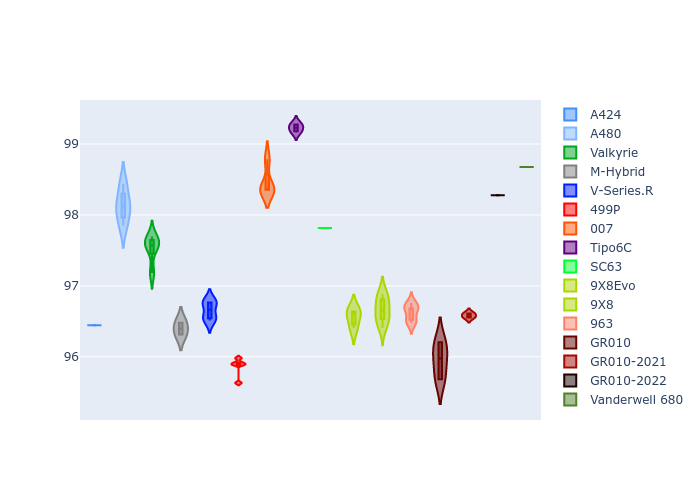

# Combined Plots

## Metadata

- BoP Accuracy: 91.79%
- Overall BoP Grade: A2
- Track: MONZA
- Threshhold: 210.0kph

## BoP Table
| Manufacturer     | Car            | Weight   | Power   | PINC   | E/Stint   | FDS    |
|:-----------------|:---------------|:---------|:--------|:-------|:----------|:-------|
| Alpine           | A424           | 1047kg   | 520.0kw | -      | 913MJ     | -      |
| Alpine           | A480           | 1052kg   | 432.0kw | -      | 799MJ     | -      |
| Aston Martin     | Valkyrie       | 1042kg   | 504.0kw | +0.40% | 899MJ     | -      |
| BMW              | M-Hybrid       | 1041kg   | 512.0kw | -      | 906MJ     | -      |
| Cadillac         | V-Series.R     | 1034kg   | 510.0kw | -      | 901MJ     | -      |
| Ferrari          | 499P           | 1063kg   | 508.0kw | -      | 902MJ     | 190kph |
| Glickenhaus      | 007            | 1030kg   | 520.0kw | -      | 916MJ     | -      |
| Isotta Fraschini | Tipo6C         | 1059kg   | 520.0kw | -      | 917MJ     | 190kph |
| Lamborghini      | SC63           | 1042kg   | 519.0kw | -      | 908MJ     | -      |
| Peugeot          | 9X8Evo         | 1050kg   | 510.0kw | -      | 899MJ     | 190kph |
| Peugeot          | 9X8            | 1030kg   | 520.0kw | -      | 912MJ     | 150kph |
| Porsche          | 963            | 1047kg   | 516.0kw | -      | 908MJ     | -      |
| Toyota           | GR010          | 1080kg   | 512.0kw | -      | 912MJ     | 190kph |
| Toyota           | GR010OLD       | 1065kg   | 513.0kw | -      | 960MJ     | 150kph |
| Vanwall          | Vanderwell 680 | 1030kg   | 520.0kw | -      | 913MJ     | -      |

## Performance Table
| Manufacturer     | Car            | RP      | QP      | Vavg      |   RDLC | BOP-Grade   | Match   |
|:-----------------|:---------------|:--------|:--------|:----------|-------:|:------------|:--------|
| Alpine           | A424           | 1:38.07 | 1:35.12 | 314.87kph |   1.03 | ~A1         | 99.77%  |
| Alpine           | A480           | 1:38.69 | 1:36.70 | 303.24kph |   1.02 | ~A1         | 95.97%  |
| Aston Martin     | Valkyrie       | 1:39.65 | 1:35.93 | 311.15kph |   1.04 | +A2         | 91.07%  |
| BMW              | M-Hybrid       | 1:38.48 | 1:35.19 | 312.63kph |   1.03 | ~A1         | 99.96%  |
| Cadillac         | V-Series.R     | 1:38.78 | 1:35.56 | 309.48kph |   1.03 | ~A1         | 99.79%  |
| Ferrari          | 499P           | 1:37.68 | 1:34.38 | 313.21kph |   1.03 | ~A1         | 96.71%  |
| Glickenhaus      | 007            | 1:39.11 | 1:36.83 | 311.46kph |   1.02 | +A2         | 90.92%  |
| Isotta Fraschini | Tipo6C         | 1:39.27 | 1:37.91 | 311.24kph |   1.01 | ~A1         | 95.52%  |
| Lamborghini      | SC63           | 1:39.26 | 1:36.73 | 312.87kph |   1.03 | ~A1         | 95.17%  |
| Peugeot          | 9X8Evo         | 1:38.24 | 1:34.99 | 314.30kph |   1.03 | ~A1         | 99.96%  |
| Peugeot          | 9X8            | 1:38.29 | 1:35.38 | 307.51kph |   1.03 | ~A1         | 99.93%  |
| Porsche          | 963            | 1:38.33 | 1:35.12 | 313.05kph |   1.03 | ~A1         | 99.88%  |
| Toyota           | GR010          | 1:37.81 | 1:34.41 | 312.84kph |   1.04 | ~A1         | 97.85%  |
| Toyota           | GR010OLD       | 1:37.17 | 1:34.95 | 308.75kph |   1.02 | -B1         | 87.77%  |
| Vanwall          | Vanderwell 680 | 1:41.01 | 1:37.38 | 305.33kph |   1.04 | +Ω1         | 26.64%  |

## Race Laptimes

## Quali Laptimes

## Topspeeds

## Laptimes Lineplot

