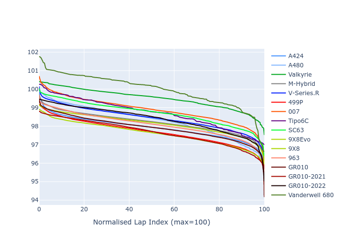

# Combined Plots

## Metadata

- BoP Accuracy: 93.24%
- Overall BoP Grade: A2
- Track: MONZA
- Threshhold: 210.0kph
- Average Laptime: 1:38.38
- Average Quali Laptime: 1:37.24
- Average Topspeed: 316.03kph

## BoP Table
| Manufacturer     | Car            | Weight   | Power   | PINC   | E/Stint   | FDS    | RDP    | QDP    | TDP    |
|:-----------------|:---------------|:---------|:--------|:-------|:----------|:-------|:-------|:-------|:-------|
| Alpine           | A424           | 1047kg   | 520.0kw | -      | 913MJ     | -      | 51.64% | 59.31% | 26.80% |
| Alpine           | A480           | 952kg    | 432.0kw | -      | 799MJ     | -      | 53.05% | 74.07% | 48.97% |
| Aston Martin     | Valkyrie       | 1042kg   | 504.0kw | +0.40% | 899MJ     | -      | 53.50% | 53.33% | 21.51% |
| BMW              | M-Hybrid       | 1041kg   | 512.0kw | -      | 906MJ     | -      | 52.89% | 56.22% | 33.41% |
| Cadillac         | V-Series.R     | 1034kg   | 510.0kw | -      | 901MJ     | -      | 48.63% | 60.80% | 19.01% |
| Ferrari          | 499P           | 1063kg   | 508.0kw | -      | 902MJ     | 190kph | 51.38% | 44.98% | 9.83%  |
| Glickenhaus      | 007            | 1030kg   | 520.0kw | -      | 916MJ     | -      | 46.15% | 49.30% | 41.45% |
| Isotta Fraschini | Tipo6C         | 1059kg   | 520.0kw | -      | 917MJ     | 190kph | 43.95% | 47.22% | 31.53% |
| Lamborghini      | SC63           | 1042kg   | 519.0kw | -      | 908MJ     | -      | 48.33% | 60.95% | 28.65% |
| Peugeot          | 9X8Evo         | 1050kg   | 510.0kw | -      | 899MJ     | 190kph | 48.87% | 52.78% | 15.41% |
| Peugeot          | 9X8            | 1030kg   | 520.0kw | -      | 912MJ     | 150kph | 54.54% | 58.39% | 9.69%  |
| Porsche          | 963            | 1047kg   | 516.0kw | -      | 908MJ     | -      | 50.70% | 44.30% | 29.51% |
| Toyota           | GR010          | 1080kg   | 512.0kw | -      | 912MJ     | 190kph | 51.09% | 52.71% | 11.46% |
| Toyota           | GR010-2021     | 1065kg   | 513.0kw | -      | 960MJ     | 150kph | 54.08% | 54.81% | 9.72%  |
| Toyota           | GR010-2022     | 1080kg   | 512.0kw | -      | 905MJ     | 190kph | 53.45% | 68.83% | 9.58%  |
| Vanwall          | Vanderwell 680 | 1030kg   | 520.0kw | -      | 913MJ     | -      | 49.68% | 60.93% | 34.43% |

## Performance Table
| Manufacturer     | Car            | RP      | QP      | Vavg      |   RDLC | BOP-Grade   | Match   |
|:-----------------|:---------------|:--------|:--------|:----------|-------:|:------------|:--------|
| Alpine           | A424           | 1:37.90 | 1:36.45 | 316.62kph |   1.02 | ~A1         | 99.97%  |
| Alpine           | A480           | 1:38.29 | 1:38.13 | 312.13kph |   1    | ~A1         | 99.60%  |
| Aston Martin     | Valkyrie       | 1:39.51 | 1:37.52 | 313.37kph |   1.02 | +D1         | 69.70%  |
| BMW              | M-Hybrid       | 1:38.20 | 1:36.40 | 314.89kph |   1.02 | ~A1         | 100.00% |
| Cadillac         | V-Series.R     | 1:38.43 | 1:36.65 | 312.63kph |   1.02 | ~A1         | 99.51%  |
| Ferrari          | 499P           | 1:37.68 | 1:35.86 | 317.35kph |   1.02 | ~A1         | 99.61%  |
| Glickenhaus      | 007            | 1:38.87 | 1:38.46 | 318.05kph |   1    | +A2         | 92.28%  |
| Isotta Fraschini | Tipo6C         | 1:38.69 | 1:39.23 | 315.89kph |   0.99 | +A2         | 94.03%  |
| Lamborghini      | SC63           | 1:38.71 | 1:37.82 | 315.17kph |   1.01 | ~A1         | 99.33%  |
| Peugeot          | 9X8Evo         | 1:38.13 | 1:36.55 | 315.86kph |   1.02 | ~A1         | 100.00% |
| Peugeot          | 9X8            | 1:37.61 | 1:36.66 | 316.28kph |   1.01 | ~A1         | 99.84%  |
| Porsche          | 963            | 1:38.08 | 1:36.62 | 317.89kph |   1.02 | ~A1         | 99.80%  |
| Toyota           | GR010          | 1:37.91 | 1:35.95 | 317.20kph |   1.02 | ~A1         | 99.71%  |
| Toyota           | GR010-2021     | 1:37.66 | 1:36.58 | 320.70kph |   1.01 | ~A1         | 100.00% |
| Toyota           | GR010-2022     | 1:38.38 | 1:38.28 | 319.94kph |   1    | ~A1         | 99.66%  |
| Vanwall          | Vanderwell 680 | 1:39.98 | 1:38.68 | 312.45kph |   1.01 | +Ω1         | 38.86%  |

## Race Laptimes

## Quali Laptimes

## Topspeeds

## Laptimes Lineplot

