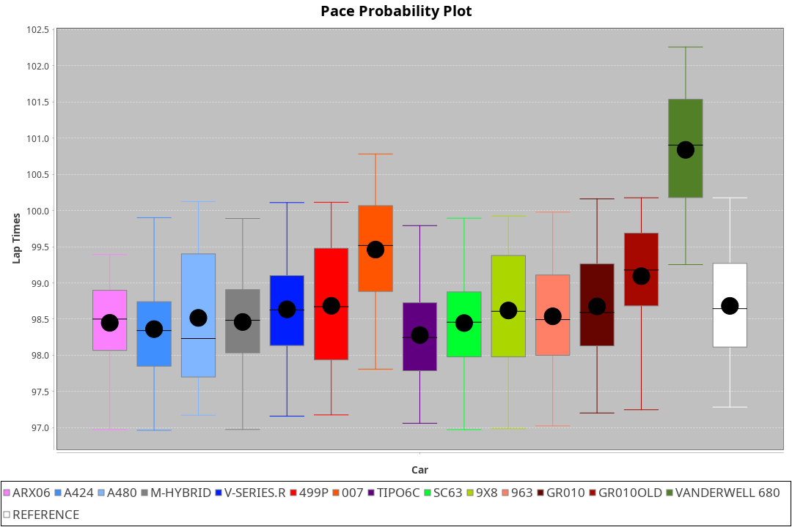
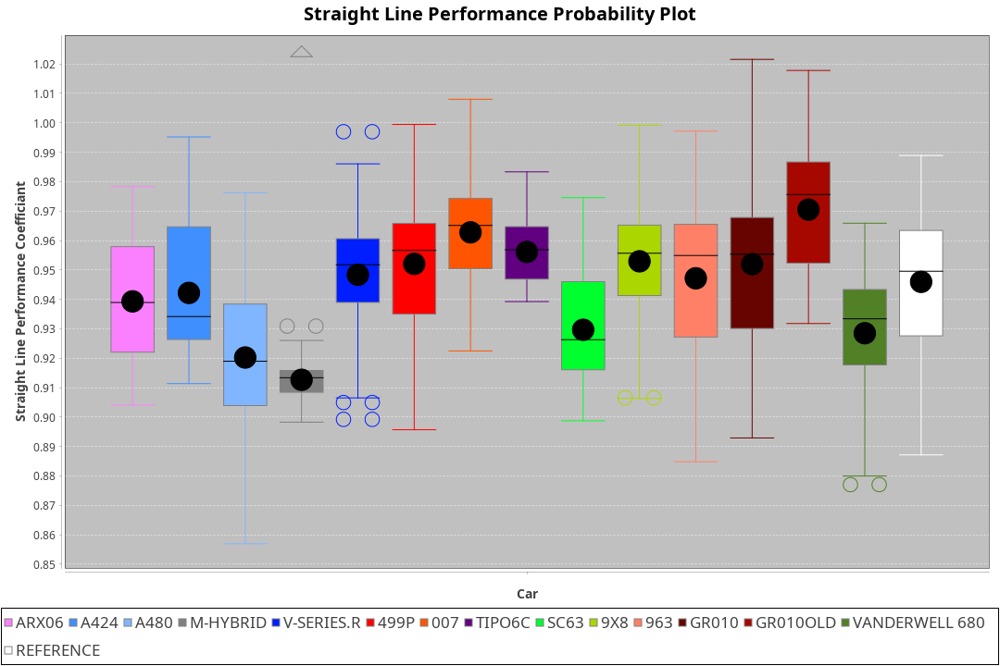
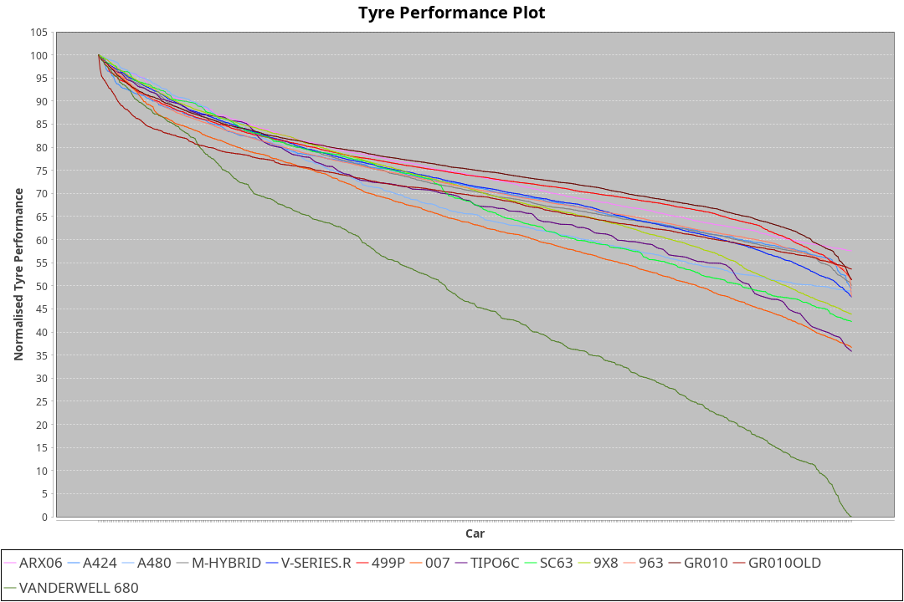

| Manufacturer     | Car            | Weight | Power | PINC    | E/Stint | FDS     |
|:-|:-|:-|:-|:-|:-|:-|
| Acura            | ARX06          | 1072kg | 511kw |    -    | 911MJ   |    -    |
| Alpine           | A424           | 1047kg | 520kw |    -    | 915MJ   |    -    |
| Alpine           | A480           | 952kg  | 432kw |    -    | 766MJ   |    -    |
| BMW              | M-Hybrid       | 1041kg | 512kw |    -    | 905MJ   |    -    |
| Cadillac         | V-Series.R     | 1034kg | 510kw |    -    | 898MJ   |    -    |
| Ferrari          | 499P           | 1063kg | 508kw |    -    | 899MJ   | 190kph  |
| Glickenhaus      | 007            | 1030kg | 520kw |    -    | 910MJ   |    -    |
| Isotta Fraschini | Tipo6C         | 1059kg | 520kw |    -    | 920MJ   | 190kph  |
| Lamborghini      | SC63           | 1042kg | 519kw |    -    | 910MJ   |    -    |
| Peugeot          | 9X8            | 1030kg | 520kw |    -    | 904MJ   | 150kph  |
| Porsche          | 963            | 1047kg | 516kw |    -    | 902MJ   |    -    |
| Toyota           | GR010          | 1080kg | 512kw |    -    | 904MJ   | 190kph  |
| Toyota           | GR010OLD       | 1065kg | 513kw |    -    | 906MJ   | 190kph  |
| Vanwall          | Vanderwell 680 | 1030kg | 520kw |    -    | 903MJ   |    -    |

### BoP Accuracy: 67.08%; Overall BoP Grade: D1
| Manufacturer     | Car            | Type  | RP      | QP      | Weight | Power¹ | Threshhold | PINC    | Power² | E/Stint | AVG Vmax  | FDS     | RDLC | L/Stint | BOP-Grade | Model Accuracy | Model Points | Match%  |
|:-|:-|:-|:-|:-|:-|:-|:-|:-|:-|:-|:-|:-|:-|:-|:-|:-|:-|:-|
| Acura            | ARX06          | LMDH  | 1:37.71 | 1:34.12 | 1072kg | 511kw  | 210.0kph   |    -    | 511kw  |  911MJ  | 299.84kph |    -    | 0.99 | 29      | -E1       | 100.00%        | 995          | 59.72%  |
| Alpine           | A424           | LMDH  | 1:38.16 | 1:36.12 | 1047kg | 520kw  | 210.0kph   |    -    | 520kw  |  915MJ  | 303.80kph |    -    | 1.02 | 29      | +C2       | 100.00%        | 642          | 72.79%  |
| Alpine           | A480           | LMP1  | 1:37.48 | 1:35.56 |  952kg | 432kw  | 210.0kph   |    -    | 432kw  |  766MJ  | 298.33kph |    -    | 0.98 | 27      | -C2       | 60.26%         | 849          | 74.24%  |
| BMW              | M-Hybrid       | LMDH  | 1:38.01 | 1:35.14 | 1041kg | 512kw  | 210.0kph   |    -    | 512kw  |  905MJ  | 298.71kph |    -    | 1.03 | 29      | -B2       | 100.00%        | 1714         | 81.20%  |
| Cadillac         | V-Series.R     | LMDH  | 1:38.02 | 1:34.89 | 1034kg | 510kw  | 210.0kph   |    -    | 510kw  |  898MJ  | 303.06kph |    -    | 1.03 | 29      | -B1       | 98.95%         | 2271         | 85.64%  |
| Ferrari          | 499P           | LMHHU | 1:37.71 | 1:34.57 | 1063kg | 508kw  | 210.0kph   |    -    | 508kw  |  899MJ  | 302.95kph | 190kph  | 1.03 | 29      | -D1       | 99.93%         | 2718         | 67.35%  |
| Glickenhaus      | 007            | LMHNH | 1:39.07 | 1:36.58 | 1030kg | 520kw  | 210.0kph   |    -    | 520kw  |  910MJ  | 306.60kph |    -    | 0.96 | 29      | +C2       | 96.34%         | 1634         | 74.37%  |
| Isotta Fraschini | Tipo6C         | LMHHU | 1:39.47 | 1:37.87 | 1059kg | 520kw  | 210.0kph   |    -    | 520kw  |  920MJ  | 302.45kph | 190kph  | 1.05 | 29      | +Ω1       | 92.36%         | 133          | 16.64%  |
| Lamborghini      | SC63           | LMDH  | 1:38.36 | 1:37.65 | 1042kg | 519kw  | 210.0kph   |    -    | 519kw  |  910MJ  | 301.73kph |    -    | 1.05 | 29      | ~A1       | 96.54%         | 418          | 100.00% |
| Peugeot          | 9X8            | LMHHE | 1:38.49 | 1:35.86 | 1030kg | 520kw  | 210.0kph   |    -    | 520kw  |  904MJ  | 304.20kph | 150kph  | 1.04 | 29      | ~A1       | 88.68%         | 2617         | 99.39%  |
| Porsche          | 963            | LMDH  | 1:38.04 | 1:34.86 | 1047kg | 516kw  | 210.0kph   |    -    | 516kw  |  902MJ  | 303.44kph |    -    | 1.02 | 29      | -B1       | 99.98%         | 6168         | 85.51%  |
| Toyota           | GR010          | LMHHU | 1:37.67 | 1:34.53 | 1080kg | 512kw  | 210.0kph   |    -    | 512kw  |  904MJ  | 301.92kph | 190kph  | 1.01 | 29      | -D1       | 98.53%         | 3557         | 68.04%  |
| Toyota           | GR010OLD       | LMHHE | 1:37.82 | 1:34.82 | 1065kg | 513kw  | 210.0kph   |    -    | 513kw  |  906MJ  | 305.13kph | 190kph  | 1.02 | 29      | -C1       | 92.01%         | 1427         | 78.61%  |
| Vanwall          | Vanderwell 680 | LMHNH | 1:40.79 | 1:37.38 | 1030kg | 520kw  | 210.0kph   |    -    | 520kw  |  903MJ  | 300.32kph |    -    | 1.01 | 29      | +Ω2       | 94.62%         | 633          | -24.34% |

## Power below Threshhold
| N/Nmax    | ARX06   | A424    | M-HYBRID | V-SERIES.R | 499P    | 007     | TIPO6C  | SC63    | 9X8     | 963     | GR010   | GR010OLD | VANDERWELL 680 | ​     | RPM      | A480    |
|:-|:-|:-|:-|:-|:-|:-|:-|:-|:-|:-|:-|:-|:-|:-|:-|:-|
|  0.550    |  252    |  256    |  252     |  251       |  250    |  256    |  256    |  256    |  256    |  254    |  252    |  253     |  256           |  ​    |   --     |   -     |
|  0.575    |  275    |  279    |  275     |  274       |  273    |  279    |  279    |  279    |  279    |  277    |  275    |  276     |  279           |  ​    |   --     |   -     |
|  0.600    |  295    |  300    |  296     |  295       |  293    |  300    |  300    |  299    |  300    |  298    |  296    |  296     |  300           |  ​    |   --     |   -     |
|  0.625    |  316    |  322    |  317     |  316       |  314    |  322    |  322    |  321    |  322    |  319    |  317    |  317     |  322           |  ​    |   --     |   -     |
|  0.650    |  337    |  343    |  338     |  337       |  335    |  343    |  343    |  342    |  343    |  340    |  338    |  338     |  343           |  ​    |   --     |   -     |
|  0.675    |  359    |  365    |  359     |  358       |  357    |  365    |  365    |  364    |  365    |  362    |  359    |  360     |  365           |  ​    |   --     |   -     |
|  0.700    |  380    |  387    |  381     |  380       |  378    |  387    |  387    |  386    |  387    |  384    |  381    |  382     |  387           |  ​    |   --     |   -     |
|  0.725    |  402    |  409    |  403     |  401       |  399    |  409    |  409    |  408    |  409    |  406    |  403    |  403     |  409           |  ​    |   --     |   -     |
|  0.750    |  422    |  430    |  423     |  422       |  420    |  430    |  430    |  429    |  430    |  427    |  423    |  424     |  430           |  ​    |   --     |   -     |
|  0.775    |  441    |  449    |  442     |  441       |  439    |  449    |  449    |  448    |  449    |  446    |  442    |  443     |  449           |  ​    |  5000    |  254    |
|  0.800    |  459    |  467    |  460     |  458       |  456    |  467    |  467    |  466    |  467    |  463    |  460    |  461     |  467           |  ​    |  5500    |  300    |
|  0.825    |  474    |  482    |  475     |  473       |  471    |  482    |  482    |  481    |  482    |  478    |  475    |  476     |  482           |  ​    |  6000    |  335    |
|  0.850    |  485    |  494    |  486     |  485       |  483    |  494    |  494    |  493    |  494    |  490    |  486    |  487     |  494           |  ​    |  6500    |  378    |
|  0.875    |  496    |  505    |  497     |  495       |  493    |  505    |  505    |  504    |  505    |  501    |  497    |  498     |  505           |  ​    |  7000    |  422    |
|  0.900    |  503    |  512    |  504     |  502       |  500    |  512    |  512    |  511    |  512    |  508    |  504    |  505     |  512           |  ​    |  7500    |  433    |
|  0.925    |  508    |  517    |  509     |  507       |  505    |  517    |  517    |  516    |  517    |  513    |  509    |  510     |  517           |  ​    |  8000    |  429    |
| **0.950** | **511** | **520** | **512**  | **510**    | **508** | **520** | **520** | **519** | **520** | **516** | **512** | **513**  | **520**        | **​** | **8500** | **432** |
|  0.975    |  509    |  518    |  510     |  508       |  506    |  518    |  518    |  517    |  518    |  514    |  510    |  511     |  518           |  ​    |  9000    |  216    |
|  1.000    |  505    |  514    |  506     |  505       |  503    |  514    |  514    |  513    |  514    |  510    |  506    |  507     |  514           |  ​    |   --     |   -     |
|  1.025    |  436    |  444    |  437     |  436       |  434    |  444    |  444    |  443    |  444    |  441    |  437    |  438     |  444           |  ​    |   --     |   -     |

## Power above Threshhold
| N/Nmax    | ARX06   | A424    | M-HYBRID | V-SERIES.R | 499P    | 007     | TIPO6C  | SC63    | 9X8     | 963     | GR010   | GR010OLD | VANDERWELL 680 | ​     | RPM      | A480    |
|:-|:-|:-|:-|:-|:-|:-|:-|:-|:-|:-|:-|:-|:-|:-|:-|:-|
|  0.550    |  252    |  256    |  252     |  251       |  250    |  256    |  256    |  256    |  256    |  254    |  252    |  253     |  256           |  ​    |   --     |   -     |
|  0.575    |  275    |  279    |  275     |  274       |  273    |  279    |  279    |  279    |  279    |  277    |  275    |  276     |  279           |  ​    |   --     |   -     |
|  0.600    |  295    |  300    |  296     |  295       |  293    |  300    |  300    |  299    |  300    |  298    |  296    |  296     |  300           |  ​    |   --     |   -     |
|  0.625    |  316    |  322    |  317     |  316       |  314    |  322    |  322    |  321    |  322    |  319    |  317    |  317     |  322           |  ​    |   --     |   -     |
|  0.650    |  337    |  343    |  338     |  337       |  335    |  343    |  343    |  342    |  343    |  340    |  338    |  338     |  343           |  ​    |   --     |   -     |
|  0.675    |  359    |  365    |  359     |  358       |  357    |  365    |  365    |  364    |  365    |  362    |  359    |  360     |  365           |  ​    |   --     |   -     |
|  0.700    |  380    |  387    |  381     |  380       |  378    |  387    |  387    |  386    |  387    |  384    |  381    |  382     |  387           |  ​    |   --     |   -     |
|  0.725    |  402    |  409    |  403     |  401       |  399    |  409    |  409    |  408    |  409    |  406    |  403    |  403     |  409           |  ​    |   --     |   -     |
|  0.750    |  422    |  430    |  423     |  422       |  420    |  430    |  430    |  429    |  430    |  427    |  423    |  424     |  430           |  ​    |   --     |   -     |
|  0.775    |  441    |  449    |  442     |  441       |  439    |  449    |  449    |  448    |  449    |  446    |  442    |  443     |  449           |  ​    |  5000    |  254    |
|  0.800    |  459    |  467    |  460     |  458       |  456    |  467    |  467    |  466    |  467    |  463    |  460    |  461     |  467           |  ​    |  5500    |  300    |
|  0.825    |  474    |  482    |  475     |  473       |  471    |  482    |  482    |  481    |  482    |  478    |  475    |  476     |  482           |  ​    |  6000    |  335    |
|  0.850    |  485    |  494    |  486     |  485       |  483    |  494    |  494    |  493    |  494    |  490    |  486    |  487     |  494           |  ​    |  6500    |  378    |
|  0.875    |  496    |  505    |  497     |  495       |  493    |  505    |  505    |  504    |  505    |  501    |  497    |  498     |  505           |  ​    |  7000    |  422    |
|  0.900    |  503    |  512    |  504     |  502       |  500    |  512    |  512    |  511    |  512    |  508    |  504    |  505     |  512           |  ​    |  7500    |  433    |
|  0.925    |  508    |  517    |  509     |  507       |  505    |  517    |  517    |  516    |  517    |  513    |  509    |  510     |  517           |  ​    |  8000    |  429    |
| **0.950** | **511** | **520** | **512**  | **510**    | **508** | **520** | **520** | **519** | **520** | **516** | **512** | **513**  | **520**        | **​** | **8500** | **432** |
|  0.975    |  509    |  518    |  510     |  508       |  506    |  518    |  518    |  517    |  518    |  514    |  510    |  511     |  518           |  ​    |  9000    |  216    |
|  1.000    |  505    |  514    |  506     |  505       |  503    |  514    |  514    |  513    |  514    |  510    |  506    |  507     |  514           |  ​    |   --     |   -     |
|  1.025    |  436    |  444    |  437     |  436       |  434    |  444    |  444    |  443    |  444    |  441    |  437    |  438     |  444           |  ​    |   --     |   -     |
