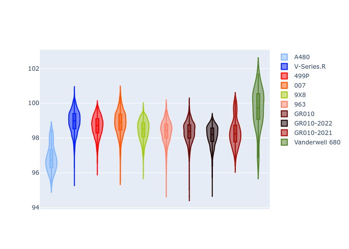
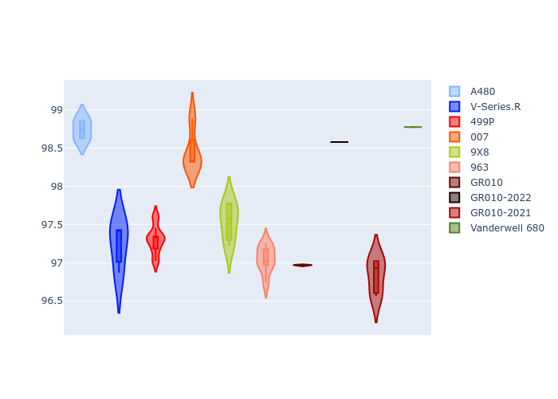
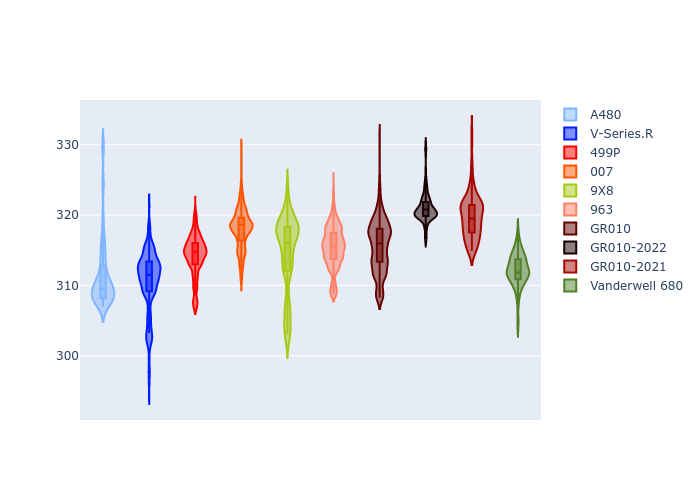
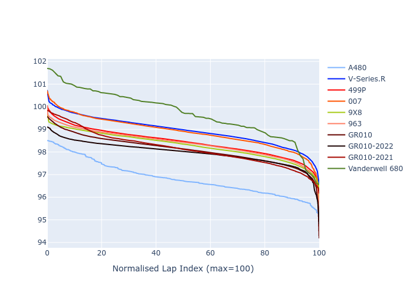

# Combined Plots

## Metadata

- BoP Accuracy: 94.38%
- Overall BoP Grade: A2
- Track: MONZA
- Threshhold: 0.0kph
- Average Laptime: 1:38.44
- Average Quali Laptime: 1:37.34
- Laptime Std Dev: 0.70 seconds
- Filtered Average Topspeed: 315.13kph

## BoP Table
| Manufacturer   | Car            | Weight   | Power   | PINC   | E/Stint   | FDS    | RDP    | QDP    | TDP    |
|:---------------|:---------------|:---------|:--------|:-------|:----------|:-------|:-------|:-------|:-------|
| Alpine         | A480           | 952kg    | 428.0kw | -      | 795MJ     | -      | 54.81% | 80.56% | 55.69% |
| Cadillac       | V-Series.R     | 1032kg   | 498.0kw | -      | 890MJ     | -      | 48.29% | 59.47% | 18.65% |
| Ferrari        | 499P           | 1069kg   | 497.0kw | -      | 893MJ     | 190kph | 51.25% | 43.28% | 10.17% |
| Glickenhaus    | 007            | 1030kg   | 520.0kw | -      | 916MJ     | -      | 46.15% | 49.30% | 41.45% |
| Peugeot        | 9X8            | 1046kg   | 520.0kw | -      | 914MJ     | 150kph | 54.54% | 58.39% | 9.69%  |
| Porsche        | 963            | 1049kg   | 506.0kw | -      | 899MJ     | -      | 50.57% | 42.80% | 29.05% |
| Toyota         | GR010          | 1080kg   | 507.0kw | -      | 908MJ     | 190kph | 51.03% | 51.78% | 14.64% |
| Toyota         | GR010-2022     | 1071kg   | 513.0kw | -      | 905MJ     | 190kph | 53.24% | 64.49% | 9.72%  |
| Toyota         | GR010-2021     | 1066kg   | 515.0kw | -      | 962MJ     | 150kph | 53.89% | 50.91% | 25.87% |
| Vanwall        | Vanderwell 680 | 1030kg   | 520.0kw | -      | 913MJ     | -      | 35.83% | 59.29% | 34.15% |

## Performance Table
| Manufacturer   | Car            | RP      | QP      | Vavg      |   RDLC | BOP-Grade   | Match   |
|:---------------|:---------------|:--------|:--------|:----------|-------:|:------------|:--------|
| Alpine         | A480           | 1:36.76 | 1:36.61 | 310.31kph |   1    | ~A1         | 97.75%  |
| Cadillac       | V-Series.R     | 1:38.94 | 1:37.25 | 310.52kph |   1.02 | ~A1         | 97.60%  |
| Ferrari        | 499P           | 1:38.67 | 1:36.75 | 314.21kph |   1.02 | ~A1         | 100.00% |
| Glickenhaus    | 007            | 1:38.87 | 1:38.48 | 318.05kph |   1    | ~A1         | 96.55%  |
| Peugeot        | 9X8            | 1:38.45 | 1:37.44 | 314.52kph |   1.01 | ~A1         | 100.00% |
| Porsche        | 963            | 1:38.37 | 1:36.71 | 315.50kph |   1.02 | ~A1         | 99.95%  |
| Toyota         | GR010          | 1:38.35 | 1:36.43 | 315.86kph |   1.02 | ~A1         | 99.72%  |
| Toyota         | GR010-2022     | 1:38.13 | 1:38.12 | 320.98kph |   1    | ~A1         | 99.55%  |
| Toyota         | GR010-2021     | 1:38.21 | 1:36.83 | 319.52kph |   1.01 | ~A1         | 97.75%  |
| Vanwall        | Vanderwell 680 | 1:39.63 | 1:38.74 | 311.81kph |   1.01 | +E2         | 54.90%  |

## Race Laptimes

## Quali Laptimes

## Topspeeds

## Laptimes Lineplot

