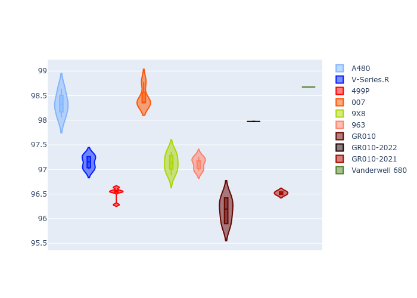
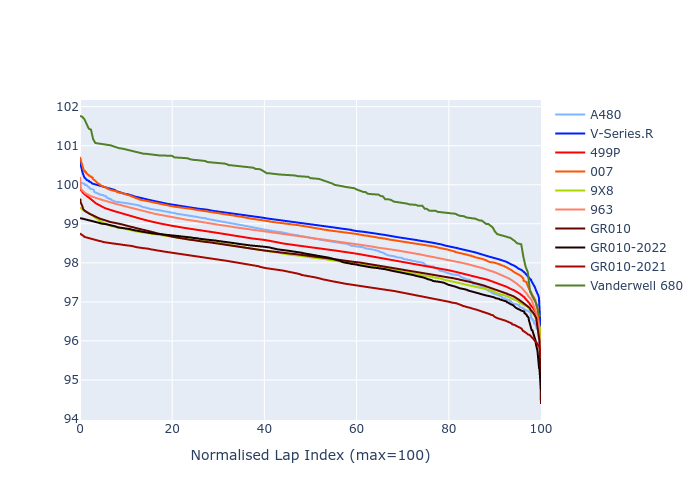

# Combined Plots

## Metadata

- BoP Accuracy: 91.21%
- Overall BoP Grade: A2
- Track: MONZA
- Threshhold: 0.0kph

## BoP Table
| Manufacturer   | Car            | Weight   | Power   | PINC   | E/Stint   | FDS    | RDP    | QDP    | TDP    |
|:---------------|:---------------|:---------|:--------|:-------|:----------|:-------|:-------|:-------|:-------|
| Alpine         | A480           | 952kg    | 428.0kw | -      | 795MJ     | -      | 54.51% | 76.19% | 54.04% |
| Cadillac       | V-Series.R     | 1032kg   | 498.0kw | -      | 890MJ     | -      | 47.80% | 56.73% | 19.63% |
| Ferrari        | 499P           | 1069kg   | 497.0kw | -      | 893MJ     | 190kph | 53.02% | 42.32% | 9.88%  |
| Glickenhaus    | 007            | 1030kg   | 520.0kw | -      | 916MJ     | -      | 46.49% | 46.07% | 47.78% |
| Peugeot        | 9X8            | 1046kg   | 520.0kw | -      | 914MJ     | 150kph | 54.07% | 57.08% | 10.80% |
| Porsche        | 963            | 1049kg   | 506.0kw | -      | 899MJ     | -      | 50.87% | 45.25% | 30.77% |
| Toyota         | GR010          | 1080kg   | 507.0kw | -      | 908MJ     | 190kph | 52.43% | 57.12% | 12.82% |
| Toyota         | GR010-2022     | 1071kg   | 513.0kw | -      | 905MJ     | 190kph | 53.48% | 69.44% | 7.86%  |
| Toyota         | GR010-2021     | 1066kg   | 515.0kw | -      | 962MJ     | 150kph | 54.09% | 52.67% | 26.37% |
| Vanwall        | Vanderwell 680 | 1030kg   | 520.0kw | -      | 913MJ     | -      | 53.41% | 56.28% | 29.85% |

## Performance Table
| Manufacturer   | Car            | RP      | QP      | Vavg      |   RDLC | BOP-Grade   | Match   |
|:---------------|:---------------|:--------|:--------|:----------|-------:|:------------|:--------|
| Alpine         | A480           | 1:37.72 | 1:35.53 | 304.02kph |   1.02 | -A2         | 91.27%  |
| Cadillac       | V-Series.R     | 1:39.47 | 1:35.99 | 306.80kph |   1.04 | ~A1         | 97.26%  |
| Ferrari        | 499P           | 1:38.91 | 1:35.00 | 310.02kph |   1.04 | ~A1         | 99.97%  |
| Glickenhaus    | 007            | 1:39.11 | 1:36.83 | 311.46kph |   1.02 | +A2         | 93.51%  |
| Peugeot        | 9X8            | 1:38.73 | 1:35.47 | 304.34kph |   1.03 | ~A1         | 99.91%  |
| Porsche        | 963            | 1:39.06 | 1:35.64 | 310.99kph |   1.04 | ~A1         | 99.49%  |
| Toyota         | GR010          | 1:38.47 | 1:34.49 | 312.17kph |   1.04 | ~A1         | 99.80%  |
| Toyota         | GR010-2022     | 1:38.06 | 1:35.74 | 312.10kph |   1.02 | ~A1         | 99.71%  |
| Toyota         | GR010-2021     | 1:38.24 | 1:35.19 | 305.53kph |   1.03 | ~A1         | 99.78%  |
| Vanwall        | Vanderwell 680 | 1:40.97 | 1:37.38 | 305.33kph |   1.04 | +Ω1         | 31.40%  |

## Race Laptimes

## Quali Laptimes

## Topspeeds

## Laptimes Lineplot

