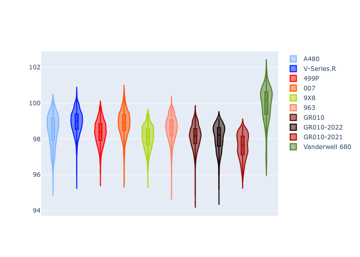

# Combined Plots

## Metadata

- BoP Accuracy: 93.61%
- Overall BoP Grade: A2
- Track: MONZA
- Threshhold: 0.0kph
- Average Laptime: 1:38.52
- Average Quali Laptime: 1:37.41
- Average Topspeed: 315.41kph

## BoP Table
| Manufacturer   | Car            | Weight   | Power   | PINC   | E/Stint   | FDS    | RDP    | QDP    | TDP    |
|:---------------|:---------------|:---------|:--------|:-------|:----------|:-------|:-------|:-------|:-------|
| Alpine         | A480           | 952kg    | 428.0kw | -      | 795MJ     | -      | 53.05% | 74.07% | 48.97% |
| Cadillac       | V-Series.R     | 1032kg   | 498.0kw | -      | 890MJ     | -      | 48.63% | 60.80% | 19.01% |
| Ferrari        | 499P           | 1069kg   | 497.0kw | -      | 893MJ     | 190kph | 51.38% | 44.98% | 9.83%  |
| Glickenhaus    | 007            | 1030kg   | 520.0kw | -      | 916MJ     | -      | 46.15% | 49.30% | 41.45% |
| Peugeot        | 9X8            | 1046kg   | 520.0kw | -      | 914MJ     | 150kph | 54.54% | 58.39% | 9.69%  |
| Porsche        | 963            | 1049kg   | 506.0kw | -      | 899MJ     | -      | 50.70% | 44.30% | 29.51% |
| Toyota         | GR010          | 1080kg   | 507.0kw | -      | 908MJ     | 190kph | 51.09% | 52.71% | 11.46% |
| Toyota         | GR010-2022     | 1071kg   | 513.0kw | -      | 905MJ     | 190kph | 53.45% | 68.83% | 9.58%  |
| Toyota         | GR010-2021     | 1066kg   | 515.0kw | -      | 962MJ     | 150kph | 54.08% | 54.81% | 9.72%  |
| Vanwall        | Vanderwell 680 | 1030kg   | 520.0kw | -      | 913MJ     | -      | 49.68% | 60.93% | 34.43% |

## Performance Table
| Manufacturer   | Car            | RP      | QP      | Vavg      |   RDLC | BOP-Grade   | Match   |
|:---------------|:---------------|:--------|:--------|:----------|-------:|:------------|:--------|
| Alpine         | A480           | 1:38.50 | 1:38.34 | 311.08kph |   1    | ~A1         | 98.94%  |
| Cadillac       | V-Series.R     | 1:38.95 | 1:37.15 | 310.16kph |   1.02 | ~A1         | 97.24%  |
| Ferrari        | 499P           | 1:38.37 | 1:36.52 | 314.20kph |   1.02 | ~A1         | 100.00% |
| Glickenhaus    | 007            | 1:38.87 | 1:38.46 | 318.05kph |   1    | ~A1         | 95.78%  |
| Peugeot        | 9X8            | 1:38.10 | 1:37.13 | 314.52kph |   1.01 | ~A1         | 100.00% |
| Porsche        | 963            | 1:38.60 | 1:37.12 | 315.43kph |   1.02 | ~A1         | 99.88%  |
| Toyota         | GR010          | 1:38.14 | 1:36.17 | 316.08kph |   1.02 | ~A1         | 99.79%  |
| Toyota         | GR010-2022     | 1:38.07 | 1:37.97 | 321.14kph |   1    | ~A1         | 99.49%  |
| Toyota         | GR010-2021     | 1:37.59 | 1:36.52 | 321.04kph |   1.01 | ~A1         | 100.00% |
| Vanwall        | Vanderwell 680 | 1:39.98 | 1:38.68 | 312.45kph |   1.01 | +Ω1         | 45.02%  |

## Race Laptimes

## Quali Laptimes

## Topspeeds

## Laptimes Lineplot

