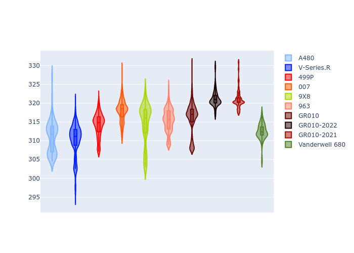

# Combined Plots

## Metadata

- BoP Accuracy: 89.81%
- Overall BoP Grade: B1
- Track: MONZA
- Threshhold: 0.0kph

## BoP Table
| Manufacturer   | Car            | Weight   | Power   | PINC   | E/Stint   | FDS    |
|:---------------|:---------------|:---------|:--------|:-------|:----------|:-------|
| Alpine         | A480           | 1052kg   | 428.0kw | -      | 795MJ     | -      |
| Cadillac       | V-Series.R     | 1032kg   | 498.0kw | -      | 890MJ     | -      |
| Ferrari        | 499P           | 1069kg   | 497.0kw | -      | 893MJ     | 190kph |
| Glickenhaus    | 007            | 1030kg   | 520.0kw | -      | 916MJ     | -      |
| Peugeot        | 9X8            | 1046kg   | 520.0kw | -      | 914MJ     | 150kph |
| Porsche        | 963            | 1049kg   | 506.0kw | -      | 899MJ     | -      |
| Toyota         | GR010          | 1080kg   | 507.0kw | -      | 908MJ     | 190kph |
| Toyota         | GR010OLD       | 1066kg   | 515.0kw | -      | 962MJ     | 150kph |
| Vanwall        | Vanderwell 680 | 1030kg   | 520.0kw | -      | 913MJ     | -      |

## Performance Table
| Manufacturer   | Car            | RP      | QP      | Vavg      |   RDLC | BOP-Grade   | Match   |
|:---------------|:---------------|:--------|:--------|:----------|-------:|:------------|:--------|
| Alpine         | A480           | 1:38.93 | 1:36.93 | 302.22kph |   1.02 | ~A1         | 95.97%  |
| Cadillac       | V-Series.R     | 1:39.39 | 1:36.13 | 307.04kph |   1.03 | ~A1         | 98.15%  |
| Ferrari        | 499P           | 1:38.35 | 1:35.00 | 310.10kph |   1.04 | ~A1         | 99.86%  |
| Glickenhaus    | 007            | 1:39.11 | 1:36.83 | 311.46kph |   1.02 | +A2         | 94.67%  |
| Peugeot        | 9X8            | 1:38.58 | 1:35.65 | 305.80kph |   1.03 | ~A1         | 99.96%  |
| Porsche        | 963            | 1:38.87 | 1:35.63 | 310.62kph |   1.03 | ~A1         | 99.89%  |
| Toyota         | GR010          | 1:38.06 | 1:34.64 | 311.73kph |   1.04 | ~A1         | 99.46%  |
| Toyota         | GR010OLD       | 1:37.08 | 1:34.87 | 309.08kph |   1.02 | -B1         | 87.77%  |
| Vanwall        | Vanderwell 680 | 1:41.01 | 1:37.38 | 305.33kph |   1.04 | +Ω1         | 32.59%  |

## Race Laptimes

## Quali Laptimes

## Topspeeds

## Laptimes Lineplot

