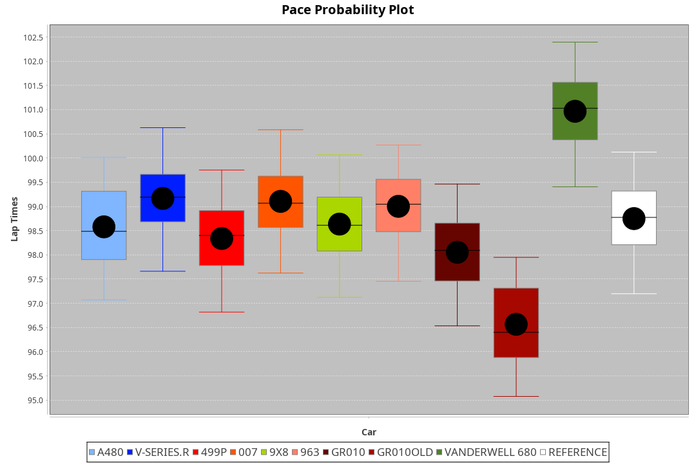
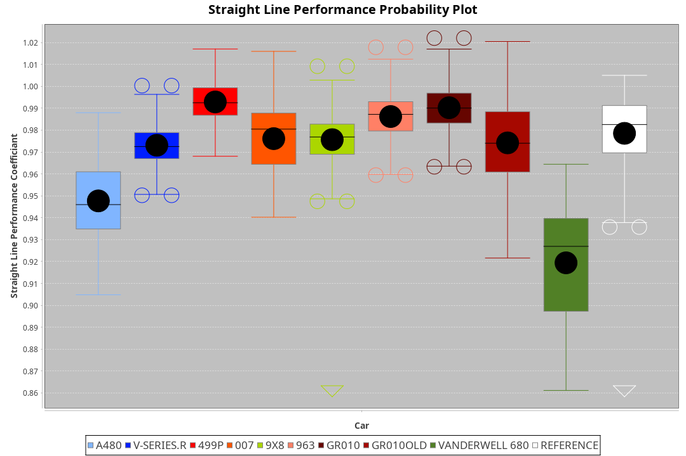
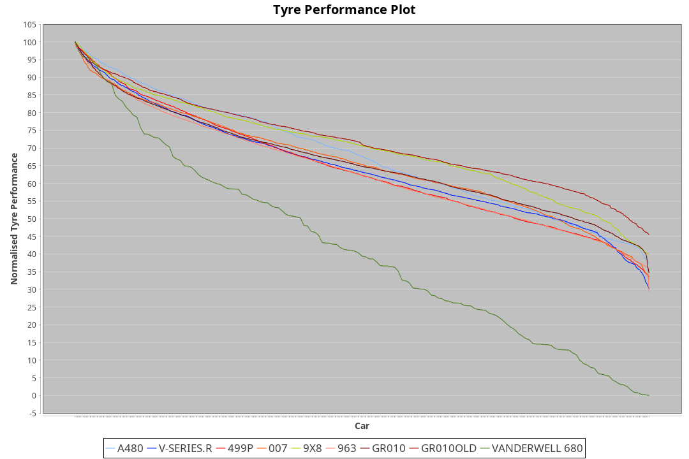

| Manufacturer | Car            | Weight | Power | PINC    | E/Stint | FDS     |
|:-|:-|:-|:-|:-|:-|:-|
| Alpine       | A480           | 952kg  | 428kw |    -    | 763MJ   |    -    |
| Cadillac     | V-Series.R     | 1032kg | 498kw |    -    | 887MJ   |    -    |
| Ferrari      | 499P           | 1069kg | 497kw |    -    | 890MJ   | 190kph  |
| Glickenhaus  | 007            | 1030kg | 520kw |    -    | 910MJ   |    -    |
| Peugeot      | 9X8            | 1046kg | 520kw |    -    | 906MJ   | 150kph  |
| Porsche      | 963            | 1049kg | 506kw |    -    | 893MJ   |    -    |
| Toyota       | GR010          | 1080kg | 507kw |    -    | 900MJ   | 190kph  |
| Toyota       | GR010OLD       | 1066kg | 515kw |    -    | 907MJ   | 150kph  |
| Vanwall      | Vanderwell 680 | 1030kg | 520kw |    -    | 903MJ   |    -    |

### BoP Accuracy: 78.60%; Overall BoP Grade: C1
| Manufacturer | Car            | Type  | RP      | QP      | Weight | Power¹ | Threshhold | PINC    | Power² | E/Stint | AVG Vmax  | FDS     | RDLC | L/Stint | BOP-Grade | Model Accuracy | Model Points | Match%  | SimDiff |
|:-|:-|:-|:-|:-|:-|:-|:-|:-|:-|:-|:-|:-|:-|:-|:-|:-|:-|:-|:-|
| Alpine       | A480           | LMP1  | 1:39.16 | 1:36.57 |  952kg | 428kw  | 0.0kph     |    -    | 428kw  |  763MJ  | 298.22kph |    -    | 0.97 | 27      | ~A1       | 68.63%         | 967          | 98.32%  | ±0.66s  |
| Cadillac     | V-Series.R     | LMDH  | 1:39.07 | 1:35.87 | 1032kg | 498kw  | 210.0kph   |    -    | 498kw  |  887MJ  | 304.49kph |    -    | 1.03 | 29      | -B2       | 83.12%         | 1921         | 84.42%  | ±0.82s  |
| Ferrari      | 499P           | LMHHU | 1:39.40 | 1:36.04 | 1069kg | 497kw  | 210.0kph   |    -    | 497kw  |  890MJ  | 306.39kph | 190kph  | 1.02 | 29      | ~A1       | 69.49%         | 1950         | 100.00% | ±1.38s  |
| Glickenhaus  | 007            | LMHNH | 1:39.12 | 1:36.68 | 1030kg | 520kw  | 210.0kph   |    -    | 520kw  |  910MJ  | 308.81kph |    -    | 0.96 | 29      | -B2       | 89.50%         | 1518         | 84.09%  | ±0.32s  |
| Peugeot      | 9X8            | LMHHE | 1:39.65 | 1:36.51 | 1046kg | 520kw  | 210.0kph   |    -    | 520kw  |  906MJ  | 306.07kph | 150kph  | 1.02 | 29      | ~A1       | 88.75%         | 2383         | 100.00% | ±1.38s  |
| Porsche      | 963            | LMDH  | 1:39.37 | 1:35.96 | 1049kg | 506kw  | 210.0kph   |    -    | 506kw  |  893MJ  | 307.44kph |    -    | 1.00 | 29      | ~A1       | 81.02%         | 5243         | 100.00% | ±0.89s  |
| Toyota       | GR010          | LMHHU | 1:39.34 | 1:36.12 | 1080kg | 507kw  | 210.0kph   |    -    | 507kw  |  900MJ  | 306.19kph | 190kph  | 1.01 | 29      | ~A1       | 73.70%         | 2701         | 100.00% | ±1.59s  |
| Toyota       | GR010OLD       | LMHHE | 1:38.65 | 1:35.12 | 1066kg | 515kw  | 0.0kph     |    -    | 515kw  |  907MJ  | 306.01kph | 150kph  | 1.03 | 29      | -E1       | 99.03%         | 1536         | 56.49%  | ±0.61s  |
| Vanwall      | Vanderwell 680 | LMHNH | 1:42.07 | 1:37.95 | 1030kg | 520kw  | 210.0kph   |    -    | 520kw  |  903MJ  | 301.43kph |    -    | 1.01 | 29      | +Ω2       | 97.01%         | 649          | -15.89% | ±1.00s  |

## Power below Threshhold
| N/Nmax    | V-SERIES.R | 499P    | 007     | 9X8     | 963     | GR010   | GR010OLD | VANDERWELL 680 | ​     | RPM      | A480    |
|:-|:-|:-|:-|:-|:-|:-|:-|:-|:-|:-|:-|
|  0.550    |  245       |  245    |  256    |  256    |  249    |  250    |  254     |  256           |  ​    |   --     |   -     |
|  0.575    |  268       |  267    |  279    |  279    |  272    |  273    |  277     |  279           |  ​    |   --     |   -     |
|  0.600    |  288       |  287    |  300    |  300    |  292    |  293    |  297     |  300           |  ​    |   --     |   -     |
|  0.625    |  308       |  307    |  322    |  322    |  313    |  314    |  319     |  322           |  ​    |   --     |   -     |
|  0.650    |  329       |  328    |  343    |  343    |  334    |  335    |  340     |  343           |  ​    |   --     |   -     |
|  0.675    |  350       |  349    |  365    |  365    |  355    |  356    |  362     |  365           |  ​    |   --     |   -     |
|  0.700    |  371       |  370    |  387    |  387    |  377    |  377    |  383     |  387           |  ​    |   --     |   -     |
|  0.725    |  392       |  391    |  409    |  409    |  398    |  399    |  405     |  409           |  ​    |   --     |   -     |
|  0.750    |  411       |  411    |  430    |  430    |  418    |  419    |  426     |  430           |  ​    |   --     |   -     |
|  0.775    |  430       |  429    |  449    |  449    |  437    |  438    |  445     |  449           |  ​    |  5000    |  251    |
|  0.800    |  447       |  446    |  467    |  467    |  454    |  455    |  463     |  467           |  ​    |  5500    |  297    |
|  0.825    |  462       |  461    |  482    |  482    |  469    |  470    |  478     |  482           |  ​    |  6000    |  332    |
|  0.850    |  473       |  472    |  494    |  494    |  481    |  482    |  489     |  494           |  ​    |  6500    |  375    |
|  0.875    |  483       |  482    |  505    |  505    |  491    |  492    |  500     |  505           |  ​    |  7000    |  418    |
|  0.900    |  490       |  489    |  512    |  512    |  498    |  499    |  507     |  512           |  ​    |  7500    |  429    |
|  0.925    |  495       |  494    |  517    |  517    |  503    |  504    |  512     |  517           |  ​    |  8000    |  425    |
| **0.950** | **498**    | **497** | **520** | **520** | **506** | **507** | **515**  | **520**        | **​** | **8500** | **428** |
|  0.975    |  496       |  495    |  518    |  518    |  504    |  505    |  513     |  518           |  ​    |  9000    |  214    |
|  1.000    |  493       |  492    |  514    |  514    |  501    |  502    |  509     |  514           |  ​    |   --     |   -     |
|  1.025    |  425       |  424    |  444    |  444    |  432    |  433    |  440     |  444           |  ​    |   --     |   -     |

## Power above Threshhold
| N/Nmax    | V-SERIES.R | 499P    | 007     | 9X8     | 963     | GR010   | GR010OLD | VANDERWELL 680 | ​     | RPM      | A480    |
|:-|:-|:-|:-|:-|:-|:-|:-|:-|:-|:-|:-|
|  0.550    |  245       |  245    |  256    |  256    |  249    |  250    |  254     |  256           |  ​    |   --     |   -     |
|  0.575    |  268       |  267    |  279    |  279    |  272    |  273    |  277     |  279           |  ​    |   --     |   -     |
|  0.600    |  288       |  287    |  300    |  300    |  292    |  293    |  297     |  300           |  ​    |   --     |   -     |
|  0.625    |  308       |  307    |  322    |  322    |  313    |  314    |  319     |  322           |  ​    |   --     |   -     |
|  0.650    |  329       |  328    |  343    |  343    |  334    |  335    |  340     |  343           |  ​    |   --     |   -     |
|  0.675    |  350       |  349    |  365    |  365    |  355    |  356    |  362     |  365           |  ​    |   --     |   -     |
|  0.700    |  371       |  370    |  387    |  387    |  377    |  377    |  383     |  387           |  ​    |   --     |   -     |
|  0.725    |  392       |  391    |  409    |  409    |  398    |  399    |  405     |  409           |  ​    |   --     |   -     |
|  0.750    |  411       |  411    |  430    |  430    |  418    |  419    |  426     |  430           |  ​    |   --     |   -     |
|  0.775    |  430       |  429    |  449    |  449    |  437    |  438    |  445     |  449           |  ​    |  5000    |  251    |
|  0.800    |  447       |  446    |  467    |  467    |  454    |  455    |  463     |  467           |  ​    |  5500    |  297    |
|  0.825    |  462       |  461    |  482    |  482    |  469    |  470    |  478     |  482           |  ​    |  6000    |  332    |
|  0.850    |  473       |  472    |  494    |  494    |  481    |  482    |  489     |  494           |  ​    |  6500    |  375    |
|  0.875    |  483       |  482    |  505    |  505    |  491    |  492    |  500     |  505           |  ​    |  7000    |  418    |
|  0.900    |  490       |  489    |  512    |  512    |  498    |  499    |  507     |  512           |  ​    |  7500    |  429    |
|  0.925    |  495       |  494    |  517    |  517    |  503    |  504    |  512     |  517           |  ​    |  8000    |  425    |
| **0.950** | **498**    | **497** | **520** | **520** | **506** | **507** | **515**  | **520**        | **​** | **8500** | **428** |
|  0.975    |  496       |  495    |  518    |  518    |  504    |  505    |  513     |  518           |  ​    |  9000    |  214    |
|  1.000    |  493       |  492    |  514    |  514    |  501    |  502    |  509     |  514           |  ​    |   --     |   -     |
|  1.025    |  425       |  424    |  444    |  444    |  432    |  433    |  440     |  444           |  ​    |   --     |   -     |
