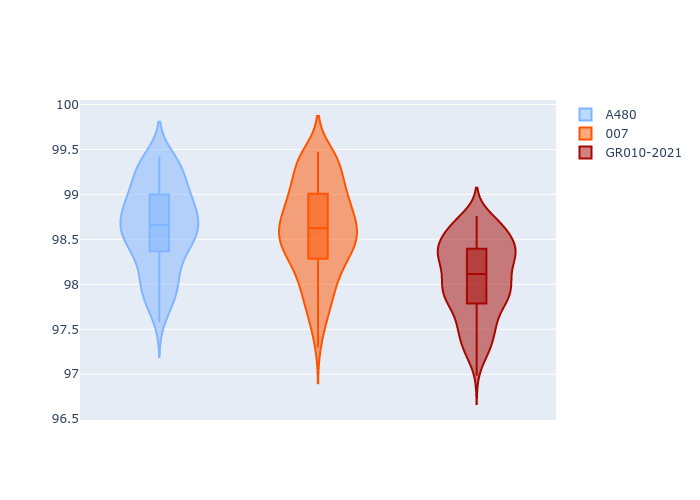

# Combined Plots

## Metadata

- BoP Accuracy: 88.73%
- Overall BoP Grade: B1
- Track: MONZA
- Threshhold: 0.0kph
- Average Laptime: 1:38.44
- Average Quali Laptime: 1:36.69
- Average Topspeed: 319.47kph

## BoP Table
| Manufacturer   | Car        | Weight   | Power   | PINC   | E/Stint   | FDS    | RDP    | QDP    | TDP    |
|:---------------|:-----------|:---------|:--------|:-------|:----------|:-------|:-------|:-------|:-------|
| Alpine         | A480       | 952kg    | 450.0kw | -      | 918MJ     | -      | 55.88% | 66.67% | 43.98% |
| Glickenhaus    | 007        | 1030kg   | 520.0kw | -      | 965MJ     | -      | 53.79% | 33.33% | 9.35%  |
| Toyota         | GR010-2021 | 1066kg   | 515.0kw | -      | 962MJ     | 150kph | 54.52% | 50.00% | 13.05% |

## Performance Table
| Manufacturer   | Car        | RP      | QP      | Vavg      |   RDLC | BOP-Grade   | Match   |
|:---------------|:-----------|:--------|:--------|:----------|-------:|:------------|:--------|
| Alpine         | A480       | 1:38.64 | 1:36.67 | 317.35kph |   1.02 | +B1         | 85.96%  |
| Glickenhaus    | 007        | 1:38.61 | 1:37.10 | 321.67kph |   1.02 | +B1         | 85.26%  |
| Toyota         | GR010-2021 | 1:38.07 | 1:36.31 | 319.40kph |   1.02 | -A2         | 94.97%  |

## Race Laptimes

## Quali Laptimes

## Topspeeds

## Laptimes Lineplot

