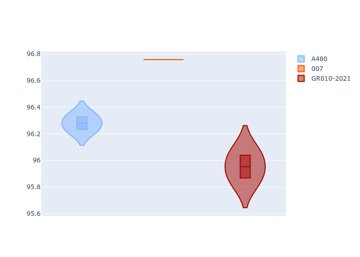

# Combined Plots

## Metadata

- BoP Accuracy: 89.25%
- Overall BoP Grade: B1
- Track: MONZA
- Threshhold: 0.0kph

## BoP Table
| Manufacturer   | Car      | Weight   | Power   | PINC   | E/Stint   | FDS    |
|:---------------|:---------|:---------|:--------|:-------|:----------|:-------|
| Alpine         | A480     | 1052kg   | 450.0kw | -      | 918MJ     | -      |
| Glickenhaus    | 007      | 1030kg   | 520.0kw | -      | 965MJ     | -      |
| Toyota         | GR010OLD | 1066kg   | 515.0kw | -      | 962MJ     | 150kph |

## Performance Table
| Manufacturer   | Car      | RP      | QP      | Vavg      |   RDLC | BOP-Grade   | Match   |
|:---------------|:---------|:--------|:--------|:----------|-------:|:------------|:--------|
| Alpine         | A480     | 1:38.37 | 1:36.37 | 302.14kph |   1.02 | +B1         | 87.50%  |
| Glickenhaus    | 007      | 1:38.36 | 1:36.80 | 306.25kph |   1.02 | +B1         | 85.26%  |
| Toyota         | GR010OLD | 1:37.82 | 1:36.02 | 304.09kph |   1.02 | -A2         | 95.00%  |

## Race Laptimes

## Quali Laptimes

## Topspeeds

## Laptimes Lineplot

