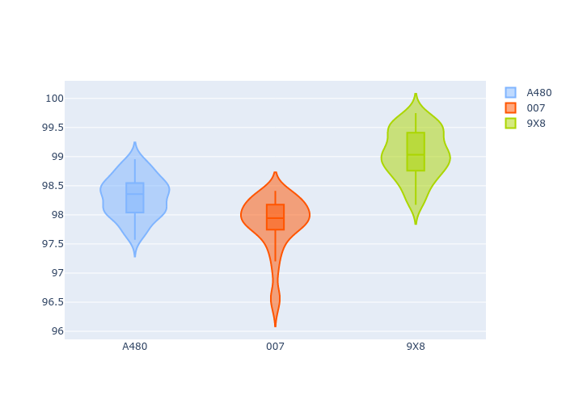
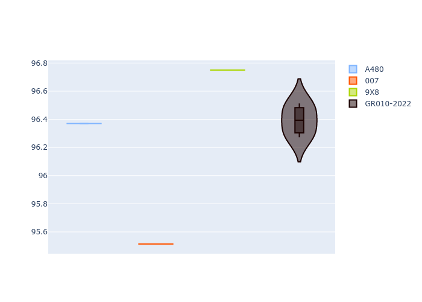
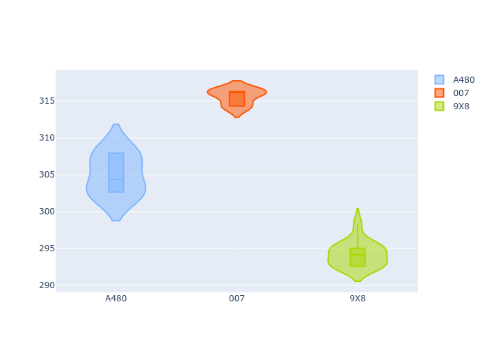
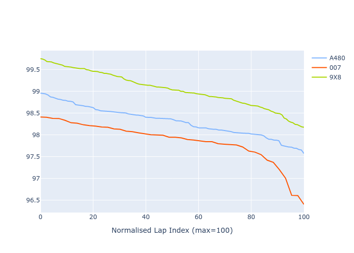

# Combined Plots

## Metadata

- BoP Accuracy: 78.93%
- Overall BoP Grade: C1
- Track: MONZA
- Threshhold: 0.0kph

## BoP Table
| Manufacturer   | Car   | Weight   | Power   | PINC   | E/Stint   | FDS    |
|:---------------|:------|:---------|:--------|:-------|:----------|:-------|
| Alpine         | A480  | 1052kg   | 428.0kw | -      | 795MJ     | -      |
| Glickenhaus    | 007   | 1030kg   | 533.0kw | -      | 921MJ     | -      |
| Peugeot        | 9X8   | 1079kg   | 515.0kw | -      | 909MJ     | 150kph |

## Performance Table
| Manufacturer   | Car   | RP      | QP      | Vavg      |   RDLC | BOP-Grade   | Match   |
|:---------------|:------|:--------|:--------|:----------|-------:|:------------|:--------|
| Alpine         | A480  | 1:38.31 | 1:36.41 | 304.99kph |   1.02 | ~A1         | 100.00% |
| Glickenhaus    | 007   | 1:37.85 | 1:35.42 | 315.60kph |   1.03 | -B1         | 86.36%  |
| Peugeot        | 9X8   | 1:39.04 | 1:36.73 | 294.21kph |   1.02 | +E2         | 50.41%  |

## Race Laptimes

## Quali Laptimes

## Topspeeds

## Laptimes Lineplot

