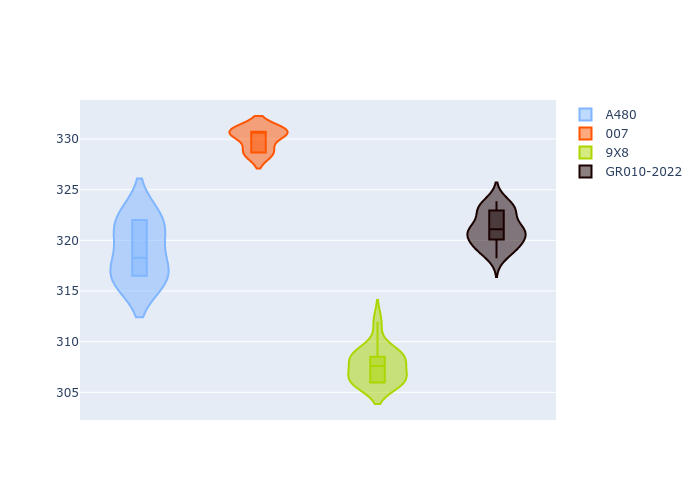

# Combined Plots

## Metadata

- BoP Accuracy: 82.66%
- Overall BoP Grade: B2
- Track: MONZA
- Threshhold: 0.0kph
- Average Laptime: 1:38.46
- Average Quali Laptime: 1:36.08
- Average Topspeed: 319.43kph

## BoP Table
| Manufacturer   | Car        | Weight   | Power   | PINC   | E/Stint   | FDS    | RDP    | QDP     | TDP   |
|:---------------|:-----------|:---------|:--------|:-------|:----------|:-------|:-------|:--------|:------|
| Alpine         | A480       | 952kg    | 428.0kw | -      | 795MJ     | -      | 54.64% | 50.00%  | 2.97% |
| Glickenhaus    | 007        | 1030kg   | 533.0kw | -      | 921MJ     | -      | 45.83% | 33.33%  | 5.66% |
| Peugeot        | 9X8        | 1079kg   | 515.0kw | -      | 909MJ     | 150kph | 56.28% | 100.00% | 6.67% |
| Toyota         | GR010-2022 | 1071kg   | 513.0kw | -      | 905MJ     | 190kph | 55.18% | 100.00% | 5.72% |

## Performance Table
| Manufacturer   | Car        | RP      | QP      | Vavg      |   RDLC | BOP-Grade   | Match   |
|:---------------|:-----------|:--------|:--------|:----------|-------:|:------------|:--------|
| Alpine         | A480       | 1:38.35 | 1:36.26 | 318.93kph |   1.02 | ~A1         | 100.00% |
| Glickenhaus    | 007        | 1:37.89 | 1:35.27 | 330.03kph |   1.03 | -B2         | 84.09%  |
| Peugeot        | 9X8        | 1:39.08 | 1:36.58 | 307.66kph |   1.03 | +E2         | 51.24%  |
| Toyota         | GR010-2022 | 1:38.52 | 1:36.22 | 321.10kph |   1.02 | ~A1         | 95.31%  |

## Race Laptimes

## Quali Laptimes

## Topspeeds

## Laptimes Lineplot

