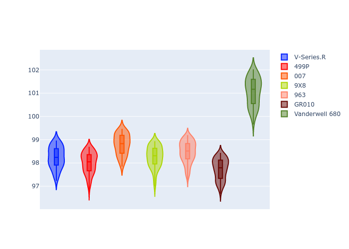
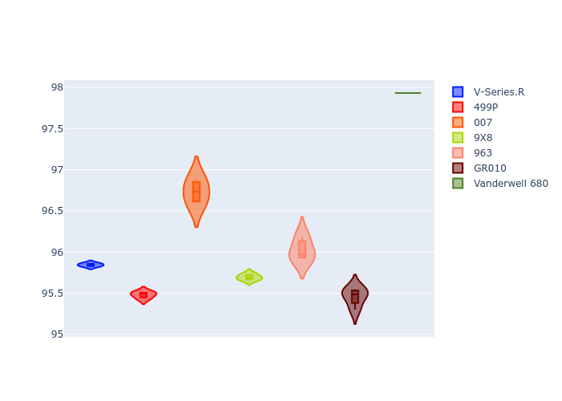
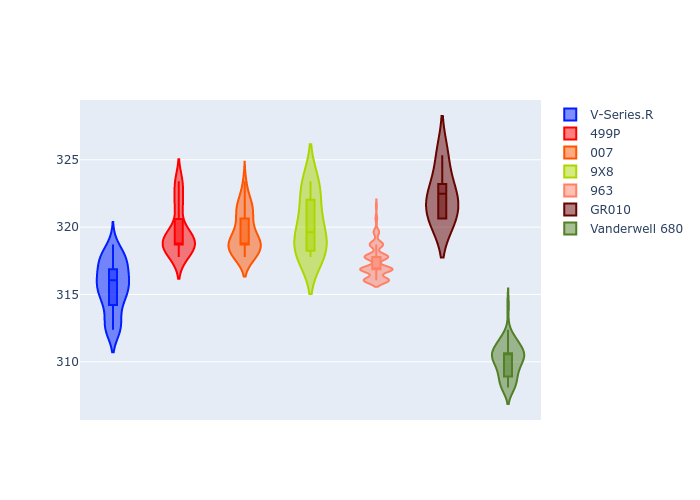
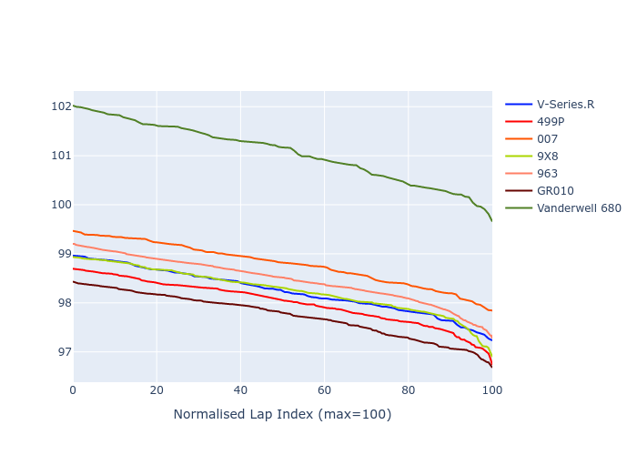

# Combined Plots

## Metadata

- BoP Accuracy: 76.85%
- Overall BoP Grade: C1
- Track: MONZA
- Threshhold: 210.0kph
- Average Laptime: 1:38.69
- Average Quali Laptime: 1:36.21
- Average Topspeed: 317.84kph

## BoP Table
| Manufacturer   | Car            | Weight   | Power   | PINC   | E/Stint   | FDS    | RDP    | QDP    | TDP    |
|:---------------|:---------------|:---------|:--------|:-------|:----------|:-------|:-------|:-------|:-------|
| Cadillac       | V-Series.R     | 1032kg   | 498.0kw | -      | 890MJ     | -      | 54.55% | 66.67% | 35.38% |
| Ferrari        | 499P           | 1069kg   | 497.0kw | -      | 893MJ     | 190kph | 56.89% | 60.00% | 4.73%  |
| Glickenhaus    | 007            | 1030kg   | 520.0kw | -      | 916MJ     | -      | 52.76% | 66.67% | 19.07% |
| Peugeot        | 9X8            | 1046kg   | 520.0kw | -      | 914MJ     | 150kph | 55.50% | 75.00% | 2.88%  |
| Porsche        | 963            | 1049kg   | 506.0kw | -      | 899MJ     | -      | 58.36% | 37.50% | 32.75% |
| Toyota         | GR010          | 1080kg   | 507.0kw | -      | 908MJ     | 190kph | 57.39% | 80.00% | 1.18%  |
| Vanwall        | Vanderwell 680 | 1030kg   | 520.0kw | -      | 913MJ     | -      | 57.07% | 33.33% | 26.09% |

## Performance Table
| Manufacturer   | Car            | RP      | QP      | Vavg      |   RDLC | BOP-Grade   | Match   |
|:---------------|:---------------|:--------|:--------|:----------|-------:|:------------|:--------|
| Cadillac       | V-Series.R     | 1:38.27 | 1:35.82 | 315.60kph |   1.03 | -A2         | 93.52%  |
| Ferrari        | 499P           | 1:38.04 | 1:35.52 | 319.70kph |   1.03 | -B1         | 86.78%  |
| Glickenhaus    | 007            | 1:38.82 | 1:36.77 | 319.62kph |   1.02 | ~A1         | 95.24%  |
| Peugeot        | 9X8            | 1:38.29 | 1:35.70 | 320.13kph |   1.03 | -A2         | 94.01%  |
| Porsche        | 963            | 1:38.51 | 1:36.12 | 317.36kph |   1.02 | ~A1         | 97.65%  |
| Toyota         | GR010          | 1:37.77 | 1:35.48 | 322.32kph |   1.02 | -C2         | 70.74%  |
| Vanwall        | Vanderwell 680 | 1:41.10 | 1:38.05 | 310.14kph |   1.03 | +Ω2         | 0.00%   |

## Race Laptimes

## Quali Laptimes

## Topspeeds

## Laptimes Lineplot

