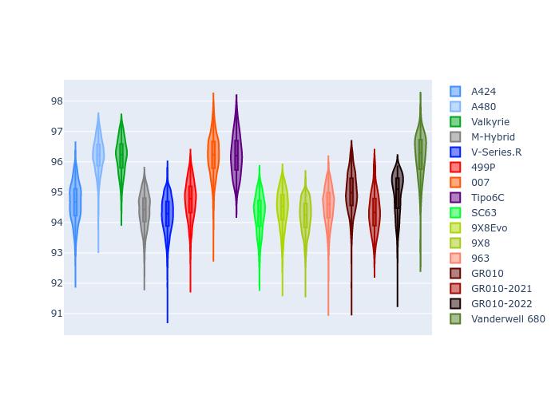
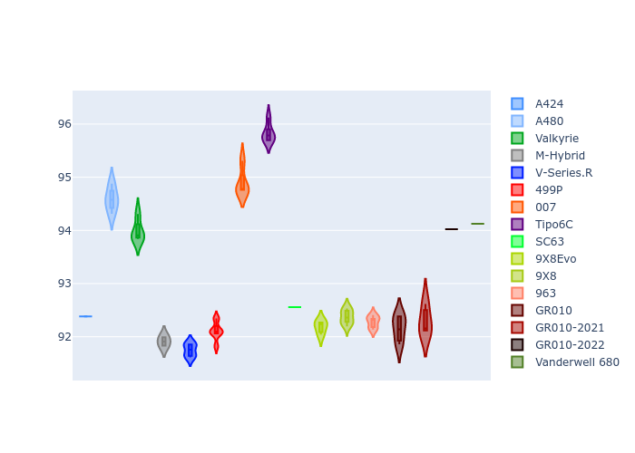
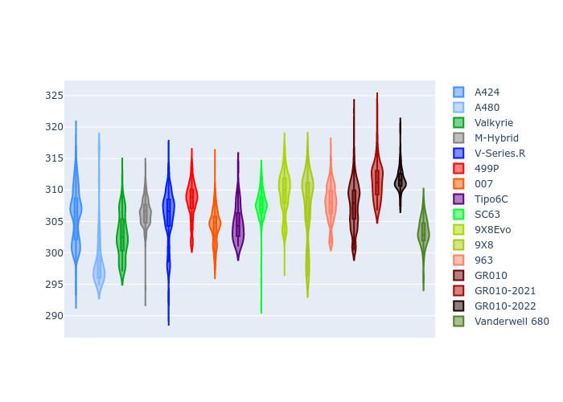
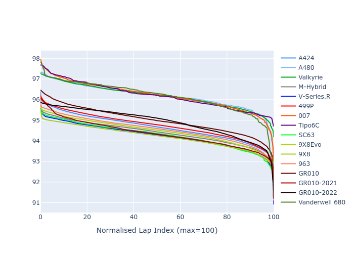

# Combined Plots

## Metadata

- BoP Accuracy: 97.35%
- Overall BoP Grade: A1
- Track: PORTIMAO
- Threshhold: 250.0kph
- Average Laptime: 1:34.40
- Average Quali Laptime: 1:32.42
- Average Topspeed: 307.82kph

## BoP Table
| Manufacturer     | Car            | Weight   | Power   | PINC   | E/Stint   | FDS    | RDP    | QDP    | TDP    |
|:-----------------|:---------------|:---------|:--------|:-------|:----------|:-------|:-------|:-------|:-------|
| Alpine           | A424           | 1068kg   | 515.0kw | +0.70% | 913MJ     | -      | 51.64% | 59.31% | 26.80% |
| Alpine           | A480           | 995kg    | 421.0kw | +0.10% | 893MJ     | -      | 54.81% | 80.56% | 55.69% |
| Aston Martin     | Valkyrie       | 1032kg   | 508.0kw | -      | 901MJ     | -      | 53.50% | 53.33% | 21.51% |
| BMW              | M-Hybrid       | 1060kg   | 517.0kw | -      | 912MJ     | -      | 52.89% | 56.22% | 33.41% |
| Cadillac         | V-Series.R     | 1050kg   | 520.0kw | -      | 911MJ     | -      | 48.63% | 60.80% | 19.01% |
| Ferrari          | 499P           | 1073kg   | 503.0kw | +0.10% | 897MJ     | 190kph | 51.38% | 44.98% | 9.83%  |
| Glickenhaus      | 007            | 1032kg   | 518.0kw | -      | 909MJ     | -      | 46.15% | 49.30% | 41.45% |
| Isotta Fraschini | Tipo6C         | 1031kg   | 515.0kw | -      | 910MJ     | 190kph | 43.95% | 47.22% | 31.53% |
| Lamborghini      | SC63           | 1032kg   | 508.0kw | -      | 897MJ     | -      | 48.33% | 60.95% | 28.65% |
| Peugeot          | 9X8Evo         | 1065kg   | 516.0kw | -0.10% | 905MJ     | 190kph | 48.87% | 52.78% | 15.41% |
| Peugeot          | 9X8            | 1056kg   | 524.0kw | -      | 917MJ     | 150kph | 54.54% | 58.39% | 9.69%  |
| Porsche          | 963            | 1063kg   | 514.0kw | -0.10% | 910MJ     | -      | 50.70% | 44.30% | 29.51% |
| Toyota           | GR010          | 1069kg   | 501.0kw | +0.10% | 897MJ     | 190kph | 51.09% | 52.71% | 11.46% |
| Toyota           | GR010-2021     | 1062kg   | 509.0kw | -0.10% | 956MJ     | 150kph | 53.89% | 50.91% | 25.87% |
| Toyota           | GR010-2022     | 1060kg   | 503.0kw | -0.10% | 894MJ     | 190kph | 53.24% | 64.49% | 9.72%  |
| Vanwall          | Vanderwell 680 | 1030kg   | 520.0kw | -      | 908MJ     | -      | 35.83% | 59.29% | 34.15% |

## Performance Table
| Manufacturer     | Car            | RP      | QP      | Vavg      |   RDLC | BOP-Grade   | Match   |
|:-----------------|:---------------|:--------|:--------|:----------|-------:|:------------|:--------|
| Alpine           | A424           | 1:34.03 | 1:31.77 | 307.02kph |   1.02 | ~A1         | 99.97%  |
| Alpine           | A480           | 1:34.53 | 1:33.47 | 297.01kph |   1.01 | +A2         | 94.25%  |
| Aston Martin     | Valkyrie       | 1:34.52 | 1:31.79 | 308.14kph |   1.03 | ~A1         | 100.00% |
| BMW              | M-Hybrid       | 1:33.97 | 1:31.38 | 307.07kph |   1.03 | ~A1         | 99.94%  |
| Cadillac         | V-Series.R     | 1:33.83 | 1:31.28 | 306.23kph |   1.03 | ~A1         | 99.68%  |
| Ferrari          | 499P           | 1:34.52 | 1:31.71 | 308.34kph |   1.03 | ~A1         | 99.62%  |
| Glickenhaus      | 007            | 1:34.51 | 1:33.24 | 310.44kph |   1.01 | ~A1         | 98.99%  |
| Isotta Fraschini | Tipo6C         | 1:34.51 | 1:34.21 | 310.90kph |   1    | +A2         | 94.78%  |
| Lamborghini      | SC63           | 1:34.52 | 1:32.78 | 306.96kph |   1.02 | ~A1         | 100.00% |
| Peugeot          | 9X8Evo         | 1:34.51 | 1:32.13 | 308.57kph |   1.03 | ~A1         | 100.00% |
| Peugeot          | 9X8            | 1:34.30 | 1:32.46 | 307.43kph |   1.02 | ~A1         | 99.96%  |
| Porsche          | 963            | 1:34.10 | 1:31.67 | 308.71kph |   1.03 | ~A1         | 99.76%  |
| Toyota           | GR010          | 1:34.52 | 1:31.69 | 309.06kph |   1.03 | ~A1         | 99.71%  |
| Toyota           | GR010-2021     | 1:34.50 | 1:32.22 | 311.54kph |   1.02 | ~A1         | 95.69%  |
| Toyota           | GR010-2022     | 1:34.52 | 1:33.61 | 312.79kph |   1.01 | ~A1         | 99.78%  |
| Vanwall          | Vanderwell 680 | 1:35.07 | 1:33.26 | 304.98kph |   1.02 | +C1         | 75.49%  |

## Race Laptimes

## Quali Laptimes

## Topspeeds

## Laptimes Lineplot

