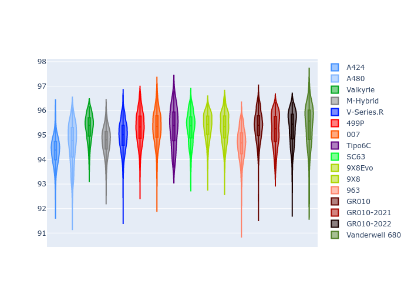

# Combined Plots

## Metadata

- BoP Accuracy: 97.54%
- Overall BoP Grade: A1
- Track: PORTIMAO
- Threshhold: 210.0kph

## BoP Table
| Manufacturer     | Car            | Weight   | Power   | PINC   | E/Stint   | FDS    |
|:-----------------|:---------------|:---------|:--------|:-------|:----------|:-------|
| Alpine           | A424           | 1067kg   | 520.0kw | -1.00% | 913MJ     | -      |
| Alpine           | A480           | 1052kg   | 432.0kw | +1.00% | 902MJ     | -      |
| Aston Martin     | Valkyrie       | 1060kg   | 504.0kw | +1.00% | 902MJ     | -      |
| BMW              | M-Hybrid       | 1061kg   | 512.0kw | -1.00% | 906MJ     | -      |
| Cadillac         | V-Series.R     | 1054kg   | 510.0kw | +1.00% | 905MJ     | -      |
| Ferrari          | 499P           | 1083kg   | 508.0kw | -1.00% | 900MJ     | 190kph |
| Glickenhaus      | 007            | 1050kg   | 520.0kw | -      | 913MJ     | -      |
| Isotta Fraschini | Tipo6C         | 1059kg   | 520.0kw | -      | 917MJ     | 190kph |
| Lamborghini      | SC63           | 1062kg   | 519.0kw | -1.00% | 908MJ     | -      |
| Peugeot          | 9X8Evo         | 1070kg   | 510.0kw | -1.00% | 899MJ     | 190kph |
| Peugeot          | 9X8            | 1050kg   | 520.0kw | -      | 912MJ     | 150kph |
| Porsche          | 963            | 1067kg   | 516.0kw | -1.00% | 910MJ     | -      |
| Toyota           | GR010          | 1097kg   | 512.0kw | -1.00% | 907MJ     | 190kph |
| Toyota           | GR010OLD       | 1085kg   | 513.0kw | +1.00% | 965MJ     | 150kph |
| Vanwall          | Vanderwell 680 | 1030kg   | 520.0kw | -      | 908MJ     | -      |

## Performance Table
| Manufacturer     | Car            | RP      | QP      | Vavg      |   RDLC | BOP-Grade   | Match   |
|:-----------------|:---------------|:--------|:--------|:----------|-------:|:------------|:--------|
| Alpine           | A424           | 1:33.53 | 1:31.24 | 305.04kph |   1.03 | ~A1         | 99.08%  |
| Alpine           | A480           | 1:33.57 | 1:32.23 | 297.40kph |   1.01 | ~A1         | 99.22%  |
| Aston Martin     | Valkyrie       | 1:34.81 | 1:31.80 | 302.96kph |   1.03 | ~A1         | 97.81%  |
| BMW              | M-Hybrid       | 1:33.90 | 1:31.29 | 302.86kph |   1.03 | ~A1         | 99.84%  |
| Cadillac         | V-Series.R     | 1:33.74 | 1:31.22 | 301.43kph |   1.03 | ~A1         | 99.60%  |
| Ferrari          | 499P           | 1:34.49 | 1:31.78 | 303.46kph |   1.03 | ~A1         | 99.58%  |
| Glickenhaus      | 007            | 1:34.03 | 1:32.42 | 302.53kph |   1.02 | ~A1         | 99.61%  |
| Isotta Fraschini | Tipo6C         | 1:34.82 | 1:34.08 | 304.43kph |   1.01 | ~A1         | 95.52%  |
| Lamborghini      | SC63           | 1:34.56 | 1:32.69 | 303.10kph |   1.02 | ~A1         | 97.71%  |
| Peugeot          | 9X8Evo         | 1:34.76 | 1:32.12 | 304.50kph |   1.03 | +A2         | 93.64%  |
| Peugeot          | 9X8            | 1:33.89 | 1:31.64 | 298.69kph |   1.02 | ~A1         | 99.93%  |
| Porsche          | 963            | 1:33.83 | 1:31.29 | 303.27kph |   1.03 | ~A1         | 99.83%  |
| Toyota           | GR010          | 1:34.81 | 1:31.99 | 303.44kph |   1.03 | ~A1         | 97.11%  |
| Toyota           | GR010OLD       | 1:33.46 | 1:31.85 | 300.77kph |   1.02 | ~A1         | 98.93%  |
| Vanwall          | Vanderwell 680 | 1:34.95 | 1:32.11 | 298.65kph |   1.03 | +B1         | 85.71%  |

## Race Laptimes

## Quali Laptimes

## Topspeeds

## Laptimes Lineplot

