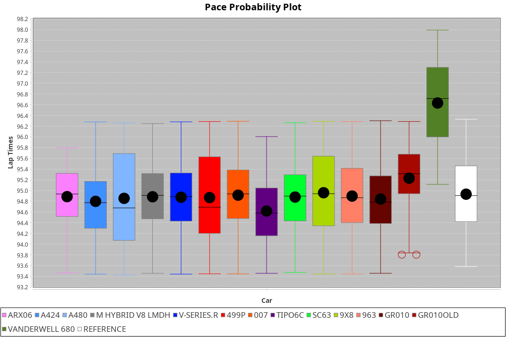
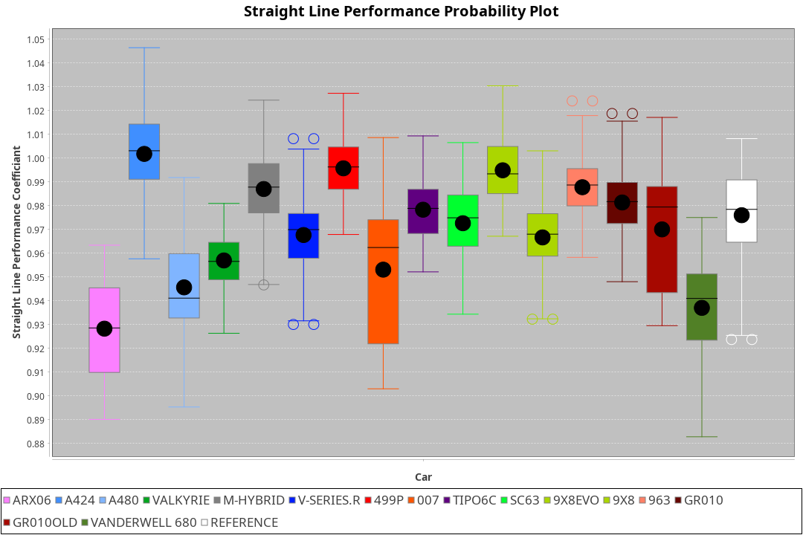

| Manufacturer     | Car            | Weight | Power   | PINC    | E/Stint | FDS     |
|:-|:-|:-|:-|:-|:-|:-|
| Acura            | ARX06          | 1070kg | 512.0kw |    -    | 912MJ   |    -    |
| Alpine           | A424           | 1057kg | 517.0kw |    -    | 912MJ   |    -    |
| Alpine           | A480           | 952kg  | 429.0kw |    -    | 896MJ   |    -    |
| Aston Martin     | Valkyrie       | 1050kg | 501.0kw | 0.40%   | 897MJ   |    -    |
| BMW              | M-Hybrid       | 1051kg | 509.0kw |    -    | 903MJ   |    -    |
| Cadillac         | V-Series.R     | 1044kg | 507.0kw |    -    | 899MJ   |    -    |
| Ferrari          | 499P           | 1073kg | 505.0kw |    -    | 899MJ   | 190kph  |
| Glickenhaus      | 007            | 1040kg | 517.0kw |    -    | 909MJ   |    -    |
| Isotta Fraschini | Tipo6C         | 1065kg | 517.0kw |    -    | 915MJ   | 190kph  |
| Lamborghini      | SC63           | 1052kg | 516.0kw |    -    | 906MJ   |    -    |
| Peugeot          | 9X8Evo         | 1060kg | 507.0kw |    -    | 897MJ   | 190kph  |
| Peugeot          | 9X8            | 1040kg | 517.0kw |    -    | 909MJ   | 150kph  |
| Porsche          | 963            | 1057kg | 513.0kw |    -    | 909MJ   |    -    |
| Toyota           | GR010          | 1085kg | 509.0kw |    -    | 906MJ   | 190kph  |
| Toyota           | GR010OLD       | 1075kg | 510.0kw |    -    | 958MJ   | 150kph  |
| Vanwall          | Vanderwell 680 | 1037kg | 517.0kw |    -    | 906MJ   |    -    |

### BoP Accuracy: 65.58%; Overall BoP Grade: D1
| Manufacturer     | Car            | Type  | RP      | QP      | Weight | Power¹  | Threshhold | PINC    | Power²   | E/Stint | AVG Vmax  | FDS     | RDLC | L/Stint | BOP-Grade | Model Accuracy | Model Points | Match% | SimDiff |
|:-|:-|:-|:-|:-|:-|:-|:-|:-|:-|:-|:-|:-|:-|:-|:-|:-|:-|:-|:-|
| Acura            | ARX06          | LMDH  | 1:35.68 | 1:32.71 | 1070kg | 512.0kw | 210.0kph   |    -    | 512.00kw |  912MJ  | 295.45kph |    -    | 1.00 | 40      | +E1       | 100.00%        | 996          | 58.59% | #       |
| Alpine           | A424           | LMDH  | 1:33.91 | 1:31.33 | 1057kg | 517.0kw | 210.0kph   |    -    | 517.00kw |  912MJ  | 302.00kph |    -    | 1.01 | 40      | -Ω1       | 97.47%         | 1810         | 44.23% | #       |
| Alpine           | A480           | LMP1  | 1:35.43 | 1:33.83 |  952kg | 429.0kw | 210.0kph   |    -    | 429.00kw |  896MJ  | 293.20kph |    -    | 0.98 | 37      | +C1       | 92.36%         | 1643         | 76.77% | +0.48   |
| Aston Martin     | Valkyrie       | LMHNH | 1:35.66 | 1:32.51 | 1050kg | 501.0kw | 210.0kph   | 0.40%   | 503.00kw |  897MJ  | 290.92kph |    -    | 1.03 | 40      | +Ω1       | 100.00%        | 466          | 49.33% | #       |
| BMW              | M-Hybrid       | LMDH  | 1:34.73 | 1:31.88 | 1051kg | 509.0kw | 210.0kph   |    -    | 509.00kw |  903MJ  | 296.70kph |    -    | 1.02 | 40      | -B1       | 100.00%        | 3339         | 89.71% | #       |
| Cadillac         | V-Series.R     | LMDH  | 1:34.57 | 1:31.64 | 1044kg | 507.0kw | 210.0kph   |    -    | 507.00kw |  899MJ  | 297.60kph |    -    | 1.03 | 40      | -B2       | 99.00%         | 6039         | 81.43% | #       |
| Ferrari          | 499P           | LMHHU | 1:35.44 | 1:32.51 | 1073kg | 505.0kw | 210.0kph   |    -    | 505.00kw |  899MJ  | 294.94kph | 190kph  | 1.03 | 40      | +C1       | 99.56%         | 7418         | 77.43% | #       |
| Glickenhaus      | 007            | LMHNH | 1:34.22 | 1:32.40 | 1040kg | 517.0kw | 210.0kph   |    -    | 517.00kw |  909MJ  | 300.87kph |    -    | 0.96 | 40      | -D2       | 93.90%         | 2170         | 63.36% | +2.19   |
| Isotta Fraschini | Tipo6C         | LMHHU | 1:35.71 | 1:34.68 | 1065kg | 517.0kw | 210.0kph   |    -    | 517.00kw |  915MJ  | 292.28kph | 190kph  | 1.06 | 40      | +Ω1       | 97.73%         | 129          | 34.79% | #       |
| Lamborghini      | SC63           | LMDH  | 1:34.89 | 1:33.07 | 1052kg | 516.0kw | 210.0kph   |    -    | 516.00kw |  906MJ  | 292.24kph |    -    | 1.05 | 40      | -A2       | 100.00%        | 784          | 94.84% | #       |
| Peugeot          | 9X8Evo         | LMHHU | 1:35.11 | 1:32.38 | 1060kg | 507.0kw | 210.0kph   |    -    | 507.00kw |  897MJ  | 305.62kph | 190kph  | 1.00 | 40      | +A2       | 100.00%        | 1889         | 93.70% | #       |
| Peugeot          | 9X8            | LMHHE | 1:33.67 | 1:31.47 | 1040kg | 517.0kw | 210.0kph   |    -    | 517.00kw |  909MJ  | 293.20kph | 150kph  | 1.04 | 40      | -Ω1       | 99.16%         | 4816         | 29.97% | +0.51   |
| Porsche          | 963            | LMDH  | 1:34.57 | 1:31.57 | 1057kg | 513.0kw | 210.0kph   |    -    | 513.00kw |  909MJ  | 295.23kph |    -    | 1.02 | 40      | -C1       | 100.00%        | 14574        | 76.94% | #       |
| Toyota           | GR010          | LMHHU | 1:35.71 | 1:32.73 | 1085kg | 509.0kw | 210.0kph   |    -    | 509.00kw |  906MJ  | 292.52kph | 190kph  | 1.02 | 40      | +E1       | 97.78%         | 5323         | 55.37% | #       |
| Toyota           | GR010OLD       | LMHHE | 1:34.05 | 1:32.02 | 1075kg | 510.0kw | 210.0kph   |    -    | 510.00kw |  958MJ  | 301.41kph | 150kph  | 1.02 | 40      | -E2       | 94.52%         | 690          | 52.38% | +0.35   |
| Vanwall          | Vanderwell 680 | LMHNH | 1:35.69 | 1:32.65 | 1037kg | 517.0kw | 210.0kph   |    -    | 517.00kw |  906MJ  | 296.40kph |    -    | 1.01 | 40      | +C2       | 95.37%         | 639          | 70.49% | +0.84   |

## Power below Threshhold
| N/Nmax    | ARX06   | A424    | VALKYRIE | M-HYBRID | V-SERIES.R | 499P    | 007     | TIPO6C  | SC63    | 9X8EVO  | 9X8     | 963     | GR010   | GR010OLD | VANDERWELL 680 | ​     | RPM      | A480    |
|:-|:-|:-|:-|:-|:-|:-|:-|:-|:-|:-|:-|:-|:-|:-|:-|:-|:-|:-|
|  0.550    |  252    |  255    |  247     |  251     |  250       |  249    |  255    |  255    |  254    |  250    |  255    |  253    |  251    |  251     |  255           |  ​    |   --     |   -     |
|  0.575    |  275    |  278    |  270     |  274     |  273       |  272    |  278    |  278    |  277    |  273    |  278    |  276    |  274    |  274     |  278           |  ​    |   --     |   -     |
|  0.600    |  296    |  298    |  290     |  294     |  293       |  292    |  298    |  298    |  298    |  293    |  298    |  296    |  294    |  295     |  298           |  ​    |   --     |   -     |
|  0.625    |  317    |  320    |  310     |  315     |  314       |  312    |  320    |  320    |  319    |  314    |  320    |  317    |  315    |  316     |  320           |  ​    |   --     |   -     |
|  0.650    |  338    |  341    |  331     |  336     |  335       |  333    |  341    |  341    |  340    |  335    |  341    |  338    |  336    |  337     |  341           |  ​    |   --     |   -     |
|  0.675    |  359    |  363    |  352     |  357     |  356       |  355    |  363    |  363    |  362    |  356    |  363    |  360    |  357    |  358     |  363           |  ​    |   --     |   -     |
|  0.700    |  381    |  385    |  373     |  379     |  377       |  376    |  385    |  385    |  384    |  377    |  385    |  382    |  379    |  380     |  385           |  ​    |   --     |   -     |
|  0.725    |  403    |  407    |  394     |  400     |  399       |  397    |  407    |  407    |  406    |  399    |  407    |  403    |  400    |  401     |  407           |  ​    |   --     |   -     |
|  0.750    |  423    |  427    |  414     |  421     |  419       |  417    |  427    |  427    |  427    |  419    |  427    |  424    |  421    |  422     |  427           |  ​    |   --     |   -     |
|  0.775    |  442    |  446    |  433     |  440     |  438       |  436    |  446    |  446    |  446    |  438    |  446    |  443    |  440    |  441     |  446           |  ​    |  5000    |  252    |
|  0.800    |  460    |  464    |  450     |  457     |  455       |  454    |  464    |  464    |  463    |  455    |  464    |  461    |  457    |  458     |  464           |  ​    |  5500    |  297    |
|  0.825    |  475    |  479    |  465     |  472     |  470       |  469    |  479    |  479    |  478    |  470    |  479    |  476    |  472    |  473     |  479           |  ​    |  6000    |  332    |
|  0.850    |  486    |  491    |  476     |  484     |  482       |  480    |  491    |  491    |  490    |  482    |  491    |  487    |  484    |  485     |  491           |  ​    |  6500    |  375    |
|  0.875    |  497    |  502    |  486     |  494     |  492       |  490    |  502    |  502    |  501    |  492    |  502    |  498    |  494    |  495     |  502           |  ​    |  7000    |  419    |
|  0.900    |  504    |  509    |  493     |  501     |  499       |  497    |  509    |  509    |  508    |  499    |  509    |  505    |  501    |  502     |  509           |  ​    |  7500    |  430    |
|  0.925    |  509    |  514    |  498     |  506     |  504       |  502    |  514    |  514    |  513    |  504    |  514    |  510    |  506    |  507     |  514           |  ​    |  8000    |  426    |
| **0.950** | **512** | **517** | **501**  | **509**  | **507**    | **505** | **517** | **517** | **516** | **507** | **517** | **513** | **509** | **510**  | **517**        | **​** | **8500** | **429** |
|  0.975    |  510    |  515    |  499     |  507     |  505       |  503    |  515    |  515    |  514    |  505    |  515    |  511    |  507    |  508     |  515           |  ​    |  9000    |  214    |
|  1.000    |  506    |  511    |  496     |  504     |  502       |  500    |  511    |  511    |  510    |  502    |  511    |  507    |  504    |  505     |  511           |  ​    |   --     |   -     |
|  1.025    |  437    |  441    |  428     |  435     |  433       |  431    |  441    |  441    |  441    |  433    |  441    |  438    |  435    |  436     |  441           |  ​    |   --     |   -     |

## Power above Threshhold
| N/Nmax    | ARX06   | A424    | VALKYRIE   | M-HYBRID | V-SERIES.R | 499P    | 007     | TIPO6C  | SC63    | 9X8EVO  | 9X8     | 963     | GR010   | GR010OLD | VANDERWELL 680 | ​     | RPM      | A480    |
|:-|:-|:-|:-|:-|:-|:-|:-|:-|:-|:-|:-|:-|:-|:-|:-|:-|:-|:-|
|  0.550    |  252    |  255    |  248.00    |  251     |  250       |  249    |  255    |  255    |  254    |  250    |  255    |  253    |  251    |  251     |  255           |  ​    |   --     |   -     |
|  0.575    |  275    |  278    |  271.00    |  274     |  273       |  272    |  278    |  278    |  277    |  273    |  278    |  276    |  274    |  274     |  278           |  ​    |   --     |   -     |
|  0.600    |  296    |  298    |  291.00    |  294     |  293       |  292    |  298    |  298    |  298    |  293    |  298    |  296    |  294    |  295     |  298           |  ​    |   --     |   -     |
|  0.625    |  317    |  320    |  311.00    |  315     |  314       |  312    |  320    |  320    |  319    |  314    |  320    |  317    |  315    |  316     |  320           |  ​    |   --     |   -     |
|  0.650    |  338    |  341    |  332.00    |  336     |  335       |  333    |  341    |  341    |  340    |  335    |  341    |  338    |  336    |  337     |  341           |  ​    |   --     |   -     |
|  0.675    |  359    |  363    |  353.00    |  357     |  356       |  355    |  363    |  363    |  362    |  356    |  363    |  360    |  357    |  358     |  363           |  ​    |   --     |   -     |
|  0.700    |  381    |  385    |  374.00    |  379     |  377       |  376    |  385    |  385    |  384    |  377    |  385    |  382    |  379    |  380     |  385           |  ​    |   --     |   -     |
|  0.725    |  403    |  407    |  395.00    |  400     |  399       |  397    |  407    |  407    |  406    |  399    |  407    |  403    |  400    |  401     |  407           |  ​    |   --     |   -     |
|  0.750    |  423    |  427    |  416.00    |  421     |  419       |  417    |  427    |  427    |  427    |  419    |  427    |  424    |  421    |  422     |  427           |  ​    |   --     |   -     |
|  0.775    |  442    |  446    |  435.00    |  440     |  438       |  436    |  446    |  446    |  446    |  438    |  446    |  443    |  440    |  441     |  446           |  ​    |  5000    |  252    |
|  0.800    |  460    |  464    |  452.00    |  457     |  455       |  454    |  464    |  464    |  463    |  455    |  464    |  461    |  457    |  458     |  464           |  ​    |  5500    |  297    |
|  0.825    |  475    |  479    |  467.00    |  472     |  470       |  469    |  479    |  479    |  478    |  470    |  479    |  476    |  472    |  473     |  479           |  ​    |  6000    |  332    |
|  0.850    |  486    |  491    |  478.00    |  484     |  482       |  480    |  491    |  491    |  490    |  482    |  491    |  487    |  484    |  485     |  491           |  ​    |  6500    |  375    |
|  0.875    |  497    |  502    |  488.00    |  494     |  492       |  490    |  502    |  502    |  501    |  492    |  502    |  498    |  494    |  495     |  502           |  ​    |  7000    |  419    |
|  0.900    |  504    |  509    |  495.00    |  501     |  499       |  497    |  509    |  509    |  508    |  499    |  509    |  505    |  501    |  502     |  509           |  ​    |  7500    |  430    |
|  0.925    |  509    |  514    |  500.00    |  506     |  504       |  502    |  514    |  514    |  513    |  504    |  514    |  510    |  506    |  507     |  514           |  ​    |  8000    |  426    |
| **0.950** | **512** | **517** | **503.00** | **509**  | **507**    | **505** | **517** | **517** | **516** | **507** | **517** | **513** | **509** | **510**  | **517**        | **​** | **8500** | **429** |
|  0.975    |  510    |  515    |  501.00    |  507     |  505       |  503    |  515    |  515    |  514    |  505    |  515    |  511    |  507    |  508     |  515           |  ​    |  9000    |  214    |
|  1.000    |  506    |  511    |  498.00    |  504     |  502       |  500    |  511    |  511    |  510    |  502    |  511    |  507    |  504    |  505     |  511           |  ​    |   --     |   -     |
|  1.025    |  437    |  441    |  430.00    |  435     |  433       |  431    |  441    |  441    |  441    |  433    |  441    |  438    |  435    |  436     |  441           |  ​    |   --     |   -     |
