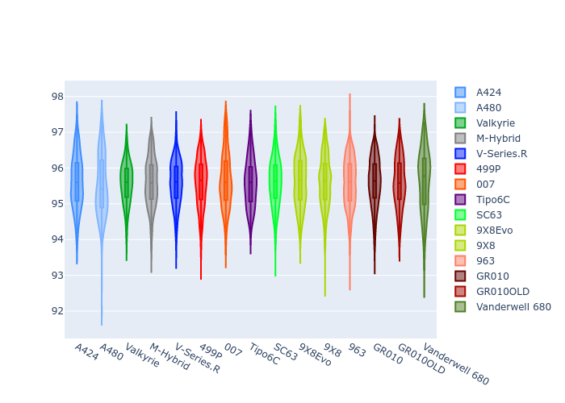
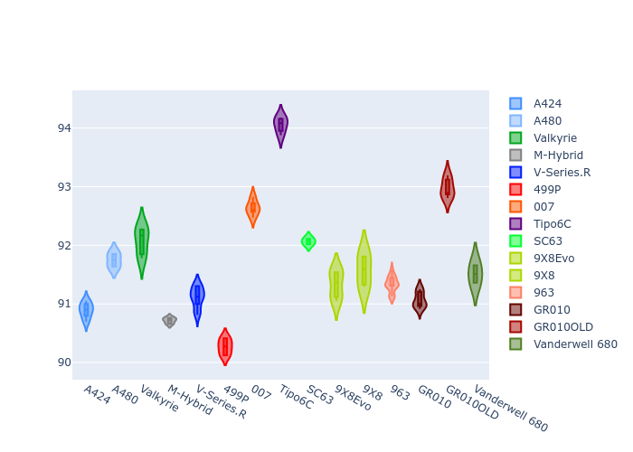
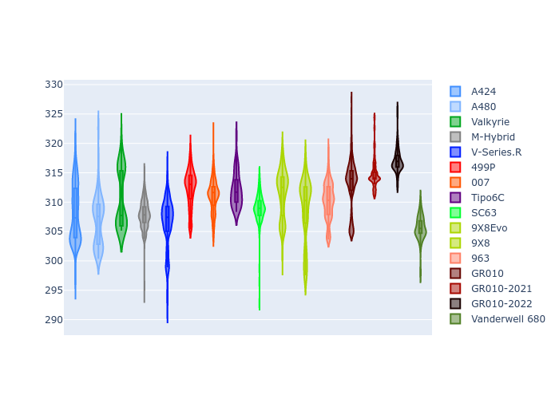
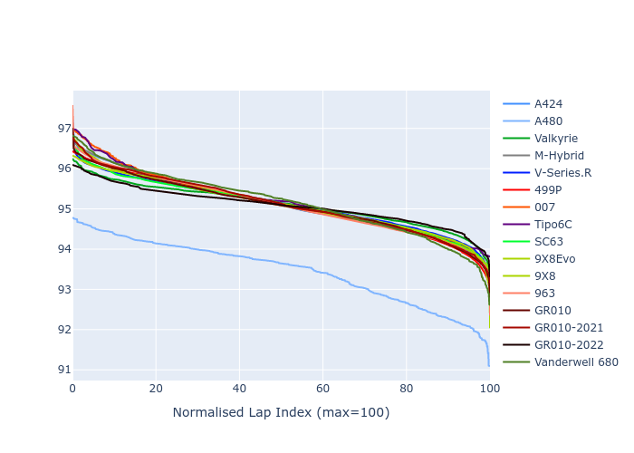

# Combined Plots

## Metadata

- BoP Accuracy: 99.47%
- Overall BoP Grade: A1
- Track: PORTIMAO
- Threshhold: 0.0kph

## BoP Table
| Manufacturer     | Car            | Weight   | Power   | PINC   | E/Stint   | FDS    |
|:-----------------|:---------------|:---------|:--------|:-------|:----------|:-------|
| Alpine           | A424           | 1056kg   | 480.0kw | -      | 878MJ     | -      |
| Alpine           | A480           | 1052kg   | 410.0kw | -      | 876MJ     | -      |
| Aston Martin     | Valkyrie       | 1033kg   | 480.0kw | -      | 875MJ     | -      |
| BMW              | M-Hybrid       | 1053kg   | 480.0kw | -      | 878MJ     | -      |
| Cadillac         | V-Series.R     | 1044kg   | 480.0kw | -      | 875MJ     | -      |
| Ferrari          | 499P           | 1065kg   | 480.0kw | -      | 876MJ     | 190kph |
| Glickenhaus      | 007            | 1031kg   | 483.0kw | -      | 878MJ     | -      |
| Isotta Fraschini | Tipo6C         | 1078kg   | 520.0kw | -      | 919MJ     | 190kph |
| Lamborghini      | SC63           | 1058kg   | 499.0kw | -      | 892MJ     | -      |
| Peugeot          | 9X8Evo         | 1044kg   | 480.0kw | -      | 871MJ     | 190kph |
| Peugeot          | 9X8            | 1040kg   | 489.0kw | -      | 884MJ     | 150kph |
| Porsche          | 963            | 1054kg   | 480.0kw | -      | 879MJ     | -      |
| Toyota           | GR010          | 1064kg   | 480.0kw | -      | 877MJ     | 190kph |
| Toyota           | GR010OLD       | 1077kg   | 480.0kw | -      | 930MJ     | 150kph |
| Vanwall          | Vanderwell 680 | 1045kg   | 520.0kw | -      | 910MJ     | -      |

## Performance Table
| Manufacturer     | Car            | RP      | QP      | Vavg      |   RDLC | BOP-Grade   | Match   |
|:-----------------|:---------------|:--------|:--------|:----------|-------:|:------------|:--------|
| Alpine           | A424           | 1:35.59 | 1:33.19 | 298.25kph |   1.03 | ~A1         | 99.46%  |
| Alpine           | A480           | 1:35.44 | 1:34.04 | 291.04kph |   1.01 | ~A1         | 97.87%  |
| Aston Martin     | Valkyrie       | 1:35.58 | 1:32.51 | 299.63kph |   1.03 | ~A1         | 100.00% |
| BMW              | M-Hybrid       | 1:35.60 | 1:32.89 | 297.48kph |   1.03 | ~A1         | 100.00% |
| Cadillac         | V-Series.R     | 1:35.57 | 1:32.94 | 295.10kph |   1.03 | ~A1         | 99.96%  |
| Ferrari          | 499P           | 1:35.59 | 1:32.80 | 299.92kph |   1.03 | ~A1         | 99.98%  |
| Glickenhaus      | 007            | 1:35.59 | 1:33.91 | 296.50kph |   1.02 | ~A1         | 97.42%  |
| Isotta Fraschini | Tipo6C         | 1:35.57 | 1:34.82 | 302.47kph |   1.01 | ~A1         | 100.00% |
| Lamborghini      | SC63           | 1:35.59 | 1:33.68 | 300.04kph |   1.02 | ~A1         | 99.52%  |
| Peugeot          | 9X8Evo         | 1:35.60 | 1:32.91 | 301.37kph |   1.03 | ~A1         | 98.70%  |
| Peugeot          | 9X8            | 1:35.60 | 1:33.26 | 293.13kph |   1.03 | ~A1         | 99.96%  |
| Porsche          | 963            | 1:35.58 | 1:32.94 | 297.55kph |   1.03 | ~A1         | 99.89%  |
| Toyota           | GR010          | 1:35.59 | 1:32.72 | 300.54kph |   1.03 | ~A1         | 99.97%  |
| Toyota           | GR010OLD       | 1:35.60 | 1:33.90 | 293.61kph |   1.02 | ~A1         | 100.00% |
| Vanwall          | Vanderwell 680 | 1:35.60 | 1:32.71 | 297.09kph |   1.03 | ~A1         | 99.26%  |

## Race Laptimes

## Quali Laptimes

## Topspeeds

## Laptimes Lineplot

