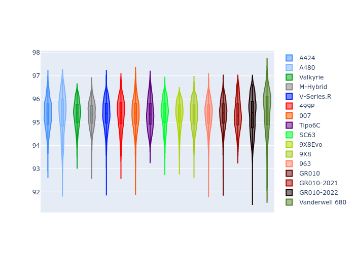
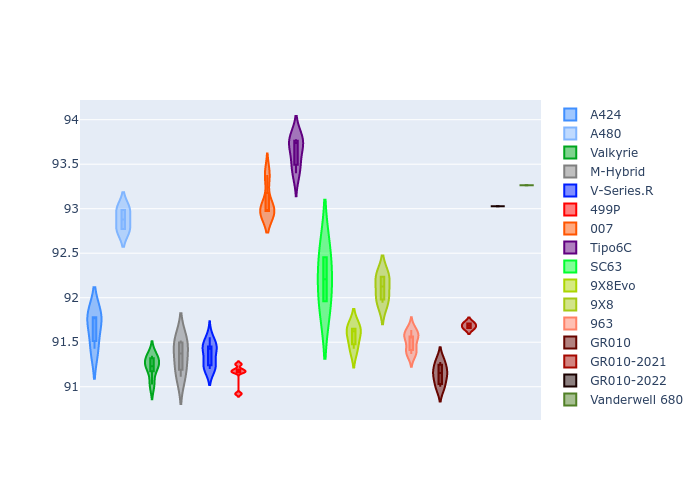
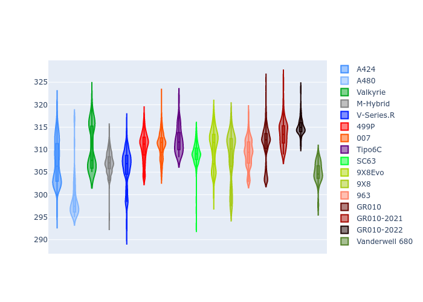
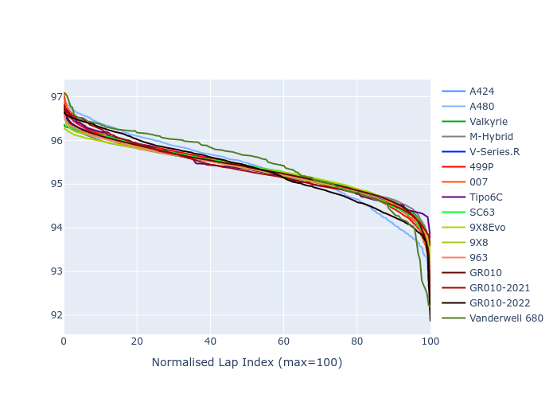

# Combined Plots

## Metadata

- BoP Accuracy: 98.86%
- Overall BoP Grade: A1
- Track: PORTIMAO
- Threshhold: 0.0kph
- Average Laptime: 1:34.86
- Average Quali Laptime: 1:32.91
- Laptime Std Dev: 0.18 seconds
- Filtered Average Topspeed: 307.13kph

## BoP Table
| Manufacturer     | Car            | Weight   | Power   | PINC   | E/Stint   | FDS    | RDP    | QDP    | TDP    |
|:-----------------|:---------------|:---------|:--------|:-------|:----------|:-------|:-------|:-------|:-------|
| Alpine           | A424           | 1041kg   | 497.0kw | -      | 884MJ     | -      | 51.45% | 55.09% | 24.89% |
| Alpine           | A480           | 932kg    | 416.0kw | -      | 880MJ     | -      | 54.77% | 76.19% | 54.04% |
| Aston Martin     | Valkyrie       | 1056kg   | 520.0kw | -      | 914MJ     | -      | 53.07% | 48.70% | 24.00% |
| BMW              | M-Hybrid       | 1042kg   | 498.0kw | -      | 893MJ     | -      | 52.63% | 52.34% | 34.06% |
| Cadillac         | V-Series.R     | 1045kg   | 504.0kw | -      | 896MJ     | -      | 48.80% | 57.26% | 18.10% |
| Ferrari          | 499P           | 1064kg   | 498.0kw | -      | 892MJ     | 200kph | 51.39% | 44.34% | 9.89%  |
| Glickenhaus      | 007            | 1044kg   | 520.0kw | -      | 913MJ     | -      | 46.14% | 49.30% | 41.45% |
| Isotta Fraschini | Tipo6C         | 1059kg   | 520.0kw | -      | 917MJ     | 190kph | 43.95% | 47.22% | 31.53% |
| Lamborghini      | SC63           | 1065kg   | 520.0kw | -      | 912MJ     | -      | 48.32% | 60.95% | 28.65% |
| Peugeot          | 9X8Evo         | 1031kg   | 497.0kw | -      | 882MJ     | 200kph | 49.16% | 50.25% | 18.00% |
| Peugeot          | 9X8            | 1036kg   | 504.0kw | -      | 897MJ     | 150kph | 54.54% | 58.39% | 9.69%  |
| Porsche          | 963            | 1039kg   | 494.0kw | -      | 890MJ     | -      | 50.61% | 41.90% | 27.68% |
| Toyota           | GR010          | 1065kg   | 498.0kw | -      | 894MJ     | 190kph | 51.33% | 51.71% | 14.89% |
| Toyota           | GR010-2021     | 1061kg   | 499.0kw | -      | 946MJ     | 200kph | 54.02% | 52.67% | 26.37% |
| Toyota           | GR010-2022     | 1058kg   | 499.0kw | -      | 891MJ     | 200kph | 53.24% | 64.49% | 9.72%  |
| Vanwall          | Vanderwell 680 | 1030kg   | 520.0kw | -      | 908MJ     | -      | 50.86% | 59.83% | 31.84% |

## Performance Table
| Manufacturer     | Car            | RP      | QP      | Vavg      |   RDLC | BOP-Grade   | Match   |
|:-----------------|:---------------|:--------|:--------|:----------|-------:|:------------|:--------|
| Alpine           | A424           | 1:34.81 | 1:32.53 | 305.40kph |   1.02 | ~A1         | 99.88%  |
| Alpine           | A480           | 1:34.81 | 1:33.26 | 303.84kph |   1.02 | ~A1         | 99.80%  |
| Aston Martin     | Valkyrie       | 1:34.82 | 1:32.69 | 307.35kph |   1.02 | ~A1         | 100.00% |
| BMW              | M-Hybrid       | 1:34.81 | 1:32.30 | 304.97kph |   1.03 | ~A1         | 100.00% |
| Cadillac         | V-Series.R     | 1:34.81 | 1:32.28 | 303.82kph |   1.03 | ~A1         | 99.90%  |
| Ferrari          | 499P           | 1:34.81 | 1:32.18 | 308.13kph |   1.03 | ~A1         | 99.92%  |
| Glickenhaus      | 007            | 1:34.80 | 1:33.55 | 309.57kph |   1.01 | ~A1         | 99.05%  |
| Isotta Fraschini | Tipo6C         | 1:34.83 | 1:34.48 | 308.98kph |   1    | ~A1         | 98.51%  |
| Lamborghini      | SC63           | 1:34.82 | 1:33.08 | 306.06kph |   1.02 | ~A1         | 100.00% |
| Peugeot          | 9X8Evo         | 1:34.81 | 1:32.52 | 308.28kph |   1.02 | ~A1         | 100.00% |
| Peugeot          | 9X8            | 1:34.83 | 1:32.97 | 305.23kph |   1.02 | ~A1         | 100.00% |
| Porsche          | 963            | 1:34.82 | 1:32.55 | 306.92kph |   1.02 | ~A1         | 99.92%  |
| Toyota           | GR010          | 1:34.82 | 1:32.00 | 308.22kph |   1.03 | ~A1         | 99.54%  |
| Toyota           | GR010-2021     | 1:34.80 | 1:32.76 | 309.75kph |   1.02 | ~A1         | 97.20%  |
| Toyota           | GR010-2022     | 1:34.81 | 1:33.92 | 312.20kph |   1.01 | ~A1         | 99.55%  |
| Vanwall          | Vanderwell 680 | 1:35.55 | 1:33.53 | 305.42kph |   1.02 | +B1         | 88.54%  |

## Race Laptimes

## Quali Laptimes

## Topspeeds

## Laptimes Lineplot

