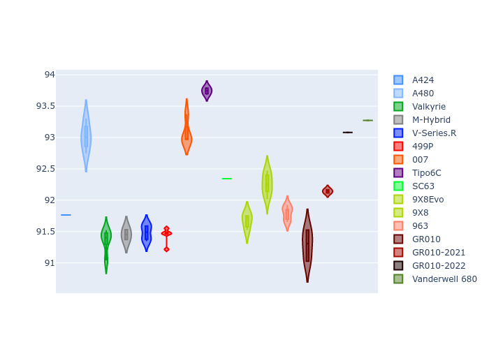

# Combined Plots

## Metadata

- BoP Accuracy: 97.48%
- Overall BoP Grade: A1
- Track: PORTIMAO
- Threshhold: 0.0kph

## BoP Table
| Manufacturer     | Car            | Weight   | Power   | PINC   | E/Stint   | FDS    | RDP    | QDP    | TDP    |
|:-----------------|:---------------|:---------|:--------|:-------|:----------|:-------|:-------|:-------|:-------|
| Alpine           | A424           | 1057kg   | 480.0kw | -      | 878MJ     | -      | 52.35% | 61.85% | 27.84% |
| Alpine           | A480           | 952kg    | 410.0kw | -      | 876MJ     | -      | 54.51% | 76.19% | 54.04% |
| Aston Martin     | Valkyrie       | 1031kg   | 481.0kw | -      | 876MJ     | -      | 53.59% | 53.33% | 21.51% |
| BMW              | M-Hybrid       | 1053kg   | 480.0kw | -      | 878MJ     | -      | 53.26% | 57.23% | 34.54% |
| Cadillac         | V-Series.R     | 1043kg   | 480.0kw | -      | 874MJ     | -      | 47.80% | 56.73% | 19.63% |
| Ferrari          | 499P           | 1079kg   | 480.0kw | -      | 877MJ     | 190kph | 53.02% | 42.32% | 9.88%  |
| Glickenhaus      | 007            | 1030kg   | 486.0kw | -      | 881MJ     | -      | 46.49% | 46.07% | 47.78% |
| Isotta Fraschini | Tipo6C         | 1079kg   | 520.0kw | -      | 919MJ     | 190kph | 43.95% | 47.22% | 31.53% |
| Lamborghini      | SC63           | 1058kg   | 501.0kw | -      | 894MJ     | -      | 46.33% | 59.50% | 29.33% |
| Peugeot          | 9X8Evo         | 1041kg   | 480.0kw | -      | 871MJ     | 190kph | 48.47% | 51.26% | 16.02% |
| Peugeot          | 9X8            | 1043kg   | 487.0kw | -      | 882MJ     | 150kph | 54.07% | 57.08% | 10.80% |
| Porsche          | 963            | 1055kg   | 480.0kw | -      | 879MJ     | -      | 50.87% | 45.25% | 30.77% |
| Toyota           | GR010          | 1084kg   | 480.0kw | -      | 880MJ     | 190kph | 52.43% | 57.12% | 12.82% |
| Toyota           | GR010-2021     | 1075kg   | 483.0kw | -      | 933MJ     | 150kph | 54.09% | 52.67% | 26.37% |
| Toyota           | GR010-2022     | 1080kg   | 480.0kw | -      | 876MJ     | 190kph | 53.48% | 69.44% | 7.86%  |
| Vanwall          | Vanderwell 680 | 1036kg   | 520.0kw | -      | 909MJ     | -      | 53.41% | 56.28% | 29.85% |

## Performance Table
| Manufacturer     | Car            | RP      | QP      | Vavg      |   RDLC | BOP-Grade   | Match   |
|:-----------------|:---------------|:--------|:--------|:----------|-------:|:------------|:--------|
| Alpine           | A424           | 1:35.10 | 1:32.60 | 297.94kph |   1.03 | ~A1         | 99.22%  |
| Alpine           | A480           | 1:33.46 | 1:31.90 | 292.77kph |   1.02 | -C1         | 75.20%  |
| Aston Martin     | Valkyrie       | 1:35.10 | 1:32.05 | 300.07kph |   1.03 | ~A1         | 100.00% |
| BMW              | M-Hybrid       | 1:35.10 | 1:32.26 | 297.44kph |   1.03 | ~A1         | 99.46%  |
| Cadillac         | V-Series.R     | 1:35.10 | 1:32.30 | 294.97kph |   1.03 | ~A1         | 99.74%  |
| Ferrari          | 499P           | 1:35.09 | 1:31.82 | 298.43kph |   1.04 | ~A1         | 99.83%  |
| Glickenhaus      | 007            | 1:35.09 | 1:33.43 | 297.27kph |   1.02 | ~A1         | 96.04%  |
| Isotta Fraschini | Tipo6C         | 1:35.09 | 1:34.44 | 302.37kph |   1.01 | ~A1         | 95.52%  |
| Lamborghini      | SC63           | 1:35.08 | 1:33.14 | 300.47kph |   1.02 | ~A1         | 100.00% |
| Peugeot          | 9X8Evo         | 1:35.10 | 1:32.42 | 301.68kph |   1.03 | ~A1         | 98.95%  |
| Peugeot          | 9X8            | 1:35.10 | 1:32.46 | 290.99kph |   1.03 | ~A1         | 99.94%  |
| Porsche          | 963            | 1:35.09 | 1:32.31 | 297.81kph |   1.03 | ~A1         | 99.84%  |
| Toyota           | GR010          | 1:35.08 | 1:31.71 | 298.94kph |   1.04 | ~A1         | 99.71%  |
| Toyota           | GR010-2021     | 1:35.09 | 1:32.63 | 291.09kph |   1.03 | ~A1         | 98.97%  |
| Toyota           | GR010-2022     | 1:35.08 | 1:33.33 | 297.10kph |   1.02 | ~A1         | 100.00% |
| Vanwall          | Vanderwell 680 | 1:35.10 | 1:32.29 | 298.02kph |   1.03 | ~A1         | 97.17%  |

## Race Laptimes

## Quali Laptimes

## Topspeeds

## Laptimes Lineplot

