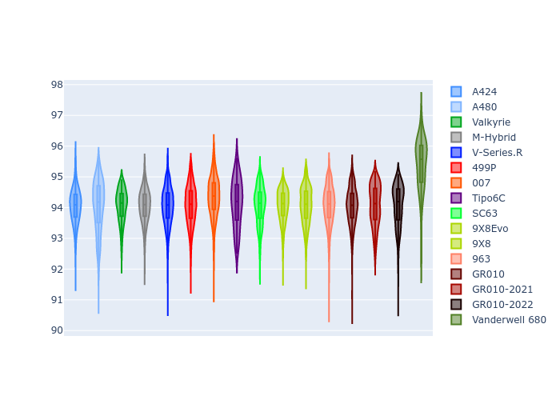
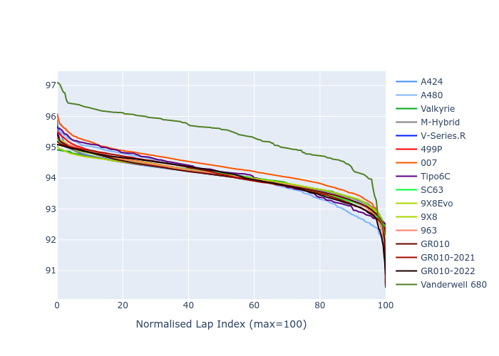

# Combined Plots

## Metadata

- BoP Accuracy: 96.37%
- Overall BoP Grade: A1
- Track: PORTIMAO
- Threshhold: 0.0kph
- Average Laptime: 1:34.17
- Average Quali Laptime: 1:32.20
- Average Topspeed: 310.34kph

## BoP Table
| Manufacturer     | Car            | Weight   | Power   | PINC   | E/Stint   | FDS    | RDP    | QDP    | TDP    |
|:-----------------|:---------------|:---------|:--------|:-------|:----------|:-------|:-------|:-------|:-------|
| Alpine           | A424           | 1041kg   | 510.0kw | -      | 904MJ     | -      | 51.64% | 59.31% | 26.80% |
| Alpine           | A480           | 930kg    | 428.0kw | -      | 893MJ     | -      | 53.05% | 74.07% | 48.97% |
| Aston Martin     | Valkyrie       | 1034kg   | 520.0kw | -      | 911MJ     | -      | 53.50% | 53.33% | 21.51% |
| BMW              | M-Hybrid       | 1042kg   | 512.0kw | -      | 906MJ     | -      | 52.89% | 56.22% | 33.41% |
| Cadillac         | V-Series.R     | 1046kg   | 519.0kw | -      | 910MJ     | -      | 48.63% | 60.80% | 19.01% |
| Ferrari          | 499P           | 1065kg   | 518.0kw | -      | 910MJ     | 190kph | 51.38% | 44.98% | 9.83%  |
| Glickenhaus      | 007            | 1030kg   | 520.0kw | -      | 911MJ     | -      | 46.15% | 49.30% | 41.45% |
| Isotta Fraschini | Tipo6C         | 1030kg   | 520.0kw | -      | 914MJ     | 180kph | 43.95% | 47.22% | 31.53% |
| Lamborghini      | SC63           | 1037kg   | 520.0kw | -      | 909MJ     | -      | 48.33% | 60.95% | 28.65% |
| Peugeot          | 9X8Evo         | 1030kg   | 512.0kw | -      | 898MJ     | 190kph | 48.87% | 52.78% | 15.41% |
| Peugeot          | 9X8            | 1035kg   | 520.0kw | -      | 911MJ     | 150kph | 54.54% | 58.39% | 9.69%  |
| Porsche          | 963            | 1040kg   | 509.0kw | -      | 903MJ     | -      | 50.70% | 44.30% | 29.51% |
| Toyota           | GR010          | 1062kg   | 516.0kw | -      | 910MJ     | 190kph | 51.09% | 52.71% | 11.46% |
| Toyota           | GR010-2021     | 1061kg   | 516.0kw | -      | 962MJ     | 150kph | 54.08% | 54.81% | 9.72%  |
| Toyota           | GR010-2022     | 1058kg   | 520.0kw | -      | 909MJ     | 190kph | 53.45% | 68.83% | 9.58%  |
| Vanwall          | Vanderwell 680 | 1030kg   | 520.0kw | -      | 908MJ     | -      | 49.68% | 60.93% | 34.43% |

## Performance Table
| Manufacturer     | Car            | RP      | QP      | Vavg      |   RDLC | BOP-Grade   | Match   |
|:-----------------|:---------------|:--------|:--------|:----------|-------:|:------------|:--------|
| Alpine           | A424           | 1:34.04 | 1:31.76 | 308.16kph |   1.02 | ~A1         | 99.36%  |
| Alpine           | A480           | 1:34.05 | 1:33.02 | 306.86kph |   1.01 | ~A1         | 99.73%  |
| Aston Martin     | Valkyrie       | 1:34.07 | 1:31.36 | 310.54kph |   1.03 | ~A1         | 100.00% |
| BMW              | M-Hybrid       | 1:34.06 | 1:31.45 | 307.89kph |   1.03 | ~A1         | 100.00% |
| Cadillac         | V-Series.R     | 1:34.05 | 1:31.48 | 306.44kph |   1.03 | ~A1         | 99.79%  |
| Ferrari          | 499P           | 1:34.08 | 1:31.44 | 312.39kph |   1.03 | ~A1         | 99.98%  |
| Glickenhaus      | 007            | 1:34.34 | 1:33.07 | 311.09kph |   1.01 | ~A1         | 97.09%  |
| Isotta Fraschini | Tipo6C         | 1:34.12 | 1:33.74 | 312.10kph |   1    | ~A1         | 98.51%  |
| Lamborghini      | SC63           | 1:34.07 | 1:32.34 | 309.02kph |   1.02 | ~A1         | 100.00% |
| Peugeot          | 9X8Evo         | 1:34.06 | 1:31.67 | 311.54kph |   1.03 | ~A1         | 100.00% |
| Peugeot          | 9X8            | 1:34.07 | 1:32.26 | 308.81kph |   1.02 | ~A1         | 100.00% |
| Porsche          | 963            | 1:34.07 | 1:31.79 | 310.15kph |   1.02 | ~A1         | 99.84%  |
| Toyota           | GR010          | 1:34.05 | 1:31.29 | 313.03kph |   1.03 | ~A1         | 99.79%  |
| Toyota           | GR010-2021     | 1:34.07 | 1:32.14 | 314.77kph |   1.02 | ~A1         | 100.00% |
| Toyota           | GR010-2022     | 1:34.07 | 1:33.08 | 317.05kph |   1.01 | ~A1         | 99.49%  |
| Vanwall          | Vanderwell 680 | 1:35.39 | 1:33.27 | 305.61kph |   1.02 | +Ω1         | 48.34%  |

## Race Laptimes

## Quali Laptimes

## Topspeeds

## Laptimes Lineplot

