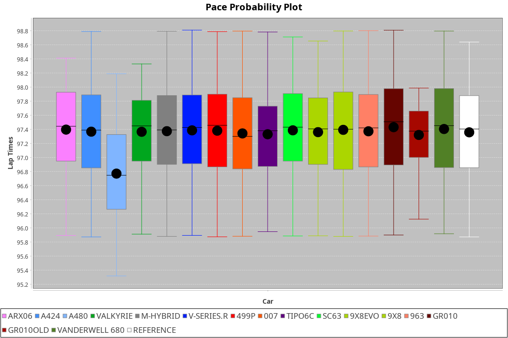
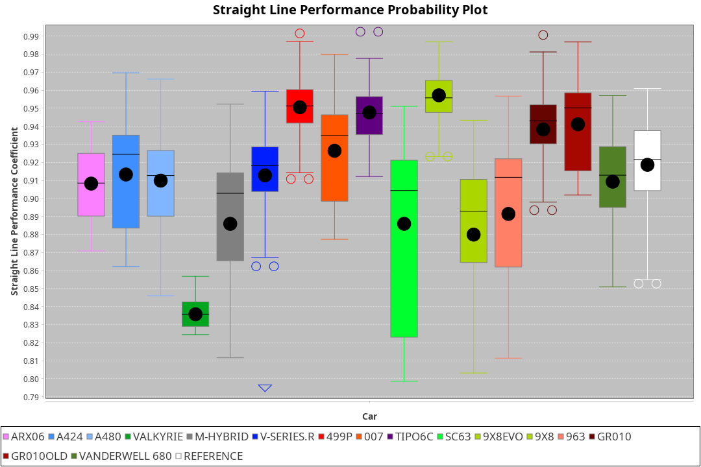
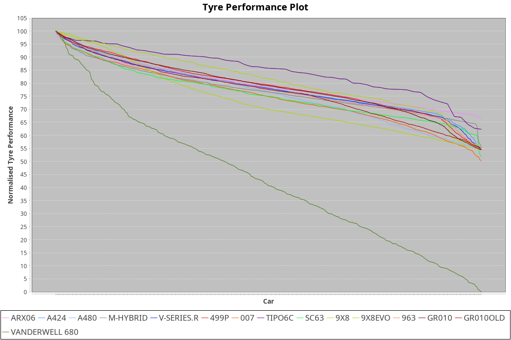

| Manufacturer     | Car            | Weight | Power   | PINC    | E/Stint | FDS     |
|:-|:-|:-|:-|:-|:-|:-|
| Acura            | ARX06          | 1049kg | 517.0kw |    -    | 914MJ   |    -    |
| Alpine           | A424           | 1033kg | 520.0kw |    -    | 913MJ   |    -    |
| Alpine           | A480           | 931kg  | 431.0kw |    -    | 763MJ   |    -    |
| BMW              | M-Hybrid       | 1036kg | 520.0kw |    -    | 911MJ   |    -    |
| Cadillac         | V-Series.R     | 1040kg | 518.0kw |    -    | 906MJ   |    -    |
| Ferrari          | 499P           | 1060kg | 516.0kw |    -    | 906MJ   | 190kph  |
| Glickenhaus      | 007            | 1030kg | 520.0kw |    -    | 910MJ   |    -    |
| Isotta Fraschini | Tipo6C         | 1030kg | 520.0kw |    -    | 914MJ   | 130kph  |
| Lamborghini      | SC63           | 1030kg | 520.0kw |    -    | 910MJ   |    -    |
| Peugeot          | 9X8            | 1034kg | 496.0kw |    -    | 883MJ   |    -    |
| Peugeot          | 9X8Evo         | 1032kg | 514.0kw |    -    | 906MJ   | 190kph  |
| Porsche          | 963            | 1035kg | 516.0kw |    -    | 901MJ   |    -    |
| Toyota           | GR010          | 1063kg | 516.0kw |    -    | 906MJ   | 190kph  |
| Toyota           | GR010OLD       | 1082kg | 480.0kw |    -    | 878MJ   |    -    |
| Vanwall          | Vanderwell 680 | 1030kg | 520.0kw |    -    | 903MJ   |    -    |

### BoP Accuracy: 81.22%; Overall BoP Grade: B2
| Manufacturer     | Car            | Type  | RP      | QP      | Weight | Power¹  | Threshhold | PINC    | Power²   | E/Stint | AVG Vmax  | FDS     | RDLC | L/Stint | BOP-Grade | Model Accuracy | Model Points | Match%  | SimDiff |
|:-|:-|:-|:-|:-|:-|:-|:-|:-|:-|:-|:-|:-|:-|:-|:-|:-|:-|:-|:-|
| Acura            | ARX06          | LMDH  | 1:32.67 | 1:29.67 | 1049kg | 517.0kw | 0.0kph     |    -    | 517.00kw |  914MJ  | 298.63kph |    -    | 1.02 | 39      | -D1       | 100.00%        | 995          | 67.51%  | #       |
| Alpine           | A424           | LMDH  | 1:32.67 | 1:30.27 | 1033kg | 520.0kw | 0.0kph     |    -    | 520.00kw |  913MJ  | 311.62kph |    -    | 1.02 | 39      | -A2       | 86.43%         | 618          | 91.82%  | #       |
| Alpine           | A480           | LMP1  | 1:32.68 | 1:30.83 |  931kg | 431.0kw | 0.0kph     |    -    | 431.00kw |  763MJ  | 298.02kph |    -    | 0.99 | 37      | ~A1       | 68.63%         | 967          | 100.00% | ±0.11s  |
| BMW              | M-Hybrid       | LMDH  | 1:32.68 | 1:29.87 | 1036kg | 520.0kw | 0.0kph     |    -    | 520.00kw |  911MJ  | 308.43kph |    -    | 1.02 | 39      | -B1       | 93.77%         | 1672         | 87.52%  | #       |
| Cadillac         | V-Series.R     | LMDH  | 1:32.67 | 1:30.25 | 1040kg | 518.0kw | 0.0kph     |    -    | 518.00kw |  906MJ  | 304.54kph |    -    | 1.02 | 39      | -A2       | 83.12%         | 1921         | 94.19%  | ±1.58s  |
| Ferrari          | 499P           | LMHHU | 1:32.67 | 1:30.12 | 1060kg | 516.0kw | 0.0kph     |    -    | 516.00kw |  906MJ  | 308.04kph | 190kph  | 1.02 | 39      | ~A1       | 69.49%         | 1950         | 100.00% | ±1.73s  |
| Glickenhaus      | 007            | LMHNH | 1:33.18 | 1:31.44 | 1030kg | 520.0kw | 0.0kph     |    -    | 520.00kw |  910MJ  | 305.34kph |    -    | 0.97 | 39      | ~A1       | 89.50%         | 1518         | 100.00% | ±2.57s  |
| Isotta Fraschini | Tipo6C         | LMHHU | 1:32.64 | 1:31.57 | 1030kg | 520.0kw | 0.0kph     |    -    | 520.00kw |  914MJ  | 307.01kph | 130kph  | 1.07 | 39      | +C2       | 73.56%         | 64           | 73.08%  | #       |
| Lamborghini      | SC63           | LMDH  | 1:33.02 | 1:32.06 | 1030kg | 520.0kw | 0.0kph     |    -    | 520.00kw |  910MJ  | 308.06kph |    -    | 1.05 | 39      | +B1       | 95.82%         | 459          | 88.52%  | #       |
| Peugeot          | 9X8            | LMHHE | 1:32.68 | 1:30.34 | 1034kg | 496.0kw | 0.0kph     |    -    | 496.00kw |  883MJ  | 298.75kph |    -    | 1.03 | 39      | -A2       | 88.75%         | 2383         | 91.26%  | ±0.93s  |
| Peugeot          | 9X8Evo         | LMHHU | 1:32.68 | 1:30.17 | 1032kg | 514.0kw | 0.0kph     |    -    | 514.00kw |  906MJ  | 308.93kph | 190kph  | 1.03 | 39      | ~A1       | 66.97%         | 221          | 100.00% | #       |
| Porsche          | 963            | LMDH  | 1:32.67 | 1:30.07 | 1035kg | 516.0kw | 0.0kph     |    -    | 516.00kw |  901MJ  | 307.64kph |    -    | 1.02 | 39      | ~A1       | 81.02%         | 5243         | 95.16%  | ±1.85s  |
| Toyota           | GR010          | LMHHU | 1:32.67 | 1:30.25 | 1063kg | 516.0kw | 0.0kph     |    -    | 516.00kw |  906MJ  | 306.44kph | 190kph  | 1.02 | 39      | ~A1       | 73.70%         | 2701         | 99.80%  | ±1.28s  |
| Toyota           | GR010OLD       | LMHHE | 1:32.67 | 1:29.91 | 1082kg | 480.0kw | 0.0kph     |    -    | 480.00kw |  878MJ  | 293.36kph |    -    | 1.01 | 39      | -B1       | 99.03%         | 1536         | 86.13%  | ±0.55s  |
| Vanwall          | Vanderwell 680 | LMHNH | 1:35.95 | 1:32.64 | 1030kg | 520.0kw | 0.0kph     |    -    | 520.00kw |  903MJ  | 298.05kph |    -    | 1.02 | 39      | +Ω2       | 97.01%         | 649          | -56.75% | ±0.59s  |

## Power below Threshhold
| N/Nmax    | ARX06   | A424    | M-HYBRID | V-SERIES.R | 499P    | 007     | TIPO6C  | SC63    | 9X8     | 9X8EVO  | 963     | GR010   | GR010OLD | VANDERWELL 680 | ​     | RPM      | A480    |
|:-|:-|:-|:-|:-|:-|:-|:-|:-|:-|:-|:-|:-|:-|:-|:-|:-|:-|
|  0.550    |  255    |  256    |  256     |  255       |  254    |  256    |  256    |  256    |  244    |  253    |  254    |  254    |  236     |  256           |  ​    |   --     |   -     |
|  0.575    |  278    |  279    |  279     |  278       |  277    |  279    |  279    |  279    |  267    |  276    |  277    |  277    |  258     |  279           |  ​    |   --     |   -     |
|  0.600    |  298    |  300    |  300     |  299       |  298    |  300    |  300    |  300    |  287    |  297    |  298    |  298    |  277     |  300           |  ​    |   --     |   -     |
|  0.625    |  320    |  322    |  322     |  321       |  319    |  322    |  322    |  322    |  307    |  318    |  319    |  319    |  297     |  322           |  ​    |   --     |   -     |
|  0.650    |  341    |  343    |  343     |  342       |  340    |  343    |  343    |  343    |  327    |  339    |  340    |  340    |  317     |  343           |  ​    |   --     |   -     |
|  0.675    |  363    |  365    |  365     |  364       |  362    |  365    |  365    |  365    |  348    |  361    |  362    |  362    |  337     |  365           |  ​    |   --     |   -     |
|  0.700    |  385    |  387    |  387     |  386       |  384    |  387    |  387    |  387    |  369    |  383    |  384    |  384    |  358     |  387           |  ​    |   --     |   -     |
|  0.725    |  407    |  409    |  409     |  407       |  406    |  409    |  409    |  409    |  390    |  404    |  406    |  406    |  378     |  409           |  ​    |   --     |   -     |
|  0.750    |  427    |  430    |  430     |  428       |  427    |  430    |  430    |  430    |  410    |  425    |  427    |  427    |  397     |  430           |  ​    |   --     |   -     |
|  0.775    |  446    |  449    |  449     |  447       |  446    |  449    |  449    |  449    |  429    |  444    |  446    |  446    |  415     |  449           |  ​    |  5000    |  253    |
|  0.800    |  464    |  467    |  467     |  465       |  463    |  467    |  467    |  467    |  445    |  462    |  463    |  463    |  431     |  467           |  ​    |  5500    |  299    |
|  0.825    |  479    |  482    |  482     |  480       |  478    |  482    |  482    |  482    |  460    |  477    |  478    |  478    |  445     |  482           |  ​    |  6000    |  334    |
|  0.850    |  491    |  494    |  494     |  492       |  490    |  494    |  494    |  494    |  471    |  488    |  490    |  490    |  456     |  494           |  ​    |  6500    |  377    |
|  0.875    |  502    |  505    |  505     |  503       |  501    |  505    |  505    |  505    |  481    |  499    |  501    |  501    |  466     |  505           |  ​    |  7000    |  421    |
|  0.900    |  509    |  512    |  512     |  510       |  508    |  512    |  512    |  512    |  488    |  506    |  508    |  508    |  472     |  512           |  ​    |  7500    |  432    |
|  0.925    |  514    |  517    |  517     |  515       |  513    |  517    |  517    |  517    |  493    |  511    |  513    |  513    |  477     |  517           |  ​    |  8000    |  428    |
| **0.950** | **517** | **520** | **520**  | **518**    | **516** | **520** | **520** | **520** | **496** | **514** | **516** | **516** | **480**  | **520**        | **​** | **8500** | **431** |
|  0.975    |  515    |  518    |  518     |  516       |  514    |  518    |  518    |  518    |  494    |  512    |  514    |  514    |  478     |  518           |  ​    |  9000    |  216    |
|  1.000    |  511    |  514    |  514     |  512       |  510    |  514    |  514    |  514    |  491    |  508    |  510    |  510    |  475     |  514           |  ​    |   --     |   -     |
|  1.025    |  441    |  444    |  444     |  442       |  441    |  444    |  444    |  444    |  424    |  439    |  441    |  441    |  410     |  444           |  ​    |   --     |   -     |

## Power above Threshhold
| N/Nmax    | ARX06   | A424    | M-HYBRID | V-SERIES.R | 499P    | 007     | TIPO6C  | SC63    | 9X8     | 9X8EVO  | 963     | GR010   | GR010OLD | VANDERWELL 680 | ​     | RPM      | A480    |
|:-|:-|:-|:-|:-|:-|:-|:-|:-|:-|:-|:-|:-|:-|:-|:-|:-|:-|
|  0.550    |  255    |  256    |  256     |  255       |  254    |  256    |  256    |  256    |  244    |  253    |  254    |  254    |  236     |  256           |  ​    |   --     |   -     |
|  0.575    |  278    |  279    |  279     |  278       |  277    |  279    |  279    |  279    |  267    |  276    |  277    |  277    |  258     |  279           |  ​    |   --     |   -     |
|  0.600    |  298    |  300    |  300     |  299       |  298    |  300    |  300    |  300    |  287    |  297    |  298    |  298    |  277     |  300           |  ​    |   --     |   -     |
|  0.625    |  320    |  322    |  322     |  321       |  319    |  322    |  322    |  322    |  307    |  318    |  319    |  319    |  297     |  322           |  ​    |   --     |   -     |
|  0.650    |  341    |  343    |  343     |  342       |  340    |  343    |  343    |  343    |  327    |  339    |  340    |  340    |  317     |  343           |  ​    |   --     |   -     |
|  0.675    |  363    |  365    |  365     |  364       |  362    |  365    |  365    |  365    |  348    |  361    |  362    |  362    |  337     |  365           |  ​    |   --     |   -     |
|  0.700    |  385    |  387    |  387     |  386       |  384    |  387    |  387    |  387    |  369    |  383    |  384    |  384    |  358     |  387           |  ​    |   --     |   -     |
|  0.725    |  407    |  409    |  409     |  407       |  406    |  409    |  409    |  409    |  390    |  404    |  406    |  406    |  378     |  409           |  ​    |   --     |   -     |
|  0.750    |  427    |  430    |  430     |  428       |  427    |  430    |  430    |  430    |  410    |  425    |  427    |  427    |  397     |  430           |  ​    |   --     |   -     |
|  0.775    |  446    |  449    |  449     |  447       |  446    |  449    |  449    |  449    |  429    |  444    |  446    |  446    |  415     |  449           |  ​    |  5000    |  253    |
|  0.800    |  464    |  467    |  467     |  465       |  463    |  467    |  467    |  467    |  445    |  462    |  463    |  463    |  431     |  467           |  ​    |  5500    |  299    |
|  0.825    |  479    |  482    |  482     |  480       |  478    |  482    |  482    |  482    |  460    |  477    |  478    |  478    |  445     |  482           |  ​    |  6000    |  334    |
|  0.850    |  491    |  494    |  494     |  492       |  490    |  494    |  494    |  494    |  471    |  488    |  490    |  490    |  456     |  494           |  ​    |  6500    |  377    |
|  0.875    |  502    |  505    |  505     |  503       |  501    |  505    |  505    |  505    |  481    |  499    |  501    |  501    |  466     |  505           |  ​    |  7000    |  421    |
|  0.900    |  509    |  512    |  512     |  510       |  508    |  512    |  512    |  512    |  488    |  506    |  508    |  508    |  472     |  512           |  ​    |  7500    |  432    |
|  0.925    |  514    |  517    |  517     |  515       |  513    |  517    |  517    |  517    |  493    |  511    |  513    |  513    |  477     |  517           |  ​    |  8000    |  428    |
| **0.950** | **517** | **520** | **520**  | **518**    | **516** | **520** | **520** | **520** | **496** | **514** | **516** | **516** | **480**  | **520**        | **​** | **8500** | **431** |
|  0.975    |  515    |  518    |  518     |  516       |  514    |  518    |  518    |  518    |  494    |  512    |  514    |  514    |  478     |  518           |  ​    |  9000    |  216    |
|  1.000    |  511    |  514    |  514     |  512       |  510    |  514    |  514    |  514    |  491    |  508    |  510    |  510    |  475     |  514           |  ​    |   --     |   -     |
|  1.025    |  441    |  444    |  444     |  442       |  441    |  444    |  444    |  444    |  424    |  439    |  441    |  441    |  410     |  444           |  ​    |   --     |   -     |
