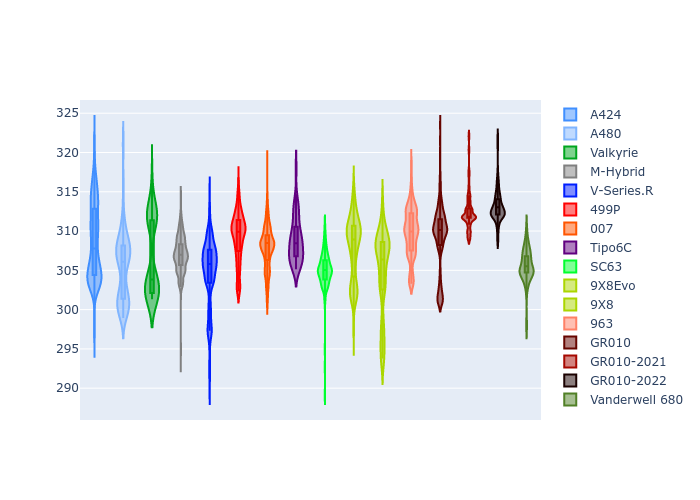

# Combined Plots

## Metadata

- BoP Accuracy: 98.06%
- Overall BoP Grade: A1
- Track: PORTIMAO
- Threshhold: 250.0kph
- Average Laptime: 1:35.02
- Average Quali Laptime: 1:33.01
- Average Topspeed: 307.92kph

## BoP Table
| Manufacturer     | Car            | Weight   | Power   | PINC   | E/Stint   | FDS    | RDP    | QDP    | TDP    |
|:-----------------|:---------------|:---------|:--------|:-------|:----------|:-------|:-------|:-------|:-------|
| Alpine           | A424           | 1057kg   | 520.0kw | -      | 914MJ     | -      | 51.64% | 59.31% | 26.80% |
| Alpine           | A480           | 952kg    | 432.0kw | +0.10% | 900MJ     | -      | 53.05% | 74.07% | 48.97% |
| Aston Martin     | Valkyrie       | 1042kg   | 506.0kw | -      | 900MJ     | -      | 53.50% | 53.33% | 21.51% |
| BMW              | M-Hybrid       | 1051kg   | 512.0kw | +0.10% | 907MJ     | -      | 52.89% | 56.22% | 33.41% |
| Cadillac         | V-Series.R     | 1044kg   | 510.0kw | +0.10% | 902MJ     | -      | 48.63% | 60.80% | 19.01% |
| Ferrari          | 499P           | 1073kg   | 508.0kw | -0.10% | 901MJ     | 190kph | 51.38% | 44.98% | 9.83%  |
| Glickenhaus      | 007            | 1039kg   | 510.0kw | -      | 903MJ     | -      | 46.15% | 49.30% | 41.45% |
| Isotta Fraschini | Tipo6C         | 1056kg   | 518.0kw | -      | 915MJ     | 190kph | 43.95% | 47.22% | 31.53% |
| Lamborghini      | SC63           | 1035kg   | 501.0kw | -      | 892MJ     | -      | 48.33% | 60.95% | 28.65% |
| Peugeot          | 9X8Evo         | 1060kg   | 510.0kw | +0.10% | 900MJ     | 190kph | 48.87% | 52.78% | 15.41% |
| Peugeot          | 9X8            | 1039kg   | 504.0kw | -      | 897MJ     | 150kph | 54.54% | 58.39% | 9.69%  |
| Porsche          | 963            | 1057kg   | 516.0kw | -0.10% | 911MJ     | -      | 50.70% | 44.30% | 29.51% |
| Toyota           | GR010          | 1090kg   | 512.0kw | -      | 909MJ     | 190kph | 51.09% | 52.71% | 11.46% |
| Toyota           | GR010-2021     | 1075kg   | 513.0kw | -0.10% | 961MJ     | 150kph | 54.08% | 54.81% | 9.72%  |
| Toyota           | GR010-2022     | 1078kg   | 512.0kw | -      | 904MJ     | 190kph | 53.45% | 68.83% | 9.58%  |
| Vanwall          | Vanderwell 680 | 1030kg   | 520.0kw | -      | 908MJ     | -      | 49.68% | 60.93% | 34.43% |

## Performance Table
| Manufacturer     | Car            | RP      | QP      | Vavg      |   RDLC | BOP-Grade   | Match   |
|:-----------------|:---------------|:--------|:--------|:----------|-------:|:------------|:--------|
| Alpine           | A424           | 1:33.96 | 1:31.68 | 308.63kph |   1.02 | ~A1         | 99.63%  |
| Alpine           | A480           | 1:34.65 | 1:33.60 | 305.39kph |   1.01 | ~A1         | 99.60%  |
| Aston Martin     | Valkyrie       | 1:35.39 | 1:32.60 | 306.63kph |   1.03 | ~A1         | 100.00% |
| BMW              | M-Hybrid       | 1:34.38 | 1:31.76 | 307.02kph |   1.03 | ~A1         | 99.88%  |
| Cadillac         | V-Series.R     | 1:34.59 | 1:31.99 | 304.81kph |   1.03 | ~A1         | 99.77%  |
| Ferrari          | 499P           | 1:35.12 | 1:32.41 | 309.26kph |   1.03 | ~A1         | 98.62%  |
| Glickenhaus      | 007            | 1:35.40 | 1:34.10 | 307.94kph |   1.01 | -A2         | 94.30%  |
| Isotta Fraschini | Tipo6C         | 1:35.38 | 1:34.99 | 308.86kph |   1    | +A2         | 91.79%  |
| Lamborghini      | SC63           | 1:35.41 | 1:33.63 | 305.10kph |   1.02 | ~A1         | 98.08%  |
| Peugeot          | 9X8Evo         | 1:35.36 | 1:32.90 | 307.97kph |   1.03 | ~A1         | 100.00% |
| Peugeot          | 9X8            | 1:35.39 | 1:33.52 | 304.91kph |   1.02 | ~A1         | 96.72%  |
| Porsche          | 963            | 1:34.25 | 1:31.97 | 309.77kph |   1.02 | ~A1         | 99.23%  |
| Toyota           | GR010          | 1:35.37 | 1:32.52 | 309.22kph |   1.03 | ~A1         | 97.21%  |
| Toyota           | GR010-2021     | 1:34.83 | 1:32.86 | 312.53kph |   1.02 | ~A1         | 100.00% |
| Toyota           | GR010-2022     | 1:35.40 | 1:34.37 | 313.14kph |   1.01 | ~A1         | 99.41%  |
| Vanwall          | Vanderwell 680 | 1:35.39 | 1:33.27 | 305.61kph |   1.02 | -A2         | 94.79%  |

## Race Laptimes

## Quali Laptimes

## Topspeeds

## Laptimes Lineplot

