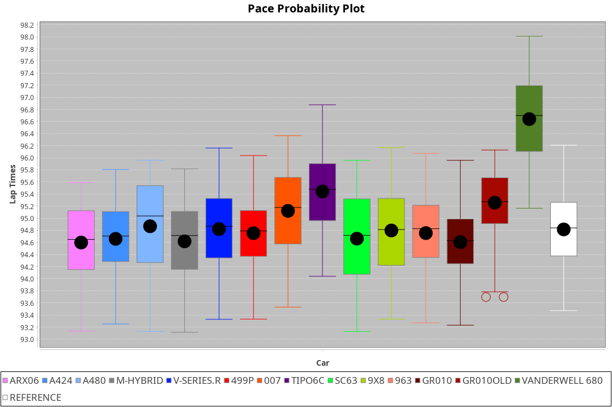
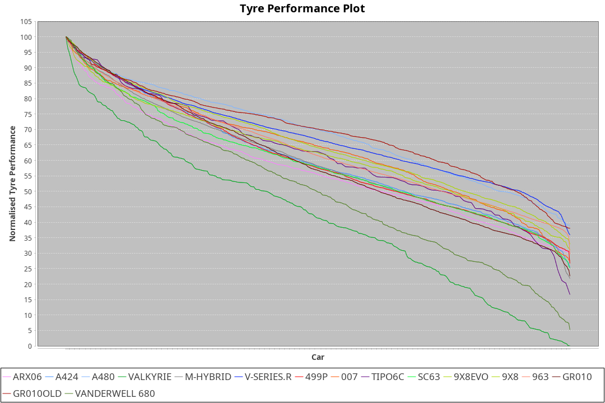

|Manufacturer|Car|Weight|Power|PINC|E/Stint|FDS|
|:-|:-|:-|:-|:-|:-|:-|
|Acura|ARX06|1080kg|510kw|1%|913MJ|-|
|Alpine|A424|1072kg|510kw|1%|911MJ|-|
|Alpine|A480|952kg|413kw|1%|751MJ|-|
|BMW|M-Hybrid|1050kg|507kw|1%|903MJ|-|
|Cadillac|V-Series.R|1032kg|503kw|-1%|890MJ|-|
|Ferrari|499P|1075kg|501kw|-1%|892MJ|190kph|
|Glickenhaus|007|1030kg|520kw|-|910MJ|-|
|IsottaFraschini|Tipo6C|1030kg|517kw|-1%|912MJ|190kph|
|Lamborghini|SC63|1055kg|511kw|1%|906MJ|-|
|Peugeot|9X8|1033kg|517kw|-1%|900MJ|150kph|
|Porsche|963|1048kg|508kw|-1%|893MJ|-|
|Toyota|GR010|1088kg|507kw|-|901MJ|190kph|
|Toyota|GR010OLD|1077kg|511kw|-1%|903MJ|190kph|
|Vanwall|Vanderwell680|1030kg|520kw|-|903MJ|-|

### BoP Accuracy: 89.99%; Overall BoP Grade: B1
|Manufacturer|Car|Type|RP|QP|Weight|Power¹|Threshhold|PINC|Power²|E/Stint|AVG Vmax|FDS|RDLC|L/Stint|BOP-Grade|ModelAccuracy|ModelPoints|Match%|
|:-|:-|:-|:-|:-|:-|:-|:-|:-|:-|:-|:-|:-|:-|:-|:-|:-|:-|:-|
|Acura|ARX06|LMDH|1:34.87|1:30.67|1080kg|510kw|210.0kph|1%|515kw|913MJ|298.54kph|-|0.98|40|-C1|100.00%|995|76.05%|
|Alpine|A424|LMDH|1:34.85|1:32.65|1072kg|510kw|210.0kph|1%|515kw|911MJ|298.56kph|-|0.99|40|~A1|80.53%|517|97.89%|
|Alpine|A480|LMP1|1:34.84|1:31.97|952kg|413kw|210.0kph|1%|417kw|751MJ|294.87kph|-|0.97|37|~A1|59.62%|840|100.00%|
|BMW|M-Hybrid|LMDH|1:34.83|1:31.42|1050kg|507kw|210.0kph|1%|512kw|903MJ|295.70kph|-|1.02|40|-B1|98.60%|1690|86.75%|
|Cadillac|V-Series.R|LMDH|1:35.09|1:31.34|1032kg|503kw|210.0kph|-1%|498kw|890MJ|299.36kph|-|1.03|40|~A1|88.58%|2033|98.54%|
|Ferrari|499P|LMHHU|1:35.16|1:31.62|1075kg|501kw|210.0kph|-1%|496kw|892MJ|299.32kph|190kph|1.02|40|~A1|84.67%|2303|100.00%|
|Glickenhaus|007|LMHNH|1:35.22|1:32.02|1030kg|520kw|210.0kph|-|520kw|910MJ|303.42kph|-|0.96|40|~A1|96.64%|1639|100.00%|
|IsottaFraschini|Tipo6C|LMHHU|1:34.99|1:33.56|1030kg|517kw|210.0kph|-1%|512kw|912MJ|301.46kph|190kph|1.08|40|+B1|66.67%|96|88.40%|
|Lamborghini|SC63|LMDH|1:34.78|1:33.49|1055kg|511kw|210.0kph|1%|516kw|906MJ|297.55kph|-|1.04|40|-B1|96.77%|419|85.43%|
|Peugeot|9X8|LMHHE|1:34.94|1:31.63|1033kg|517kw|210.0kph|-1%|512kw|900MJ|299.95kph|150kph|1.03|40|~A1|87.16%|2572|99.22%|
|Porsche|963|LMDH|1:35.09|1:31.41|1048kg|508kw|210.0kph|-1%|503kw|893MJ|299.42kph|-|1.01|40|~A1|93.05%|5740|100.00%|
|Toyota|GR010|LMHHU|1:34.94|1:31.37|1088kg|507kw|210.0kph|-|507kw|901MJ|299.62kph|190kph|1.01|40|~A1|90.17%|3255|97.55%|
|Toyota|GR010OLD|LMHHE|1:35.17|1:31.47|1077kg|511kw|210.0kph|-1%|506kw|903MJ|301.98kph|190kph|1.02|40|~A1|85.24%|1322|100.00%|
|Vanwall|Vanderwell680|LMHNH|1:36.63|1:32.56|1030kg|520kw|210.0kph|-|520kw|903MJ|297.20kph|-|1.01|40|+Ω1|91.33%|611|30.07%|

## Power below Threshhold
|N/Nmax|ACURA|ALPINE|BMW|CADILLAC|FERRARI|GLICKENHAUS|ISOTTAFRASCHINI|LAMBORGHINI|PEUGEOT|PORSCHE|TOYOTA|TOYOTA|VANWALL|​|RPM|A480|
|:-|:-|:-|:-|:-|:-|:-|:-|:-|:-|:-|:-|:-|:-|:-|:-|:-|
|0.550|251|251|250|248|247|256|255|252|255|250|250|252|256|​|--|-|
|0.575|274|274|273|271|270|279|278|275|278|273|273|275|279|​|--|-|
|0.600|295|295|293|291|290|300|298|295|298|293|293|295|300|​|--|-|
|0.625|316|316|314|311|310|322|320|316|320|314|314|316|322|​|--|-|
|0.650|337|337|335|332|331|343|341|337|341|335|335|337|343|​|--|-|
|0.675|358|358|356|353|352|365|363|359|363|357|356|359|365|​|--|-|
|0.700|380|380|377|374|373|387|385|380|385|378|377|380|387|​|--|-|
|0.725|401|401|399|395|394|409|407|402|407|399|399|402|409|​|--|-|
|0.750|422|422|419|416|414|430|427|422|427|420|419|422|430|​|--|-|
|0.775|441|441|438|435|433|449|446|441|446|439|438|441|449|​|5000|244|
|0.800|458|458|455|452|450|467|464|459|464|456|455|459|467|​|5500|288|
|0.825|473|473|470|467|465|482|479|474|479|471|470|474|482|​|6000|321|
|0.850|485|485|482|478|476|494|491|485|491|483|482|485|494|​|6500|363|
|0.875|495|495|492|488|486|505|502|496|502|493|492|496|505|​|7000|406|
|0.900|502|502|499|495|493|512|509|503|509|500|499|503|512|​|7500|416|
|0.925|507|507|504|500|498|517|514|508|514|505|504|508|517|​|8000|412|
|**0.950**|**510**|**510**|**507**|**503**|**501**|**520**|**517**|**511**|**517**|**508**|**507**|**511**|**520**|**​**|**8500**|**415**|
|0.975|508|508|505|501|499|518|515|509|515|506|505|509|518|​|9000|208|
|1.000|505|505|502|498|496|514|511|505|511|503|502|505|514|​|--|-|
|1.025|436|436|433|430|428|444|441|436|441|434|433|436|444|​|--|-|

## Power above Threshhold
|N/Nmax|ACURA|ALPINE|BMW|CADILLAC|FERRARI|GLICKENHAUS|ISOTTAFRASCHINI|LAMBORGHINI|PEUGEOT|PORSCHE|TOYOTA|TOYOTA|VANWALL|​|RPM|A480|
|:-|:-|:-|:-|:-|:-|:-|:-|:-|:-|:-|:-|:-|:-|:-|:-|:-|
|0.550|254|254|252|245|244|256|252|254|252|248|250|249|256|​|--|-|
|0.575|277|277|275|268|267|279|275|277|275|271|273|272|279|​|--|-|
|0.600|297|297|296|288|287|300|296|298|296|291|293|292|300|​|--|-|
|0.625|319|319|317|308|307|322|317|319|317|311|314|313|322|​|--|-|
|0.650|340|340|338|329|327|343|338|340|338|332|335|334|343|​|--|-|
|0.675|362|362|359|350|348|365|359|362|359|353|356|355|365|​|--|-|
|0.700|383|383|381|371|369|387|381|384|381|374|377|377|387|​|--|-|
|0.725|405|405|403|392|390|409|403|406|403|395|399|398|409|​|--|-|
|0.750|426|426|423|411|410|430|423|427|423|416|419|418|430|​|--|-|
|0.775|445|445|442|430|429|449|442|446|442|435|438|437|449|​|5000|244|
|0.800|463|463|460|447|445|467|460|463|460|452|455|454|467|​|5500|288|
|0.825|478|478|475|462|460|482|475|478|475|467|470|469|482|​|6000|321|
|0.850|489|489|486|473|471|494|486|490|486|478|482|481|494|​|6500|363|
|0.875|500|500|497|483|481|505|497|501|497|488|492|491|505|​|7000|406|
|0.900|507|507|504|490|488|512|504|508|504|495|499|498|512|​|7500|416|
|0.925|512|512|509|495|493|517|509|513|509|500|504|503|517|​|8000|412|
|**0.950**|**515**|**515**|**512**|**498**|**496**|**520**|**512**|**516**|**512**|**503**|**507**|**506**|**520**|**​**|**8500**|**415**|
|0.975|513|513|510|496|494|518|510|514|510|501|505|504|518|​|9000|208|
|1.000|509|509|506|493|491|514|506|510|506|498|502|501|514|​|--|-|
|1.025|440|440|437|425|424|444|437|441|437|430|433|432|444|​|--|-|
