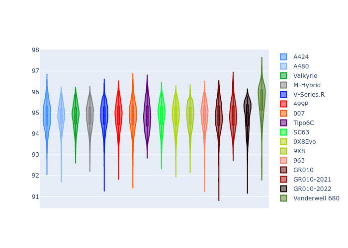
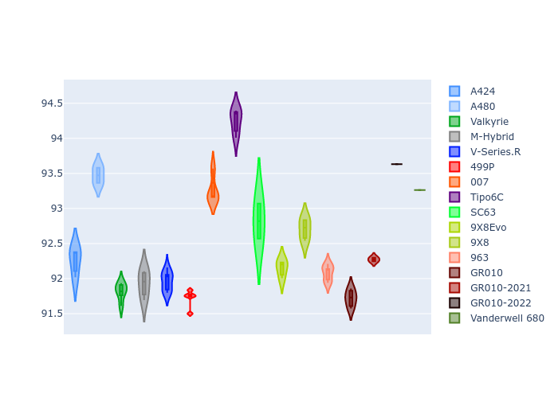
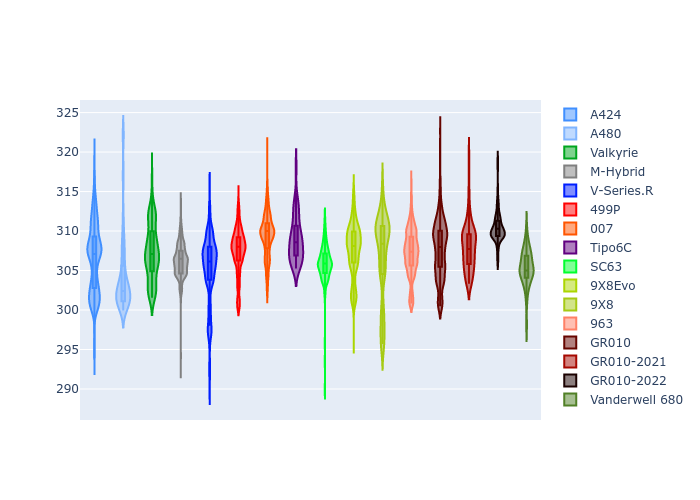
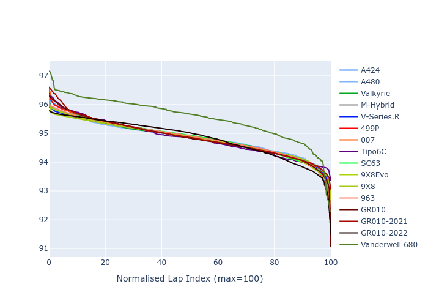

# Combined Plots

## Metadata

- BoP Accuracy: 98.92%
- Overall BoP Grade: A1
- Track: PORTIMAO
- Threshhold: 250.0kph
- Average Laptime: 1:34.88
- Average Quali Laptime: 1:32.93
- Laptime Std Dev: 0.17 seconds
- Filtered Average Topspeed: 307.18kph

## BoP Table
| Manufacturer     | Car            | Weight   | Power   | PINC   | E/Stint   | FDS    | RDP    | QDP    | TDP    |
|:-----------------|:---------------|:---------|:--------|:-------|:----------|:-------|:-------|:-------|:-------|
| Alpine           | A424           | 1044kg   | 480.0kw | +6.20% | 885MJ     | -      | 51.45% | 55.09% | 24.89% |
| Alpine           | A480           | 933kg    | 410.0kw | +2.50% | 881MJ     | -      | 54.77% | 76.19% | 54.04% |
| Aston Martin     | Valkyrie       | 1057kg   | 520.0kw | -      | 914MJ     | -      | 53.07% | 48.70% | 24.00% |
| BMW              | M-Hybrid       | 1045kg   | 480.0kw | +6.60% | 894MJ     | -      | 52.63% | 52.34% | 34.06% |
| Cadillac         | V-Series.R     | 1048kg   | 483.0kw | +7.60% | 897MJ     | -      | 48.80% | 57.26% | 18.10% |
| Ferrari          | 499P           | 1064kg   | 504.0kw | -2.20% | 891MJ     | 190kph | 51.39% | 44.34% | 9.89%  |
| Glickenhaus      | 007            | 1045kg   | 520.0kw | -      | 913MJ     | -      | 46.14% | 49.30% | 41.45% |
| Isotta Fraschini | Tipo6C         | 1059kg   | 520.0kw | -      | 917MJ     | 200kph | 43.95% | 47.22% | 31.53% |
| Lamborghini      | SC63           | 1066kg   | 520.0kw | -      | 912MJ     | -      | 48.32% | 60.95% | 28.65% |
| Peugeot          | 9X8Evo         | 1030kg   | 504.0kw | -2.60% | 881MJ     | 200kph | 49.16% | 50.25% | 18.00% |
| Peugeot          | 9X8            | 1037kg   | 481.0kw | +8.10% | 897MJ     | 200kph | 54.54% | 58.39% | 9.69%  |
| Porsche          | 963            | 1041kg   | 488.0kw | +2.20% | 890MJ     | -      | 50.61% | 41.90% | 27.68% |
| Toyota           | GR010          | 1063kg   | 504.0kw | -2.40% | 893MJ     | 190kph | 51.33% | 51.71% | 14.89% |
| Toyota           | GR010-2021     | 1061kg   | 520.0kw | -6.90% | 946MJ     | 200kph | 54.02% | 52.67% | 26.37% |
| Toyota           | GR010-2022     | 1057kg   | 520.0kw | -7.00% | 890MJ     | 200kph | 53.24% | 64.49% | 9.72%  |
| Vanwall          | Vanderwell 680 | 1030kg   | 520.0kw | -      | 908MJ     | -      | 50.86% | 59.83% | 31.84% |

## Performance Table
| Manufacturer     | Car            | RP      | QP      | Vavg      |   RDLC | BOP-Grade   | Match   |
|:-----------------|:---------------|:--------|:--------|:----------|-------:|:------------|:--------|
| Alpine           | A424           | 1:34.84 | 1:32.56 | 306.59kph |   1.02 | ~A1         | 99.88%  |
| Alpine           | A480           | 1:34.83 | 1:33.28 | 304.30kph |   1.02 | ~A1         | 99.80%  |
| Aston Martin     | Valkyrie       | 1:34.84 | 1:32.72 | 307.24kph |   1.02 | ~A1         | 100.00% |
| BMW              | M-Hybrid       | 1:34.84 | 1:32.33 | 306.27kph |   1.03 | ~A1         | 100.00% |
| Cadillac         | V-Series.R     | 1:34.84 | 1:32.30 | 305.33kph |   1.03 | ~A1         | 99.90%  |
| Ferrari          | 499P           | 1:34.85 | 1:32.22 | 307.48kph |   1.03 | ~A1         | 99.89%  |
| Glickenhaus      | 007            | 1:34.83 | 1:33.58 | 309.46kph |   1.01 | ~A1         | 99.02%  |
| Isotta Fraschini | Tipo6C         | 1:34.83 | 1:34.48 | 308.98kph |   1    | ~A1         | 98.51%  |
| Lamborghini      | SC63           | 1:34.85 | 1:33.11 | 305.95kph |   1.02 | ~A1         | 100.00% |
| Peugeot          | 9X8Evo         | 1:34.83 | 1:32.54 | 307.60kph |   1.02 | ~A1         | 100.00% |
| Peugeot          | 9X8            | 1:34.83 | 1:32.97 | 306.91kph |   1.02 | ~A1         | 100.00% |
| Porsche          | 963            | 1:34.85 | 1:32.57 | 307.28kph |   1.02 | ~A1         | 99.92%  |
| Toyota           | GR010          | 1:34.84 | 1:32.02 | 307.60kph |   1.03 | ~A1         | 99.54%  |
| Toyota           | GR010-2021     | 1:34.83 | 1:32.79 | 308.01kph |   1.02 | ~A1         | 97.20%  |
| Toyota           | GR010-2022     | 1:34.84 | 1:33.94 | 310.45kph |   1.01 | ~A1         | 99.55%  |
| Vanwall          | Vanderwell 680 | 1:35.55 | 1:33.53 | 305.42kph |   1.02 | +B1         | 89.47%  |

## Race Laptimes

## Quali Laptimes

## Topspeeds

## Laptimes Lineplot

