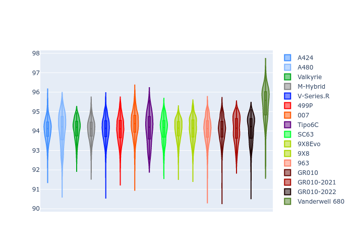

# Combined Plots

## Metadata

- BoP Accuracy: 96.78%
- Overall BoP Grade: A1
- Track: PORTIMAO
- Threshhold: 250.0kph

## BoP Table
| Manufacturer     | Car            | Weight   | Power   | PINC   | E/Stint   | FDS    | RDP    | QDP    | TDP    |
|:-----------------|:---------------|:---------|:--------|:-------|:----------|:-------|:-------|:-------|:-------|
| Alpine           | A424           | 1072kg   | 480.0kw | +0.10% | 880MJ     | -      | 52.35% | 61.85% | 27.84% |
| Alpine           | A480           | 952kg    | 410.0kw | +0.10% | 877MJ     | -      | 54.51% | 76.19% | 54.04% |
| Aston Martin     | Valkyrie       | 1046kg   | 480.0kw | +0.40% | 878MJ     | -      | 53.59% | 53.33% | 21.51% |
| BMW              | M-Hybrid       | 1076kg   | 480.0kw | +1.30% | 884MJ     | -      | 53.26% | 57.23% | 34.54% |
| Cadillac         | V-Series.R     | 1096kg   | 480.0kw | +6.30% | 896MJ     | -      | 47.80% | 56.73% | 19.63% |
| Ferrari          | 499P           | 1095kg   | 480.0kw | -      | 879MJ     | 190kph | 53.02% | 42.32% | 9.88%  |
| Glickenhaus      | 007            | 1063kg   | 486.0kw | +3.60% | 893MJ     | -      | 46.49% | 46.07% | 47.78% |
| Isotta Fraschini | Tipo6C         | 1078kg   | 520.0kw | -2.50% | 912MJ     | 190kph | 43.95% | 47.22% | 31.53% |
| Lamborghini      | SC63           | 1081kg   | 517.0kw | -4.10% | 900MJ     | -      | 46.33% | 59.50% | 29.33% |
| Peugeot          | 9X8Evo         | 1055kg   | 480.0kw | -      | 872MJ     | 190kph | 48.47% | 51.26% | 16.02% |
| Peugeot          | 9X8            | 1099kg   | 487.0kw | +6.70% | 905MJ     | 150kph | 54.07% | 57.08% | 10.80% |
| Porsche          | 963            | 1073kg   | 480.0kw | +0.50% | 882MJ     | -      | 50.87% | 45.25% | 30.77% |
| Toyota           | GR010          | 1100kg   | 480.0kw | -      | 881MJ     | 190kph | 52.43% | 57.12% | 12.82% |
| Toyota           | GR010-2021     | 1100kg   | 483.0kw | +7.60% | 956MJ     | 200kph | 54.09% | 52.67% | 26.37% |
| Toyota           | GR010-2022     | 1100kg   | 480.0kw | +1.60% | 882MJ     | 200kph | 53.48% | 69.44% | 7.86%  |
| Vanwall          | Vanderwell 680 | 1049kg   | 520.0kw | -      | 910MJ     | -      | 53.41% | 56.28% | 29.85% |

## Performance Table
| Manufacturer     | Car            | RP      | QP      | Vavg      |   RDLC | BOP-Grade   | Match   |
|:-----------------|:---------------|:--------|:--------|:----------|-------:|:------------|:--------|
| Alpine           | A424           | 1:35.51 | 1:32.98 | 296.51kph |   1.03 | ~A1         | 99.01%  |
| Alpine           | A480           | 1:33.43 | 1:31.88 | 292.85kph |   1.02 | -D1         | 65.48%  |
| Aston Martin     | Valkyrie       | 1:35.51 | 1:32.43 | 298.62kph |   1.03 | ~A1         | 100.00% |
| BMW              | M-Hybrid       | 1:35.50 | 1:32.64 | 296.21kph |   1.03 | ~A1         | 99.02%  |
| Cadillac         | V-Series.R     | 1:35.51 | 1:32.68 | 294.86kph |   1.03 | ~A1         | 99.62%  |
| Ferrari          | 499P           | 1:35.51 | 1:32.20 | 296.84kph |   1.04 | ~A1         | 99.93%  |
| Glickenhaus      | 007            | 1:35.51 | 1:33.84 | 296.89kph |   1.02 | ~A1         | 95.10%  |
| Isotta Fraschini | Tipo6C         | 1:35.51 | 1:34.85 | 300.30kph |   1.01 | ~A1         | 95.52%  |
| Lamborghini      | SC63           | 1:35.51 | 1:33.54 | 297.98kph |   1.02 | ~A1         | 99.64%  |
| Peugeot          | 9X8Evo         | 1:35.50 | 1:32.80 | 300.23kph |   1.03 | ~A1         | 98.79%  |
| Peugeot          | 9X8            | 1:35.53 | 1:32.86 | 290.91kph |   1.03 | ~A1         | 99.94%  |
| Porsche          | 963            | 1:35.51 | 1:32.71 | 296.41kph |   1.03 | ~A1         | 99.83%  |
| Toyota           | GR010          | 1:35.50 | 1:32.10 | 297.36kph |   1.04 | ~A1         | 99.71%  |
| Toyota           | GR010-2021     | 1:35.12 | 1:32.66 | 294.83kph |   1.03 | ~A1         | 100.00% |
| Toyota           | GR010-2022     | 1:35.45 | 1:33.69 | 296.48kph |   1.02 | ~A1         | 100.00% |
| Vanwall          | Vanderwell 680 | 1:35.50 | 1:32.66 | 296.68kph |   1.03 | ~A1         | 96.88%  |

## Race Laptimes

## Quali Laptimes

## Topspeeds

## Laptimes Lineplot

