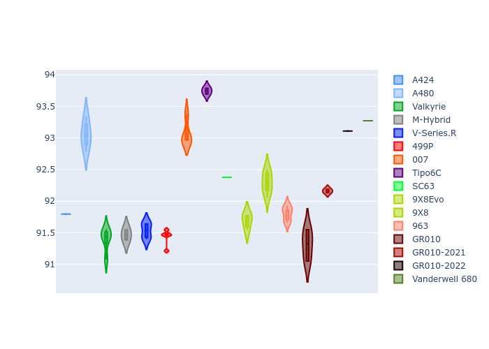

# Combined Plots

## Metadata

- BoP Accuracy: 99.44%
- Overall BoP Grade: A1
- Track: PORTIMAO
- Threshhold: 210.0kph

## BoP Table
| Manufacturer     | Car            | Weight   | Power   | PINC   | E/Stint   | FDS    |
|:-----------------|:---------------|:---------|:--------|:-------|:----------|:-------|
| Alpine           | A424           | 1070kg   | 480.0kw | -      | 879MJ     | -      |
| Alpine           | A480           | 1052kg   | 410.0kw | -      | 876MJ     | -      |
| Aston Martin     | Valkyrie       | 1047kg   | 480.0kw | -      | 877MJ     | -      |
| BMW              | M-Hybrid       | 1070kg   | 480.0kw | +0.70% | 881MJ     | -      |
| Cadillac         | V-Series.R     | 1083kg   | 480.0kw | +5.70% | 891MJ     | -      |
| Ferrari          | 499P           | 1080kg   | 480.0kw | -      | 877MJ     | 190kph |
| Glickenhaus      | 007            | 1058kg   | 482.0kw | +4.30% | 889MJ     | -      |
| Isotta Fraschini | Tipo6C         | 1078kg   | 520.0kw | -3.20% | 912MJ     | 190kph |
| Lamborghini      | SC63           | 1074kg   | 504.0kw | -1.60% | 895MJ     | -      |
| Peugeot          | 9X8Evo         | 1057kg   | 480.0kw | -      | 873MJ     | 190kph |
| Peugeot          | 9X8            | 1080kg   | 489.0kw | +6.30% | 902MJ     | 150kph |
| Porsche          | 963            | 1071kg   | 480.0kw | +0.50% | 881MJ     | -      |
| Toyota           | GR010          | 1078kg   | 480.0kw | -      | 879MJ     | 190kph |
| Toyota           | GR010OLD       | 1100kg   | 480.0kw | +5.00% | 944MJ     | 190kph |
| Vanwall          | Vanderwell 680 | 1058kg   | 520.0kw | -      | 911MJ     | -      |

## Performance Table
| Manufacturer     | Car            | RP      | QP      | Vavg      |   RDLC | BOP-Grade   | Match   |
|:-----------------|:---------------|:--------|:--------|:----------|-------:|:------------|:--------|
| Alpine           | A424           | 1:36.15 | 1:33.72 | 296.83kph |   1.03 | ~A1         | 99.35%  |
| Alpine           | A480           | 1:35.44 | 1:34.04 | 291.04kph |   1.01 | ~A1         | 99.22%  |
| Aston Martin     | Valkyrie       | 1:36.13 | 1:33.02 | 298.18kph |   1.03 | ~A1         | 100.00% |
| BMW              | M-Hybrid       | 1:36.14 | 1:33.39 | 296.32kph |   1.03 | ~A1         | 100.00% |
| Cadillac         | V-Series.R     | 1:36.15 | 1:33.49 | 295.65kph |   1.03 | ~A1         | 99.92%  |
| Ferrari          | 499P           | 1:36.15 | 1:33.33 | 298.40kph |   1.03 | ~A1         | 99.98%  |
| Glickenhaus      | 007            | 1:36.13 | 1:34.43 | 296.91kph |   1.02 | ~A1         | 97.16%  |
| Isotta Fraschini | Tipo6C         | 1:36.14 | 1:35.37 | 299.83kph |   1.01 | ~A1         | 100.00% |
| Lamborghini      | SC63           | 1:36.15 | 1:34.21 | 298.18kph |   1.02 | ~A1         | 99.16%  |
| Peugeot          | 9X8Evo         | 1:36.13 | 1:33.40 | 300.02kph |   1.03 | ~A1         | 98.58%  |
| Peugeot          | 9X8            | 1:36.14 | 1:33.76 | 294.02kph |   1.03 | ~A1         | 99.96%  |
| Porsche          | 963            | 1:36.16 | 1:33.48 | 296.24kph |   1.03 | ~A1         | 99.89%  |
| Toyota           | GR010          | 1:36.13 | 1:33.22 | 299.12kph |   1.03 | ~A1         | 100.00% |
| Toyota           | GR010OLD       | 1:36.15 | 1:34.43 | 295.28kph |   1.02 | ~A1         | 100.00% |
| Vanwall          | Vanderwell 680 | 1:36.15 | 1:33.23 | 295.76kph |   1.03 | ~A1         | 98.36%  |

## Race Laptimes

## Quali Laptimes

## Topspeeds

## Laptimes Lineplot

