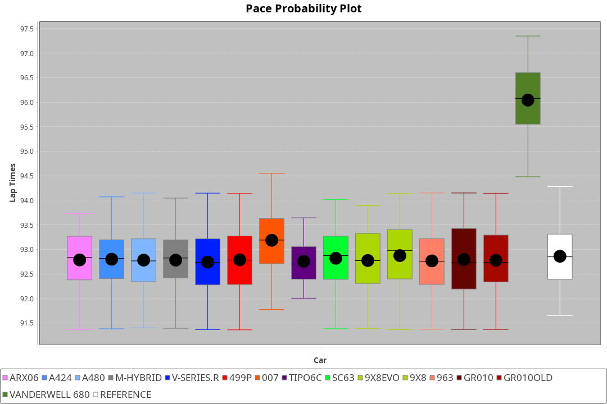
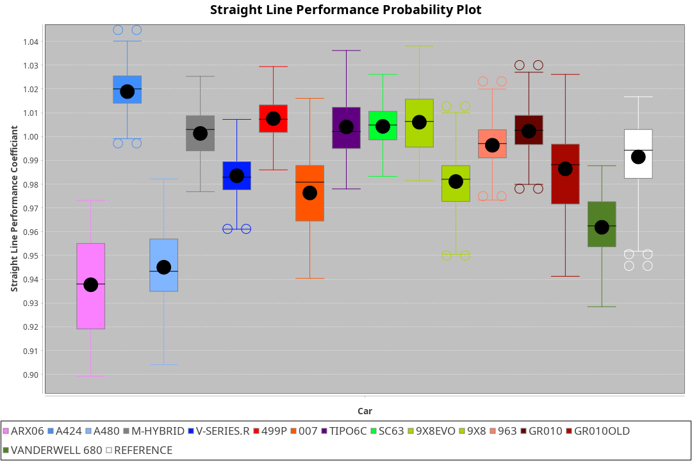
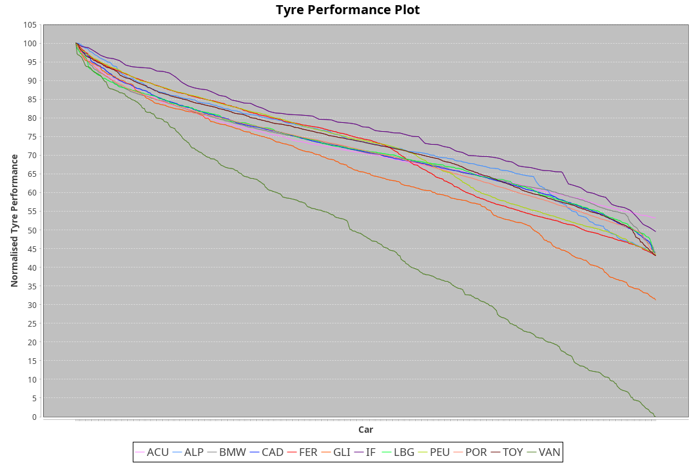

| Manufacturer     | Car            | Weight | Power | PINC    | E/Stint | FDS     |
|:-|:-|:-|:-|:-|:-|:-|
| Acura            | ARX06          | 1040kg | 481kw | 5%      | 891MJ   |    -    |
| Alpine           | A424           | 1038kg | 518kw | -4%     | 903MJ   |    -    |
| Alpine           | A480           | 933kg  | 411kw | 5%      | 756MJ   |    -    |
| BMW              | M-Hybrid       | 1047kg | 491kw | 6%      | 900MJ   |    -    |
| Cadillac         | V-Series.R     | 1037kg | 506kw | -1%     | 892MJ   |    -    |
| Ferrari          | 499P           | 1065kg | 514kw | -4%     | 895MJ   | 190kph  |
| Glickenhaus      | 007            | 1030kg | 520kw |    -    | 910MJ   |    -    |
| Isotta Fraschini | Tipo6C         | 1030kg | 520kw |    -    | 916MJ   | 170kph  |
| Lamborghini      | SC63           | 1062kg | 520kw |    -    | 913MJ   |    -    |
| Peugeot          | 9X8            | 1030kg | 520kw | -3%     | 897MJ   | 150kph  |
| Porsche          | 963            | 1039kg | 515kw | -4%     | 891MJ   |    -    |
| Toyota           | GR010          | 1062kg | 503kw | -1%     | 892MJ   | 190kph  |
| Toyota           | GR010OLD       | 1059kg | 520kw | -6%     | 897MJ   | 190kph  |
| Vanwall          | Vanderwell 680 | 1030kg | 520kw |    -    | 903MJ   |    -    |

### BoP Accuracy: 87.02%; Overall BoP Grade: B1
| Manufacturer     | Car            | Type  | RP      | QP      | Weight | Power¹ | Threshhold | PINC    | Power² | E/Stint | AVG Vmax  | FDS     | RDLC | L/Stint | BOP-Grade | Model Accuracy | Model Points | Match%  |
|:-|:-|:-|:-|:-|:-|:-|:-|:-|:-|:-|:-|:-|:-|:-|:-|:-|:-|:-|
| Acura            | ARX06          | LMDH  | 1:34.88 | 1:30.72 | 1040kg | 481kw  | 210.0kph   | 5%      | 505kw  |  891MJ  | 297.43kph |    -    | 1.02 | 40      | -B1       | 100.00%        | 995          | 85.89%  |
| Alpine           | A424           | LMDH  | 1:34.86 | 1:32.24 | 1038kg | 518kw  | 210.0kph   | -4%     | 497kw  |  903MJ  | 297.76kph |    -    | 1.02 | 40      | +C2       | 100.00%        | 642          | 72.80%  |
| Alpine           | A480           | LMP1  | 1:34.88 | 1:32.35 |  933kg | 411kw  | 210.0kph   | 5%      | 432kw  |  756MJ  | 296.15kph |    -    | 0.99 | 37      | ~A1       | 60.26%         | 849          | 100.00% |
| BMW              | M-Hybrid       | LMDH  | 1:34.88 | 1:31.44 | 1047kg | 491kw  | 210.0kph   | 6%      | 520kw  |  900MJ  | 295.20kph |    -    | 1.02 | 40      | -A2       | 100.00%        | 1714         | 91.91%  |
| Cadillac         | V-Series.R     | LMDH  | 1:34.87 | 1:31.17 | 1037kg | 506kw  | 210.0kph   | -1%     | 501kw  |  892MJ  | 297.89kph |    -    | 1.02 | 40      | ~A1       | 98.95%         | 2271         | 95.28%  |
| Ferrari          | 499P           | LMHHU | 1:34.88 | 1:31.15 | 1065kg | 514kw  | 210.0kph   | -4%     | 493kw  |  895MJ  | 297.45kph | 190kph  | 1.03 | 40      | -A2       | 99.93%         | 2718         | 93.26%  |
| Glickenhaus      | 007            | LMHNH | 1:34.94 | 1:31.92 | 1030kg | 520kw  | 0.0kph     |    -    | 520kw  |  910MJ  | 303.42kph |    -    | 0.96 | 40      | ~A1       | 96.34%         | 1634         | 100.00% |
| Isotta Fraschini | Tipo6C         | LMHHU | 1:34.83 | 1:32.68 | 1030kg | 520kw  | 0.0kph     |    -    | 520kw  |  916MJ  | 302.34kph | 170kph  | 1.08 | 40      | +C1       | 92.36%         | 133          | 76.65%  |
| Lamborghini      | SC63           | LMDH  | 1:34.86 | 1:33.53 | 1062kg | 520kw  | 210.0kph   |    -    | 520kw  |  913MJ  | 296.76kph |    -    | 1.03 | 40      | ~A1       | 96.54%         | 418          | 96.42%  |
| Peugeot          | 9X8            | LMHHE | 1:34.87 | 1:31.69 | 1030kg | 520kw  | 210.0kph   | -3%     | 504kw  |  897MJ  | 298.51kph | 150kph  | 1.03 | 40      | ~A1       | 88.68%         | 2617         | 100.00% |
| Porsche          | 963            | LMDH  | 1:34.87 | 1:31.13 | 1039kg | 515kw  | 210.0kph   | -4%     | 494kw  |  891MJ  | 297.50kph |    -    | 1.02 | 40      | -A2       | 99.98%         | 6168         | 94.30%  |
| Toyota           | GR010          | LMHHU | 1:34.87 | 1:31.14 | 1062kg | 503kw  | 210.0kph   | -1%     | 498kw  |  892MJ  | 297.83kph | 190kph  | 1.03 | 40      | ~A1       | 98.53%         | 3557         | 95.50%  |
| Toyota           | GR010OLD       | LMHHE | 1:34.88 | 1:31.30 | 1059kg | 520kw  | 210.0kph   | -6%     | 489kw  |  897MJ  | 299.13kph | 190kph  | 1.03 | 40      | ~A1       | 92.01%         | 1427         | 99.54%  |
| Vanwall          | Vanderwell 680 | LMHNH | 1:36.58 | 1:32.68 | 1030kg | 520kw  | 0.0kph     |    -    | 520kw  |  903MJ  | 297.20kph |    -    | 1.01 | 40      | +Ω1       | 94.62%         | 633          | 16.68%  |

## Power below Threshhold
| N/Nmax    | ARX06   | A424    | M-HYBRID | V-SERIES.R | 499P    | 007     | TIPO6C  | SC63    | 9X8     | 963     | GR010   | GR010OLD | VANDERWELL 680 | ​     | RPM      | A480    |
|:-|:-|:-|:-|:-|:-|:-|:-|:-|:-|:-|:-|:-|:-|:-|:-|:-|
|  0.550    |  237    |  255    |  242     |  249       |  253    |  256    |  256    |  256    |  256    |  254    |  248    |  256     |  256           |  ​    |   --     |   -     |
|  0.575    |  259    |  278    |  264     |  272       |  276    |  279    |  279    |  279    |  279    |  277    |  271    |  279     |  279           |  ​    |   --     |   -     |
|  0.600    |  278    |  299    |  284     |  292       |  297    |  300    |  300    |  300    |  300    |  297    |  291    |  300     |  300           |  ​    |   --     |   -     |
|  0.625    |  298    |  321    |  304     |  313       |  318    |  322    |  322    |  322    |  322    |  319    |  311    |  322     |  322           |  ​    |   --     |   -     |
|  0.650    |  318    |  342    |  324     |  334       |  339    |  343    |  343    |  343    |  343    |  340    |  332    |  343     |  343           |  ​    |   --     |   -     |
|  0.675    |  338    |  364    |  345     |  355       |  361    |  365    |  365    |  365    |  365    |  362    |  353    |  365     |  365           |  ​    |   --     |   -     |
|  0.700    |  359    |  386    |  366     |  377       |  383    |  387    |  387    |  387    |  387    |  383    |  374    |  387     |  387           |  ​    |   --     |   -     |
|  0.725    |  379    |  407    |  386     |  398       |  404    |  409    |  409    |  409    |  409    |  405    |  395    |  409     |  409           |  ​    |   --     |   -     |
|  0.750    |  398    |  428    |  406     |  418       |  425    |  430    |  430    |  430    |  430    |  426    |  416    |  430     |  430           |  ​    |   --     |   -     |
|  0.775    |  416    |  447    |  424     |  437       |  444    |  449    |  449    |  449    |  449    |  445    |  435    |  449     |  449           |  ​    |  5000    |  248    |
|  0.800    |  432    |  465    |  441     |  454       |  462    |  467    |  467    |  467    |  467    |  463    |  452    |  467     |  467           |  ​    |  5500    |  293    |
|  0.825    |  446    |  480    |  455     |  469       |  477    |  482    |  482    |  482    |  482    |  478    |  467    |  482     |  482           |  ​    |  6000    |  327    |
|  0.850    |  457    |  492    |  466     |  481       |  488    |  494    |  494    |  494    |  494    |  489    |  478    |  494     |  494           |  ​    |  6500    |  369    |
|  0.875    |  467    |  503    |  476     |  491       |  499    |  505    |  505    |  505    |  505    |  500    |  488    |  505     |  505           |  ​    |  7000    |  412    |
|  0.900    |  473    |  510    |  483     |  498       |  506    |  512    |  512    |  512    |  512    |  507    |  495    |  512     |  512           |  ​    |  7500    |  423    |
|  0.925    |  478    |  515    |  488     |  503       |  511    |  517    |  517    |  517    |  517    |  512    |  500    |  517     |  517           |  ​    |  8000    |  419    |
| **0.950** | **481** | **518** | **491**  | **506**    | **514** | **520** | **520** | **520** | **520** | **515** | **503** | **520**  | **520**        | **​** | **8500** | **422** |
|  0.975    |  479    |  516    |  489     |  504       |  512    |  518    |  518    |  518    |  518    |  513    |  501    |  518     |  518           |  ​    |  9000    |  211    |
|  1.000    |  476    |  512    |  486     |  501       |  508    |  514    |  514    |  514    |  514    |  509    |  498    |  514     |  514           |  ​    |   --     |   -     |
|  1.025    |  411    |  442    |  419     |  432       |  439    |  444    |  444    |  444    |  444    |  440    |  430    |  444     |  444           |  ​    |   --     |   -     |

## Power above Threshhold
| N/Nmax    | ARX06   | A424    | M-HYBRID | V-SERIES.R | 499P    | 007     | TIPO6C  | SC63    | 9X8     | 963     | GR010   | GR010OLD | VANDERWELL 680 | ​     | RPM      | A480    |
|:-|:-|:-|:-|:-|:-|:-|:-|:-|:-|:-|:-|:-|:-|:-|:-|:-|
|  0.550    |  249    |  245    |  256     |  247       |  243    |  256    |  256    |  256    |  248    |  243    |  245    |  241     |  256           |  ​    |   --     |   -     |
|  0.575    |  272    |  267    |  279     |  270       |  265    |  279    |  279    |  279    |  271    |  266    |  268    |  263     |  279           |  ​    |   --     |   -     |
|  0.600    |  292    |  287    |  300     |  290       |  285    |  300    |  300    |  300    |  291    |  285    |  288    |  282     |  300           |  ​    |   --     |   -     |
|  0.625    |  312    |  307    |  322     |  310       |  305    |  322    |  322    |  322    |  312    |  305    |  308    |  302     |  322           |  ​    |   --     |   -     |
|  0.650    |  333    |  328    |  343     |  331       |  325    |  343    |  343    |  343    |  333    |  326    |  329    |  323     |  343           |  ​    |   --     |   -     |
|  0.675    |  355    |  349    |  365     |  352       |  346    |  365    |  365    |  365    |  354    |  347    |  350    |  343     |  365           |  ​    |   --     |   -     |
|  0.700    |  376    |  370    |  387     |  373       |  367    |  387    |  387    |  387    |  375    |  368    |  371    |  364     |  387           |  ​    |   --     |   -     |
|  0.725    |  397    |  391    |  409     |  394       |  388    |  409    |  409    |  409    |  396    |  389    |  392    |  385     |  409           |  ​    |   --     |   -     |
|  0.750    |  417    |  411    |  430     |  414       |  407    |  430    |  430    |  430    |  416    |  408    |  411    |  404     |  430           |  ​    |   --     |   -     |
|  0.775    |  436    |  429    |  449     |  433       |  426    |  449    |  449    |  449    |  435    |  427    |  430    |  423     |  449           |  ​    |  5000    |  248    |
|  0.800    |  454    |  446    |  467     |  450       |  443    |  467    |  467    |  467    |  453    |  444    |  447    |  439     |  467           |  ​    |  5500    |  293    |
|  0.825    |  469    |  461    |  482     |  465       |  457    |  482    |  482    |  482    |  468    |  458    |  462    |  454     |  482           |  ​    |  6000    |  327    |
|  0.850    |  480    |  472    |  494     |  476       |  468    |  494    |  494    |  494    |  479    |  469    |  473    |  465     |  494           |  ​    |  6500    |  369    |
|  0.875    |  490    |  482    |  505     |  486       |  478    |  505    |  505    |  505    |  489    |  479    |  483    |  475     |  505           |  ​    |  7000    |  412    |
|  0.900    |  497    |  489    |  512     |  493       |  485    |  512    |  512    |  512    |  496    |  486    |  490    |  481     |  512           |  ​    |  7500    |  423    |
|  0.925    |  502    |  494    |  517     |  498       |  490    |  517    |  517    |  517    |  501    |  491    |  495    |  486     |  517           |  ​    |  8000    |  419    |
| **0.950** | **505** | **497** | **520**  | **501**    | **493** | **520** | **520** | **520** | **504** | **494** | **498** | **489**  | **520**        | **​** | **8500** | **422** |
|  0.975    |  503    |  495    |  518     |  499       |  491    |  518    |  518    |  518    |  502    |  492    |  496    |  487     |  518           |  ​    |  9000    |  211    |
|  1.000    |  500    |  492    |  514     |  496       |  488    |  514    |  514    |  514    |  499    |  489    |  493    |  484     |  514           |  ​    |   --     |   -     |
|  1.025    |  431    |  424    |  444     |  428       |  421    |  444    |  444    |  444    |  430    |  422    |  425    |  418     |  444           |  ​    |   --     |   -     |
