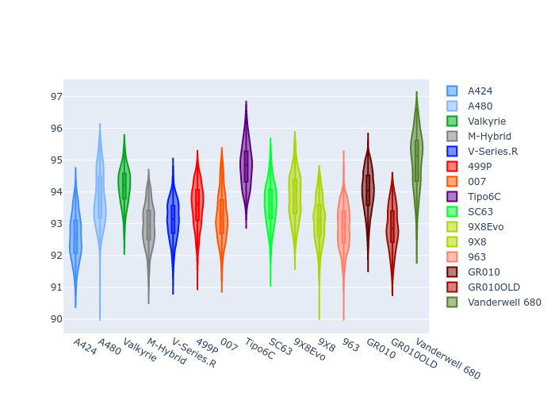
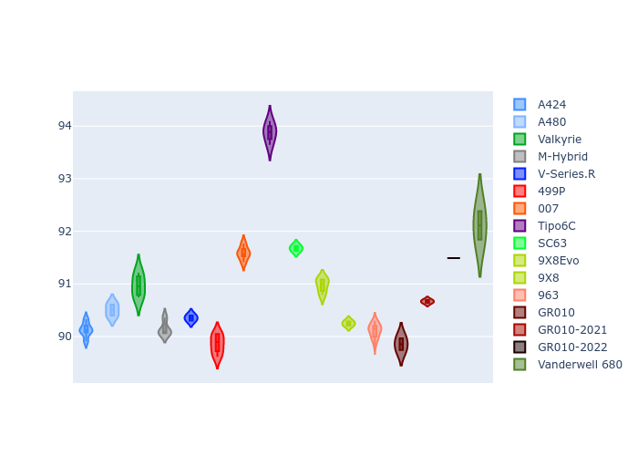
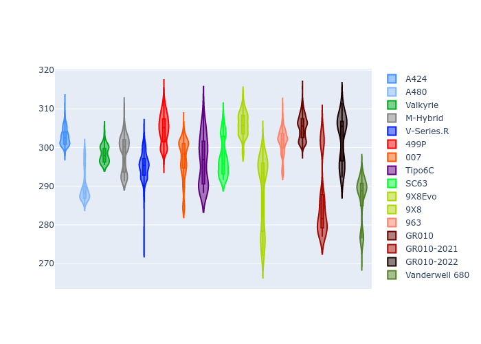
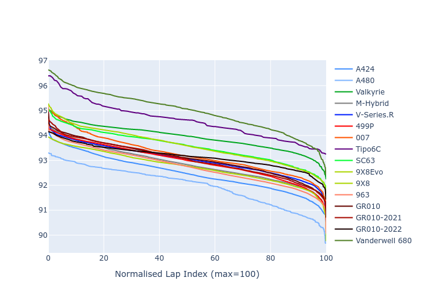

# Combined Plots

## Metadata

- BoP Accuracy: 93.68%
- Overall BoP Grade: A2
- Track: PORTIMAO
- Threshhold: 210.0kph
- Average Laptime: 1:34.60
- Average Quali Laptime: 1:32.62
- Average Topspeed: 309.11kph

## BoP Table
| Manufacturer     | Car            | Weight   | Power   | PINC   | E/Stint   | FDS    | RDP    | QDP    | TDP    |
|:-----------------|:---------------|:---------|:--------|:-------|:----------|:-------|:-------|:-------|:-------|
| Alpine           | A424           | 1047kg   | 520.0kw | -      | 913MJ     | -      | 51.64% | 59.31% | 26.80% |
| Alpine           | A480           | 952kg    | 432.0kw | -      | 899MJ     | -      | 53.05% | 74.07% | 48.97% |
| Aston Martin     | Valkyrie       | 1042kg   | 504.0kw | +0.40% | 899MJ     | -      | 53.50% | 53.33% | 21.51% |
| BMW              | M-Hybrid       | 1041kg   | 512.0kw | -      | 906MJ     | -      | 52.89% | 56.22% | 33.41% |
| Cadillac         | V-Series.R     | 1034kg   | 510.0kw | -      | 900MJ     | -      | 48.63% | 60.80% | 19.01% |
| Ferrari          | 499P           | 1063kg   | 508.0kw | -      | 901MJ     | 190kph | 51.38% | 44.98% | 9.83%  |
| Glickenhaus      | 007            | 1030kg   | 520.0kw | -      | 911MJ     | -      | 46.15% | 49.30% | 41.45% |
| Isotta Fraschini | Tipo6C         | 1059kg   | 520.0kw | -      | 917MJ     | 190kph | 43.95% | 47.22% | 31.53% |
| Lamborghini      | SC63           | 1042kg   | 519.0kw | -      | 908MJ     | -      | 48.33% | 60.95% | 28.65% |
| Peugeot          | 9X8Evo         | 1050kg   | 510.0kw | -      | 899MJ     | 190kph | 48.87% | 52.78% | 15.41% |
| Peugeot          | 9X8            | 1030kg   | 520.0kw | -      | 910MJ     | 150kph | 54.54% | 58.39% | 9.69%  |
| Porsche          | 963            | 1047kg   | 516.0kw | -      | 910MJ     | -      | 50.70% | 44.30% | 29.51% |
| Toyota           | GR010          | 1080kg   | 512.0kw | -      | 908MJ     | 190kph | 51.09% | 52.71% | 11.46% |
| Toyota           | GR010-2021     | 1065kg   | 513.0kw | -      | 960MJ     | 150kph | 54.08% | 54.81% | 9.72%  |
| Toyota           | GR010-2022     | 1080kg   | 512.0kw | -      | 904MJ     | 190kph | 53.45% | 68.83% | 9.58%  |
| Vanwall          | Vanderwell 680 | 1030kg   | 520.0kw | -      | 908MJ     | -      | 49.68% | 60.93% | 34.43% |

## Performance Table
| Manufacturer     | Car            | RP      | QP      | Vavg      |   RDLC | BOP-Grade   | Match   |
|:-----------------|:---------------|:--------|:--------|:----------|-------:|:------------|:--------|
| Alpine           | A424           | 1:33.57 | 1:31.32 | 309.69kph |   1.02 | ~A1         | 99.72%  |
| Alpine           | A480           | 1:34.67 | 1:33.62 | 305.30kph |   1.01 | ~A1         | 97.34%  |
| Aston Martin     | Valkyrie       | 1:35.45 | 1:32.66 | 306.54kph |   1.03 | +B2         | 84.93%  |
| BMW              | M-Hybrid       | 1:34.02 | 1:31.42 | 308.00kph |   1.03 | ~A1         | 99.91%  |
| Cadillac         | V-Series.R     | 1:34.22 | 1:31.65 | 305.78kph |   1.03 | ~A1         | 99.81%  |
| Ferrari          | 499P           | 1:34.72 | 1:32.04 | 310.41kph |   1.03 | ~A1         | 98.49%  |
| Glickenhaus      | 007            | 1:34.34 | 1:33.07 | 311.09kph |   1.01 | ~A1         | 99.50%  |
| Isotta Fraschini | Tipo6C         | 1:35.34 | 1:34.95 | 308.98kph |   1    | +C1         | 76.12%  |
| Lamborghini      | SC63           | 1:34.33 | 1:32.59 | 308.27kph |   1.02 | ~A1         | 100.00% |
| Peugeot          | 9X8Evo         | 1:34.99 | 1:32.55 | 308.94kph |   1.03 | ~A1         | 100.00% |
| Peugeot          | 9X8            | 1:33.87 | 1:32.07 | 309.36kph |   1.02 | ~A1         | 99.84%  |
| Porsche          | 963            | 1:33.85 | 1:31.58 | 310.93kph |   1.02 | ~A1         | 99.23%  |
| Toyota           | GR010          | 1:35.00 | 1:32.17 | 310.26kph |   1.03 | ~A1         | 96.61%  |
| Toyota           | GR010-2021     | 1:34.43 | 1:32.49 | 313.68kph |   1.02 | ~A1         | 100.00% |
| Toyota           | GR010-2022     | 1:35.47 | 1:34.45 | 312.93kph |   1.01 | +C2         | 74.34%  |
| Vanwall          | Vanderwell 680 | 1:35.39 | 1:33.27 | 305.61kph |   1.02 | +C2         | 72.99%  |

## Race Laptimes

## Quali Laptimes

## Topspeeds

## Laptimes Lineplot

