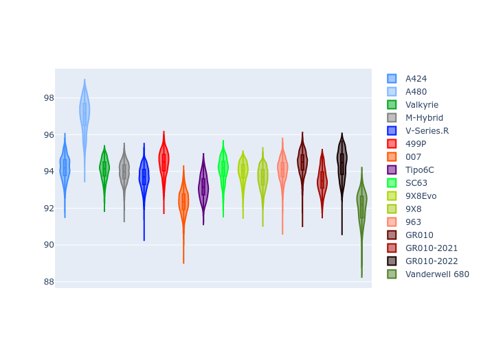
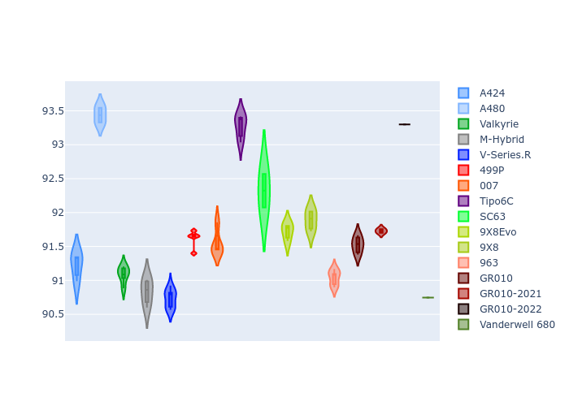
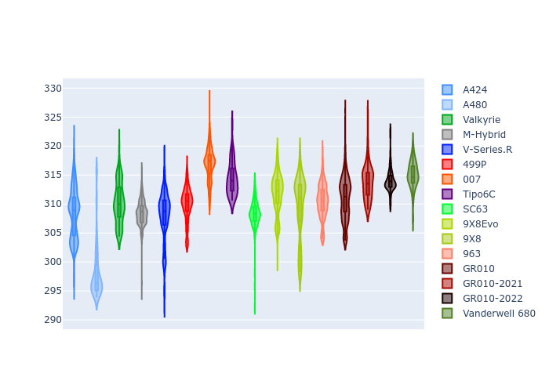
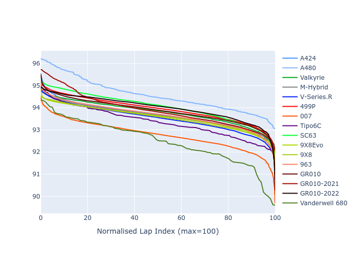

# Combined Plots

## Metadata

- BoP Accuracy: 97.18%
- Overall BoP Grade: A1
- Track: PORTIMAO
- Threshhold: 250.0kph
- Average Laptime: 1:33.62
- Average Quali Laptime: 1:31.77
- Laptime Std Dev: 0.47 seconds
- Filtered Average Topspeed: 310.42kph

## BoP Table
| Manufacturer     | Car            | Weight   | Power   | PINC   | E/Stint   | FDS    | RDP    | QDP    | TDP    |
|:-----------------|:---------------|:---------|:--------|:-------|:----------|:-------|:-------|:-------|:-------|
| Alpine           | A424           | 1046kg   | 511.0kw | +0.50% | 898MJ     | -      | 51.38% | 57.54% | 26.10% |
| Alpine           | A480           | 992kg    | 420.0kw | +0.10% | 892MJ     | -      | 54.81% | 80.56% | 55.69% |
| Aston Martin     | Valkyrie       | 1030kg   | 520.0kw | -      | 911MJ     | -      | 52.56% | 51.11% | 27.23% |
| BMW              | M-Hybrid       | 1040kg   | 513.0kw | -      | 906MJ     | -      | 52.62% | 53.36% | 32.99% |
| Cadillac         | V-Series.R     | 1037kg   | 519.0kw | -      | 909MJ     | -      | 48.29% | 59.47% | 18.65% |
| Ferrari          | 499P           | 1052kg   | 503.0kw | -0.60% | 893MJ     | 190kph | 51.25% | 43.28% | 10.17% |
| Glickenhaus      | 007            | 1003kg   | 533.0kw | -      | 919MJ     | -      | 46.15% | 49.30% | 41.45% |
| Isotta Fraschini | Tipo6C         | 1015kg   | 523.0kw | -      | 915MJ     | 190kph | 43.95% | 47.22% | 31.53% |
| Lamborghini      | SC63           | 1030kg   | 520.0kw | -1.60% | 903MJ     | -      | 48.33% | 60.95% | 28.65% |
| Peugeot          | 9X8Evo         | 1042kg   | 518.0kw | -      | 902MJ     | 190kph | 48.70% | 50.83% | 18.68% |
| Peugeot          | 9X8            | 1036kg   | 524.0kw | -      | 914MJ     | 150kph | 54.54% | 58.39% | 9.69%  |
| Porsche          | 963            | 1046kg   | 511.0kw | +0.60% | 907MJ     | -      | 50.57% | 42.80% | 29.05% |
| Toyota           | GR010          | 1061kg   | 502.0kw | +1.50% | 901MJ     | 190kph | 51.03% | 51.78% | 14.64% |
| Toyota           | GR010-2021     | 1045kg   | 509.0kw | +0.10% | 954MJ     | 150kph | 53.89% | 50.91% | 25.87% |
| Toyota           | GR010-2022     | 1050kg   | 503.0kw | +0.10% | 893MJ     | 190kph | 53.24% | 64.49% | 9.72%  |
| Vanwall          | Vanderwell 680 | 980kg    | 539.0kw | -      | 919MJ     | -      | 35.83% | 59.29% | 34.15% |

## Performance Table
| Manufacturer     | Car            | RP      | QP      | Vavg      |   RDLC | BOP-Grade   | Match   |
|:-----------------|:---------------|:--------|:--------|:----------|-------:|:------------|:--------|
| Alpine           | A424           | 1:33.66 | 1:31.56 | 308.36kph |   1.02 | ~A1         | 98.96%  |
| Alpine           | A480           | 1:34.50 | 1:33.43 | 297.08kph |   1.01 | +C1         | 78.75%  |
| Aston Martin     | Valkyrie       | 1:33.78 | 1:31.90 | 310.43kph |   1.02 | ~A1         | 100.00% |
| BMW              | M-Hybrid       | 1:33.63 | 1:31.23 | 308.48kph |   1.03 | ~A1         | 100.00% |
| Cadillac         | V-Series.R     | 1:33.51 | 1:31.08 | 307.76kph |   1.03 | ~A1         | 99.90%  |
| Ferrari          | 499P           | 1:33.93 | 1:31.25 | 309.93kph |   1.03 | ~A1         | 99.95%  |
| Glickenhaus      | 007            | 1:32.77 | 1:31.57 | 316.92kph |   1.01 | ~A1         | 98.28%  |
| Isotta Fraschini | Tipo6C         | 1:33.33 | 1:33.02 | 314.42kph |   1    | ~A1         | 100.00% |
| Lamborghini      | SC63           | 1:34.04 | 1:32.34 | 308.34kph |   1.02 | ~A1         | 98.94%  |
| Peugeot          | 9X8Evo         | 1:33.58 | 1:31.40 | 311.56kph |   1.02 | ~A1         | 100.00% |
| Peugeot          | 9X8            | 1:33.54 | 1:31.73 | 309.57kph |   1.02 | ~A1         | 99.92%  |
| Porsche          | 963            | 1:33.66 | 1:31.22 | 310.56kph |   1.03 | ~A1         | 99.89%  |
| Toyota           | GR010          | 1:33.85 | 1:31.16 | 311.17kph |   1.03 | ~A1         | 99.13%  |
| Toyota           | GR010-2021     | 1:33.78 | 1:31.60 | 313.55kph |   1.02 | +A2         | 90.22%  |
| Toyota           | GR010-2022     | 1:33.99 | 1:33.09 | 314.05kph |   1.01 | ~A1         | 99.78%  |
| Vanwall          | Vanderwell 680 | 1:32.43 | 1:30.81 | 314.59kph |   1.02 | -A2         | 91.18%  |

## Race Laptimes

## Quali Laptimes

## Topspeeds

## Laptimes Lineplot

