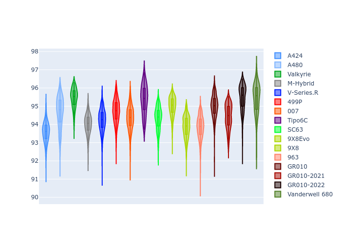

# Combined Plots

## Metadata

- BoP Accuracy: 94.07%
- Overall BoP Grade: A2
- Track: PORTIMAO
- Threshhold: 210.0kph

## BoP Table
| Manufacturer     | Car            | Weight   | Power   | PINC   | E/Stint   | FDS    |
|:-----------------|:---------------|:---------|:--------|:-------|:----------|:-------|
| Alpine           | A424           | 1047kg   | 520.0kw | -      | 913MJ     | -      |
| Alpine           | A480           | 1052kg   | 432.0kw | -      | 899MJ     | -      |
| Aston Martin     | Valkyrie       | 1042kg   | 504.0kw | +0.40% | 899MJ     | -      |
| BMW              | M-Hybrid       | 1041kg   | 512.0kw | -      | 906MJ     | -      |
| Cadillac         | V-Series.R     | 1034kg   | 510.0kw | -      | 900MJ     | -      |
| Ferrari          | 499P           | 1063kg   | 508.0kw | -      | 901MJ     | 190kph |
| Glickenhaus      | 007            | 1030kg   | 520.0kw | -      | 911MJ     | -      |
| Isotta Fraschini | Tipo6C         | 1059kg   | 520.0kw | -      | 917MJ     | 190kph |
| Lamborghini      | SC63           | 1042kg   | 519.0kw | -      | 908MJ     | -      |
| Peugeot          | 9X8Evo         | 1050kg   | 510.0kw | -      | 899MJ     | 190kph |
| Peugeot          | 9X8            | 1030kg   | 520.0kw | -      | 910MJ     | 150kph |
| Porsche          | 963            | 1047kg   | 516.0kw | -      | 910MJ     | -      |
| Toyota           | GR010          | 1080kg   | 512.0kw | -      | 908MJ     | 190kph |
| Toyota           | GR010OLD       | 1065kg   | 513.0kw | -      | 960MJ     | 150kph |
| Vanwall          | Vanderwell 680 | 1030kg   | 520.0kw | -      | 908MJ     | -      |

## Performance Table
| Manufacturer     | Car            | RP      | QP      | Vavg      |   RDLC | BOP-Grade   | Match   |
|:-----------------|:---------------|:--------|:--------|:----------|-------:|:------------|:--------|
| Alpine           | A424           | 1:32.57 | 1:30.33 | 307.98kph |   1.02 | ~A1         | 96.85%  |
| Alpine           | A480           | 1:33.73 | 1:32.39 | 296.60kph |   1.01 | -A2         | 94.63%  |
| Aston Martin     | Valkyrie       | 1:34.17 | 1:31.20 | 304.37kph |   1.03 | ~A1         | 97.49%  |
| BMW              | M-Hybrid       | 1:32.94 | 1:30.39 | 305.79kph |   1.03 | ~A1         | 99.26%  |
| Cadillac         | V-Series.R     | 1:33.11 | 1:30.62 | 302.71kph |   1.03 | ~A1         | 99.68%  |
| Ferrari          | 499P           | 1:33.56 | 1:30.91 | 306.35kph |   1.03 | ~A1         | 99.98%  |
| Glickenhaus      | 007            | 1:33.17 | 1:31.58 | 304.64kph |   1.02 | ~A1         | 99.78%  |
| Isotta Fraschini | Tipo6C         | 1:34.82 | 1:34.08 | 304.43kph |   1.01 | +C2         | 73.13%  |
| Lamborghini      | SC63           | 1:33.59 | 1:31.77 | 306.02kph |   1.02 | ~A1         | 99.52%  |
| Peugeot          | 9X8Evo         | 1:33.80 | 1:31.21 | 307.42kph |   1.03 | ~A1         | 97.28%  |
| Peugeot          | 9X8            | 1:33.09 | 1:30.87 | 300.78kph |   1.02 | ~A1         | 99.74%  |
| Porsche          | 963            | 1:32.88 | 1:30.39 | 306.19kph |   1.03 | ~A1         | 99.20%  |
| Toyota           | GR010          | 1:34.00 | 1:31.23 | 305.99kph |   1.03 | ~A1         | 99.51%  |
| Toyota           | GR010OLD       | 1:32.88 | 1:31.29 | 301.99kph |   1.02 | ~A1         | 99.68%  |
| Vanwall          | Vanderwell 680 | 1:34.95 | 1:32.11 | 298.65kph |   1.03 | +E1         | 55.36%  |

## Race Laptimes

## Quali Laptimes

## Topspeeds

## Laptimes Lineplot

