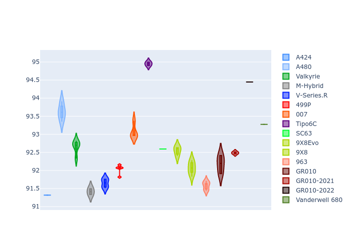
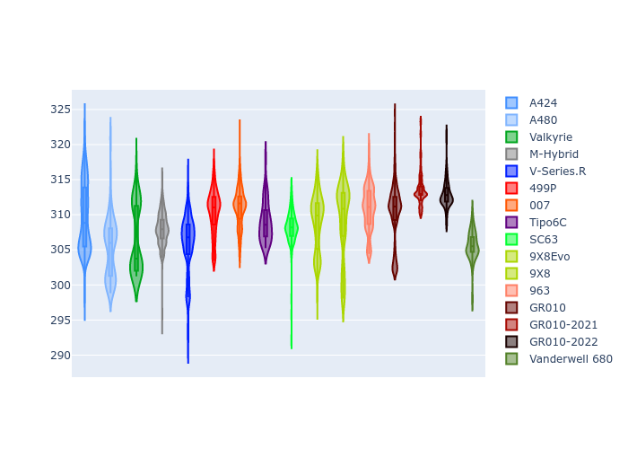
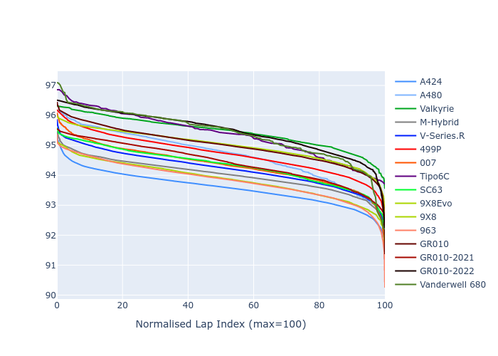

# Combined Plots

## Metadata

- BoP Accuracy: 92.20%
- Overall BoP Grade: A2
- Track: PORTIMAO
- Threshhold: 210.0kph

## BoP Table
| Manufacturer     | Car            | Weight   | Power   | PINC   | E/Stint   | FDS    | RDP    | QDP    | TDP    |
|:-----------------|:---------------|:---------|:--------|:-------|:----------|:-------|:-------|:-------|:-------|
| Alpine           | A424           | 1047kg   | 520.0kw | -      | 913MJ     | -      | 52.35% | 61.85% | 27.84% |
| Alpine           | A480           | 952kg    | 432.0kw | -      | 899MJ     | -      | 54.51% | 76.19% | 54.04% |
| Aston Martin     | Valkyrie       | 1042kg   | 504.0kw | +0.40% | 899MJ     | -      | 53.59% | 53.33% | 21.51% |
| BMW              | M-Hybrid       | 1041kg   | 512.0kw | -      | 906MJ     | -      | 53.26% | 57.23% | 34.54% |
| Cadillac         | V-Series.R     | 1034kg   | 510.0kw | -      | 900MJ     | -      | 47.80% | 56.73% | 19.63% |
| Ferrari          | 499P           | 1063kg   | 508.0kw | -      | 901MJ     | 190kph | 53.02% | 42.32% | 9.88%  |
| Glickenhaus      | 007            | 1030kg   | 520.0kw | -      | 911MJ     | -      | 46.49% | 46.07% | 47.78% |
| Isotta Fraschini | Tipo6C         | 1059kg   | 520.0kw | -      | 917MJ     | 190kph | 43.95% | 47.22% | 31.53% |
| Lamborghini      | SC63           | 1042kg   | 519.0kw | -      | 908MJ     | -      | 46.33% | 59.50% | 29.33% |
| Peugeot          | 9X8Evo         | 1050kg   | 510.0kw | -      | 899MJ     | 190kph | 48.47% | 51.26% | 16.02% |
| Peugeot          | 9X8            | 1030kg   | 520.0kw | -      | 910MJ     | 150kph | 54.07% | 57.08% | 10.80% |
| Porsche          | 963            | 1047kg   | 516.0kw | -      | 910MJ     | -      | 50.87% | 45.25% | 30.77% |
| Toyota           | GR010          | 1080kg   | 512.0kw | -      | 908MJ     | 190kph | 52.43% | 57.12% | 12.82% |
| Toyota           | GR010-2021     | 1065kg   | 513.0kw | -      | 960MJ     | 150kph | 54.09% | 52.67% | 26.37% |
| Toyota           | GR010-2022     | 1080kg   | 512.0kw | -      | 904MJ     | 190kph | 53.48% | 69.44% | 7.86%  |
| Vanwall          | Vanderwell 680 | 1030kg   | 520.0kw | -      | 908MJ     | -      | 53.41% | 56.28% | 29.85% |

## Performance Table
| Manufacturer     | Car            | RP      | QP      | Vavg      |   RDLC | BOP-Grade   | Match   |
|:-----------------|:---------------|:--------|:--------|:----------|-------:|:------------|:--------|
| Alpine           | A424           | 1:32.48 | 1:30.13 | 307.77kph |   1.03 | ~A1         | 97.67%  |
| Alpine           | A480           | 1:32.00 | 1:30.50 | 298.37kph |   1.02 | -B2         | 82.74%  |
| Aston Martin     | Valkyrie       | 1:33.94 | 1:30.97 | 304.37kph |   1.03 | ~A1         | 97.81%  |
| BMW              | M-Hybrid       | 1:32.84 | 1:30.15 | 305.74kph |   1.03 | ~A1         | 99.46%  |
| Cadillac         | V-Series.R     | 1:33.03 | 1:30.35 | 302.47kph |   1.03 | ~A1         | 99.89%  |
| Ferrari          | 499P           | 1:32.97 | 1:29.85 | 306.28kph |   1.03 | ~A1         | 99.60%  |
| Glickenhaus      | 007            | 1:33.17 | 1:31.59 | 304.64kph |   1.02 | ~A1         | 97.68%  |
| Isotta Fraschini | Tipo6C         | 1:34.52 | 1:33.88 | 304.43kph |   1.01 | +D2         | 64.93%  |
| Lamborghini      | SC63           | 1:33.55 | 1:31.68 | 306.02kph |   1.02 | ~A1         | 98.55%  |
| Peugeot          | 9X8Evo         | 1:33.56 | 1:30.97 | 307.42kph |   1.03 | ~A1         | 97.20%  |
| Peugeot          | 9X8            | 1:32.75 | 1:30.25 | 299.34kph |   1.03 | ~A1         | 99.09%  |
| Porsche          | 963            | 1:32.74 | 1:30.11 | 306.56kph |   1.03 | ~A1         | 99.37%  |
| Toyota           | GR010          | 1:33.08 | 1:29.85 | 306.42kph |   1.04 | ~A1         | 99.74%  |
| Toyota           | GR010-2021     | 1:33.01 | 1:30.67 | 298.52kph |   1.03 | ~A1         | 100.00% |
| Toyota           | GR010-2022     | 1:33.16 | 1:31.49 | 304.13kph |   1.02 | ~A1         | 100.00% |
| Vanwall          | Vanderwell 680 | 1:34.92 | 1:32.11 | 298.65kph |   1.03 | +Ω1         | 41.52%  |

## Race Laptimes

## Quali Laptimes

## Topspeeds

## Laptimes Lineplot

