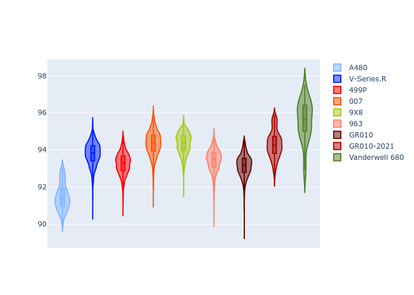
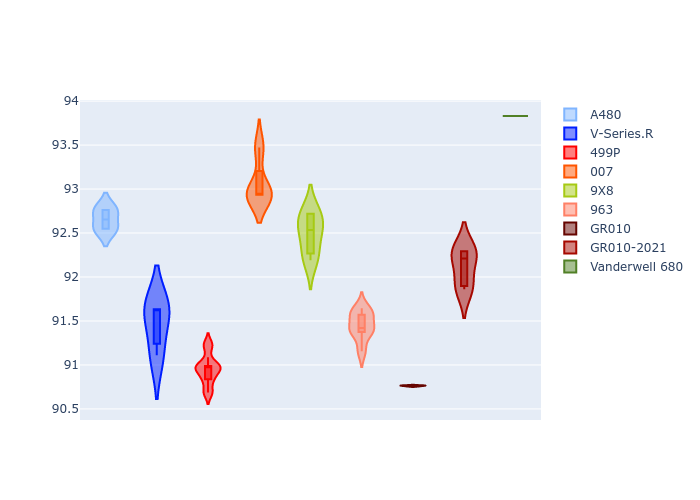
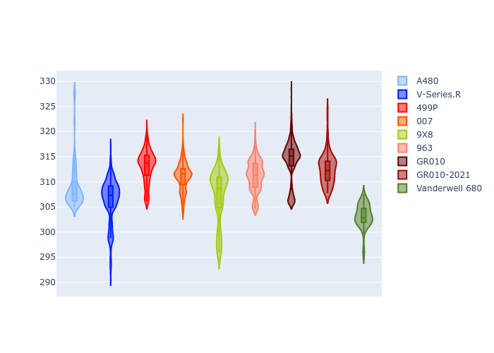
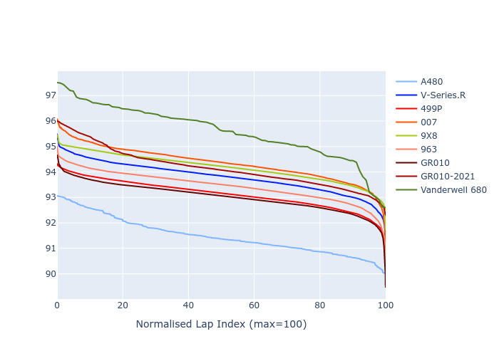

# Combined Plots

## Metadata

- BoP Accuracy: 91.74%
- Overall BoP Grade: A2
- Track: PORTIMAO
- Threshhold: 0.0kph
- Average Laptime: 1:34.04
- Average Quali Laptime: 1:32.09
- Laptime Std Dev: 0.80 seconds
- Filtered Average Topspeed: 310.23kph

## BoP Table
| Manufacturer   | Car            | Weight   | Power   | PINC   | E/Stint   | FDS    | RDP    | QDP    | TDP    |
|:---------------|:---------------|:---------|:--------|:-------|:----------|:-------|:-------|:-------|:-------|
| Alpine         | A480           | 952kg    | 450.0kw | -      | 918MJ     | -      | 53.05% | 74.07% | 48.97% |
| Cadillac       | V-Series.R     | 1035kg   | 513.0kw | -      | 903MJ     | -      | 49.22% | 60.31% | 18.04% |
| Ferrari        | 499P           | 1040kg   | 509.0kw | -      | 899MJ     | 190kph | 51.56% | 44.72% | 9.86%  |
| Glickenhaus    | 007            | 1030kg   | 520.0kw | -      | 911MJ     | -      | 46.14% | 49.30% | 41.45% |
| Peugeot        | 9X8            | 1042kg   | 516.0kw | -      | 908MJ     | 150kph | 54.54% | 58.39% | 9.69%  |
| Porsche        | 963            | 1045kg   | 516.0kw | -      | 910MJ     | -      | 50.78% | 41.25% | 27.61% |
| Toyota         | GR010          | 1043kg   | 512.0kw | -      | 904MJ     | 190kph | 51.68% | 51.25% | 14.48% |
| Toyota         | GR010-2021     | 1066kg   | 515.0kw | -      | 962MJ     | 150kph | 54.04% | 54.81% | 9.72%  |
| Vanwall        | Vanderwell 680 | 1030kg   | 512.0kw | -      | 901MJ     | -      | 49.68% | 60.93% | 34.43% |

## Performance Table
| Manufacturer   | Car            | RP      | QP      | Vavg      |   RDLC | BOP-Grade   | Match   |
|:---------------|:---------------|:--------|:--------|:----------|-------:|:------------|:--------|
| Alpine         | A480           | 1:33.02 | 1:32.65 | 309.85kph |   1    | ~A1         | 98.00%  |
| Cadillac       | V-Series.R     | 1:33.93 | 1:31.46 | 307.04kph |   1.03 | ~A1         | 99.95%  |
| Ferrari        | 499P           | 1:33.45 | 1:30.95 | 313.22kph |   1.03 | ~A1         | 99.96%  |
| Glickenhaus    | 007            | 1:34.34 | 1:33.07 | 311.09kph |   1.01 | ~A1         | 97.21%  |
| Peugeot        | 9X8            | 1:34.40 | 1:32.49 | 307.20kph |   1.02 | ~A1         | 99.57%  |
| Porsche        | 963            | 1:33.84 | 1:31.45 | 311.41kph |   1.03 | ~A1         | 99.97%  |
| Toyota         | GR010          | 1:33.35 | 1:30.76 | 314.35kph |   1.03 | ~A1         | 99.72%  |
| Toyota         | GR010-2021     | 1:34.08 | 1:32.11 | 314.02kph |   1.02 | ~A1         | 100.00% |
| Vanwall        | Vanderwell 680 | 1:35.96 | 1:33.83 | 303.90kph |   1.02 | +Ω1         | 31.28%  |

## Race Laptimes

## Quali Laptimes

## Topspeeds

## Laptimes Lineplot

