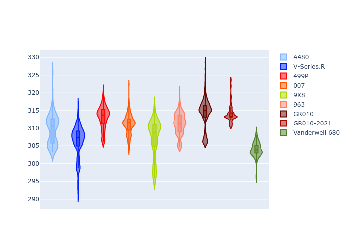

# Combined Plots

## Metadata

- BoP Accuracy: 86.13%
- Overall BoP Grade: B1
- Track: PORTIMAO
- Threshhold: 0.0kph

## BoP Table
| Manufacturer   | Car            | Weight   | Power   | PINC   | E/Stint   | FDS    | RDP    | QDP    | TDP    |
|:---------------|:---------------|:---------|:--------|:-------|:----------|:-------|:-------|:-------|:-------|
| Alpine         | A480           | 952kg    | 450.0kw | -      | 918MJ     | -      | 54.51% | 76.19% | 54.04% |
| Cadillac       | V-Series.R     | 1035kg   | 513.0kw | -      | 903MJ     | -      | 47.80% | 56.73% | 19.63% |
| Ferrari        | 499P           | 1040kg   | 509.0kw | -      | 899MJ     | 190kph | 53.02% | 42.32% | 9.88%  |
| Glickenhaus    | 007            | 1030kg   | 520.0kw | -      | 911MJ     | -      | 46.49% | 46.07% | 47.78% |
| Peugeot        | 9X8            | 1042kg   | 516.0kw | -      | 908MJ     | 150kph | 54.07% | 57.08% | 10.80% |
| Porsche        | 963            | 1045kg   | 516.0kw | -      | 910MJ     | -      | 50.87% | 45.25% | 30.77% |
| Toyota         | GR010          | 1043kg   | 512.0kw | -      | 904MJ     | 190kph | 52.43% | 57.12% | 12.82% |
| Toyota         | GR010-2021     | 1066kg   | 515.0kw | -      | 962MJ     | 150kph | 54.09% | 52.67% | 26.37% |
| Vanwall        | Vanderwell 680 | 1030kg   | 512.0kw | -      | 901MJ     | -      | 53.41% | 56.28% | 29.85% |

## Performance Table
| Manufacturer   | Car            | RP      | QP      | Vavg      |   RDLC | BOP-Grade   | Match   |
|:---------------|:---------------|:--------|:--------|:----------|-------:|:------------|:--------|
| Alpine         | A480           | 1:30.89 | 1:29.44 | 302.81kph |   1.02 | -D1         | 69.44%  |
| Cadillac       | V-Series.R     | 1:32.89 | 1:30.22 | 303.00kph |   1.03 | ~A1         | 99.96%  |
| Ferrari        | 499P           | 1:32.28 | 1:29.21 | 308.93kph |   1.03 | ~A1         | 99.47%  |
| Glickenhaus    | 007            | 1:33.17 | 1:31.59 | 304.64kph |   1.02 | +A2         | 93.12%  |
| Peugeot        | 9X8            | 1:33.32 | 1:30.79 | 297.26kph |   1.03 | ~A1         | 99.77%  |
| Porsche        | 963            | 1:32.68 | 1:30.06 | 306.78kph |   1.03 | ~A1         | 99.88%  |
| Toyota         | GR010          | 1:32.07 | 1:28.92 | 310.32kph |   1.04 | ~A1         | 99.10%  |
| Toyota         | GR010-2021     | 1:32.92 | 1:30.58 | 298.84kph |   1.03 | ~A1         | 99.71%  |
| Vanwall        | Vanderwell 680 | 1:35.39 | 1:32.55 | 296.98kph |   1.03 | +Ω1         | 14.73%  |

## Race Laptimes

## Quali Laptimes

## Topspeeds

## Laptimes Lineplot

