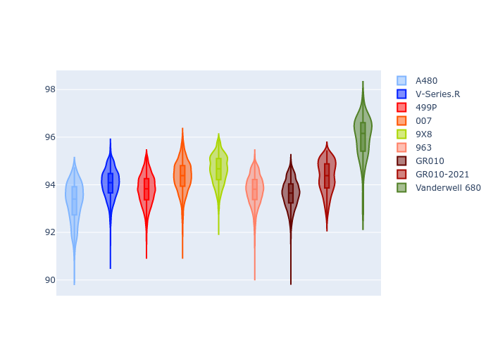

# Combined Plots

## Metadata

- BoP Accuracy: 92.00%
- Overall BoP Grade: A2
- Track: PORTIMAO
- Threshhold: 0.0kph
- Average Laptime: 1:34.20
- Average Quali Laptime: 1:32.15
- Average Topspeed: 310.09kph

## BoP Table
| Manufacturer   | Car            | Weight   | Power   | PINC   | E/Stint   | FDS    | RDP    | QDP    | TDP    |
|:---------------|:---------------|:---------|:--------|:-------|:----------|:-------|:-------|:-------|:-------|
| Alpine         | A480           | 952kg    | 450.0kw | -      | 918MJ     | -      | 53.05% | 74.07% | 48.97% |
| Cadillac       | V-Series.R     | 1035kg   | 513.0kw | -      | 903MJ     | -      | 48.63% | 60.80% | 19.01% |
| Ferrari        | 499P           | 1040kg   | 509.0kw | -      | 899MJ     | 190kph | 51.38% | 44.98% | 9.83%  |
| Glickenhaus    | 007            | 1030kg   | 520.0kw | -      | 911MJ     | -      | 46.15% | 49.30% | 41.45% |
| Peugeot        | 9X8            | 1042kg   | 516.0kw | -      | 908MJ     | 150kph | 54.54% | 58.39% | 9.69%  |
| Porsche        | 963            | 1045kg   | 516.0kw | -      | 910MJ     | -      | 50.70% | 44.30% | 29.51% |
| Toyota         | GR010          | 1043kg   | 512.0kw | -      | 904MJ     | 190kph | 51.09% | 52.71% | 11.46% |
| Toyota         | GR010-2021     | 1066kg   | 515.0kw | -      | 962MJ     | 150kph | 54.08% | 54.81% | 9.72%  |
| Vanwall        | Vanderwell 680 | 1030kg   | 512.0kw | -      | 901MJ     | -      | 49.68% | 60.93% | 34.43% |

## Performance Table
| Manufacturer   | Car            | RP      | QP      | Vavg      |   RDLC | BOP-Grade   | Match   |
|:---------------|:---------------|:--------|:--------|:----------|-------:|:------------|:--------|
| Alpine         | A480           | 1:33.26 | 1:32.25 | 309.85kph |   1.01 | ~A1         | 99.07%  |
| Cadillac       | V-Series.R     | 1:34.04 | 1:31.48 | 306.33kph |   1.03 | ~A1         | 99.93%  |
| Ferrari        | 499P           | 1:33.79 | 1:31.17 | 313.10kph |   1.03 | ~A1         | 99.98%  |
| Glickenhaus    | 007            | 1:34.34 | 1:33.07 | 311.09kph |   1.01 | ~A1         | 98.34%  |
| Peugeot        | 9X8            | 1:34.63 | 1:32.79 | 307.20kph |   1.02 | ~A1         | 97.00%  |
| Porsche        | 963            | 1:33.77 | 1:31.51 | 311.15kph |   1.02 | ~A1         | 99.86%  |
| Toyota         | GR010          | 1:33.62 | 1:30.88 | 314.20kph |   1.03 | ~A1         | 99.74%  |
| Toyota         | GR010-2021     | 1:34.33 | 1:32.38 | 314.02kph |   1.02 | ~A1         | 100.00% |
| Vanwall        | Vanderwell 680 | 1:35.98 | 1:33.83 | 303.90kph |   1.02 | +Ω1         | 34.12%  |

## Race Laptimes

## Quali Laptimes

## Topspeeds

## Laptimes Lineplot

