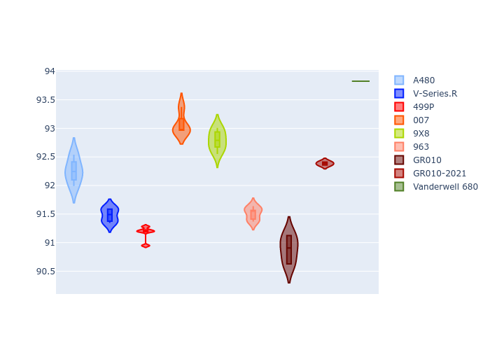

# Combined Plots

## Metadata

- BoP Accuracy: 90.69%
- Overall BoP Grade: A2
- Track: PORTIMAO
- Threshhold: 0.0kph

## BoP Table
| Manufacturer   | Car            | Weight   | Power   | PINC   | E/Stint   | FDS    |
|:---------------|:---------------|:---------|:--------|:-------|:----------|:-------|
| Alpine         | A480           | 1052kg   | 450.0kw | -      | 918MJ     | -      |
| Cadillac       | V-Series.R     | 1035kg   | 513.0kw | -      | 903MJ     | -      |
| Ferrari        | 499P           | 1040kg   | 509.0kw | -      | 899MJ     | 190kph |
| Glickenhaus    | 007            | 1030kg   | 520.0kw | -      | 911MJ     | -      |
| Peugeot        | 9X8            | 1042kg   | 516.0kw | -      | 908MJ     | 150kph |
| Porsche        | 963            | 1045kg   | 516.0kw | -      | 910MJ     | -      |
| Toyota         | GR010          | 1043kg   | 512.0kw | -      | 904MJ     | 190kph |
| Toyota         | GR010OLD       | 1066kg   | 515.0kw | -      | 962MJ     | 150kph |
| Vanwall        | Vanderwell 680 | 1030kg   | 512.0kw | -      | 901MJ     | -      |

## Performance Table
| Manufacturer   | Car            | RP      | QP      | Vavg      |   RDLC | BOP-Grade   | Match   |
|:---------------|:---------------|:--------|:--------|:----------|-------:|:------------|:--------|
| Alpine         | A480           | 1:32.43 | 1:31.14 | 301.02kph |   1.01 | ~A1         | 99.33%  |
| Cadillac       | V-Series.R     | 1:32.95 | 1:30.48 | 303.24kph |   1.03 | ~A1         | 100.00% |
| Ferrari        | 499P           | 1:32.62 | 1:30.02 | 309.01kph |   1.03 | ~A1         | 99.68%  |
| Glickenhaus    | 007            | 1:33.17 | 1:31.58 | 304.64kph |   1.02 | ~A1         | 98.06%  |
| Peugeot        | 9X8            | 1:33.83 | 1:31.58 | 298.68kph |   1.02 | +A2         | 93.95%  |
| Porsche        | 963            | 1:32.79 | 1:30.31 | 306.41kph |   1.03 | ~A1         | 99.96%  |
| Toyota         | GR010          | 1:32.58 | 1:29.90 | 309.88kph |   1.03 | ~A1         | 99.80%  |
| Toyota         | GR010OLD       | 1:32.79 | 1:31.20 | 302.31kph |   1.02 | ~A1         | 100.00% |
| Vanwall        | Vanderwell 680 | 1:35.49 | 1:32.61 | 296.98kph |   1.03 | +Ω1         | 25.45%  |

## Race Laptimes

## Quali Laptimes

## Topspeeds

## Laptimes Lineplot

