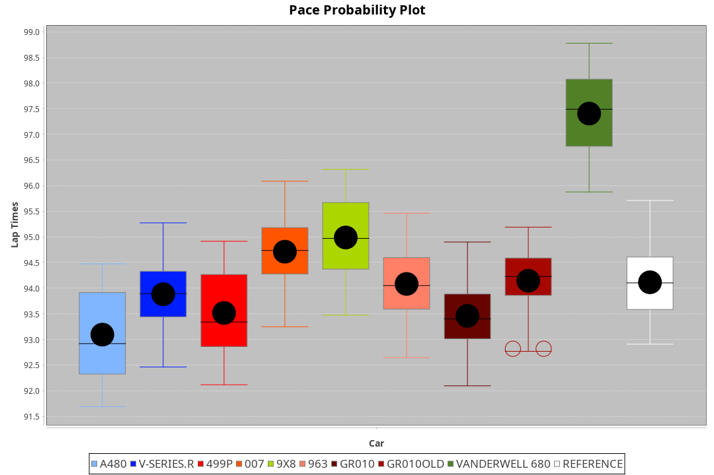
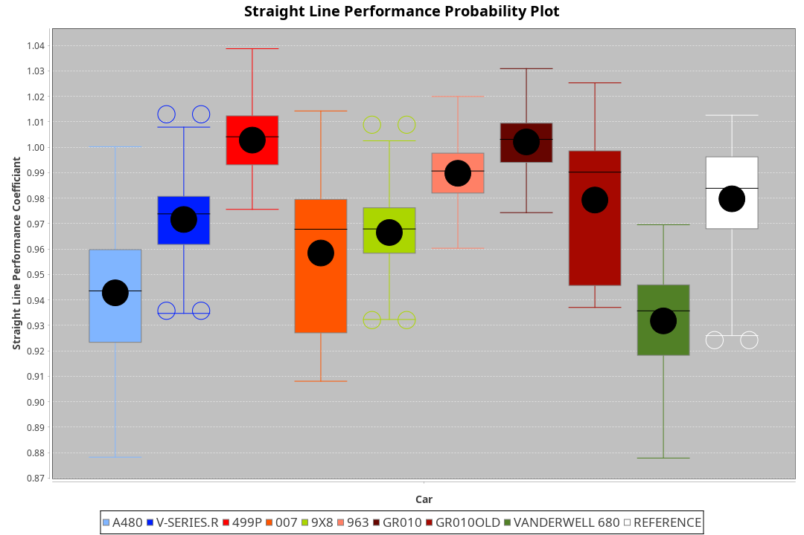
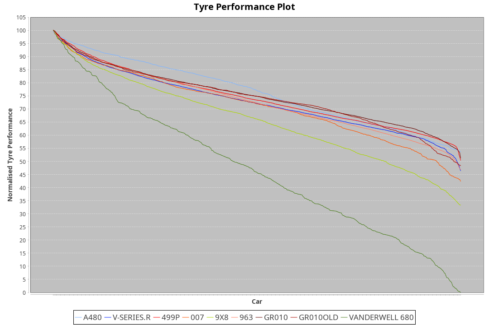

|Manufacturer|Car|Weight|Power|PINC|E/Stint|FDS|
|:-|:-|:-|:-|:-|:-|:-|
|Alpine|A480|952kg|450kw|-|782MJ|-|
|Cadillac|V-Series.R|1035kg|513kw|-|901MJ|-|
|Ferrari|499P|1040kg|509kw|-|897MJ|190kph|
|Glickenhaus|007|1030kg|520kw|-|910MJ|-|
|Peugeot|9X8|1042kg|516kw|-|902MJ|150kph|
|Porsche|963|1045kg|516kw|-|902MJ|-|
|Toyota|GR010|1043kg|512kw|-|900MJ|190kph|
|Toyota|GR010OLD|1066kg|515kw|-|907MJ|150kph|
|Vanwall|Vanderwell 680|1030kg|512kw|-|896MJ|-|

### BoP Accuracy: 59.80%; Overall BoP Grade: E1
|Manufacturer|Car|Type|RP|QP|Weight|Power¹|Threshhold|PINC|Power²|E/Stint|AVG Vmax|FDS|RDLC|L/Stint|BOP-Grade|ModelAccuracy|ModelPoints|Match%|
|:-|:-|:-|:-|:-|:-|:-|:-|:-|:-|:-|:-|:-|:-|:-|:-|:-|:-|:-|
|Alpine|A480|LMP1|1:33.08|1:30.24|952kg|450kw|0.0kph|-|450kw|782MJ|301.28kph|-|0.98|37|-Ω1|67.92%|957|47.01%|
|Cadillac|V-Series.R|LMDH|1:33.87|1:30.29|1035kg|513kw|0.0kph|-|513kw|901MJ|301.52kph|-|1.03|40|-B2|91.10%|1770|82.08%|
|Ferrari|499P|LMHHU|1:33.51|1:30.09|1040kg|509kw|0.0kph|-|509kw|897MJ|303.65kph|190kph|1.05|40|-D1|84.26%|2292|65.99%|
|Glickenhaus|007|LMHNH|1:34.67|1:31.79|1030kg|520kw|0.0kph|-|520kw|910MJ|304.27kph|-|0.96|40|+B1|94.63%|1605|86.62%|
|Peugeot|9X8|LMHHE|1:34.89|1:31.62|1042kg|516kw|0.0kph|-|516kw|902MJ|299.84kph|150kph|1.02|40|+C2|83.63%|2468|73.95%|
|Porsche|963|LMDH|1:34.05|1:30.41|1045kg|516kw|0.0kph|-|516kw|902MJ|301.39kph|-|1.01|40|-A2|93.14%|5746|90.80%|
|Toyota|GR010|LMHHU|1:33.50|1:30.09|1043kg|512kw|0.0kph|-|512kw|900MJ|303.87kph|190kph|1.05|40|-D2|87.37%|3154|64.01%|
|Toyota|GR010OLD|LMHHE|1:33.79|1:30.25|1066kg|515kw|0.0kph|-|515kw|907MJ|304.07kph|150kph|1.03|40|-C1|89.81%|1393|78.41%|
|Vanwall|Vanderwell 680|LMHNH|1:37.32|1:33.16|1030kg|512kw|0.0kph|-|512kw|896MJ|296.26kph|-|1.01|40|+Ω2|90.28%|604|-50.69%|

## Power below Threshhold
|N/Nmax|VSERIES.R|499P|007|9X8|963|GR010|GR010OLD|VANDERWELL680|​|RPM|A480|
|:-|:-|:-|:-|:-|:-|:-|:-|:-|:-|:-|:-|
|0.550|253|251|256|254|254|252|254|252|​|--|-|
|0.575|276|274|279|277|277|275|277|275|​|--|-|
|0.600|296|294|300|298|298|296|297|296|​|--|-|
|0.625|317|315|322|319|319|317|319|317|​|--|-|
|0.650|338|336|343|340|340|338|340|338|​|--|-|
|0.675|360|357|365|362|362|359|362|359|​|--|-|
|0.700|382|379|387|384|384|381|383|381|​|--|-|
|0.725|403|400|409|406|406|403|405|403|​|--|-|
|0.750|424|421|430|427|427|423|426|423|​|--|-|
|0.775|443|440|449|446|446|442|445|442|​|5000|264|
|0.800|461|457|467|463|463|460|463|460|​|5500|312|
|0.825|476|472|482|478|478|475|478|475|​|6000|349|
|0.850|487|484|494|490|490|486|489|486|​|6500|394|
|0.875|498|494|505|501|501|497|500|497|​|7000|440|
|0.900|505|501|512|508|508|504|507|504|​|7500|451|
|0.925|510|506|517|513|513|509|512|509|​|8000|447|
|**0.950**|**513**|**509**|**520**|**516**|**516**|**512**|**515**|**512**|**​**|**8500**|**450**|
|0.975|511|507|518|514|514|510|513|510|​|9000|225|
|1.000|507|504|514|510|510|506|509|506|​|--|-|
|1.025|438|435|444|441|441|437|440|437|​|--|-|

## Power above Threshhold
|N/Nmax|VSERIES.R|499P|007|9X8|963|GR010|GR010OLD|VANDERWELL680|​|RPM|A480|
|:-|:-|:-|:-|:-|:-|:-|:-|:-|:-|:-|:-|
|0.550|253|251|256|254|254|252|254|252|​|--|-|
|0.575|276|274|279|277|277|275|277|275|​|--|-|
|0.600|296|294|300|298|298|296|297|296|​|--|-|
|0.625|317|315|322|319|319|317|319|317|​|--|-|
|0.650|338|336|343|340|340|338|340|338|​|--|-|
|0.675|360|357|365|362|362|359|362|359|​|--|-|
|0.700|382|379|387|384|384|381|383|381|​|--|-|
|0.725|403|400|409|406|406|403|405|403|​|--|-|
|0.750|424|421|430|427|427|423|426|423|​|--|-|
|0.775|443|440|449|446|446|442|445|442|​|5000|264|
|0.800|461|457|467|463|463|460|463|460|​|5500|312|
|0.825|476|472|482|478|478|475|478|475|​|6000|349|
|0.850|487|484|494|490|490|486|489|486|​|6500|394|
|0.875|498|494|505|501|501|497|500|497|​|7000|440|
|0.900|505|501|512|508|508|504|507|504|​|7500|451|
|0.925|510|506|517|513|513|509|512|509|​|8000|447|
|**0.950**|**513**|**509**|**520**|**516**|**516**|**512**|**515**|**512**|**​**|**8500**|**450**|
|0.975|511|507|518|514|514|510|513|510|​|9000|225|
|1.000|507|504|514|510|510|506|509|506|​|--|-|
|1.025|438|435|444|441|441|437|440|437|​|--|-|
