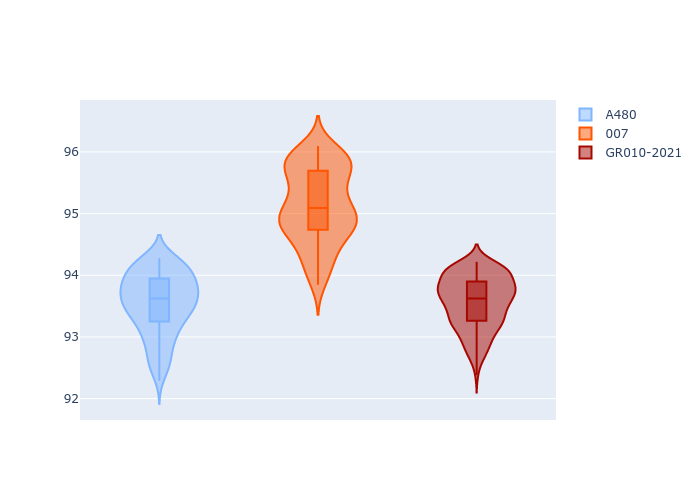
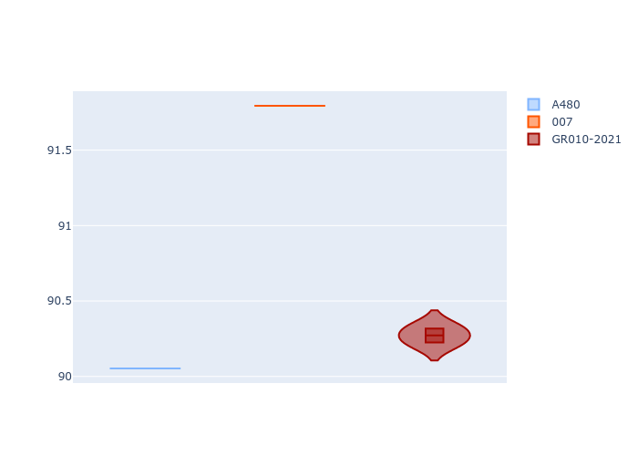
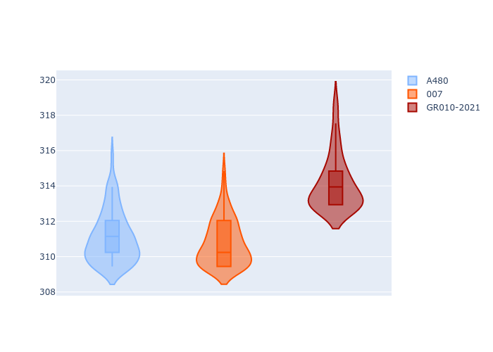
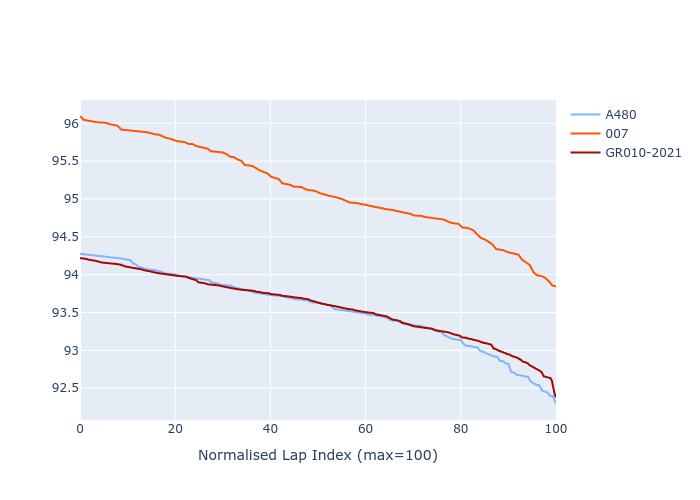

# Combined Plots

## Metadata

- BoP Accuracy: 72.86%
- Overall BoP Grade: C2
- Track: PORTIMAO
- Threshhold: 0.0kph
- Average Laptime: 1:34.08
- Average Quali Laptime: 1:32.17
- Average Topspeed: 311.99kph

## BoP Table
| Manufacturer   | Car        | Weight   | Power   | PINC   | E/Stint   | FDS    | RDP    | QDP     | TDP    |
|:---------------|:-----------|:---------|:--------|:-------|:----------|:-------|:-------|:--------|:-------|
| Alpine         | A480       | 952kg    | 450.0kw | -      | 918MJ     | -      | 57.00% | 100.00% | 56.04% |
| Glickenhaus    | 007        | 1030kg   | 520.0kw | -      | 965MJ     | -      | 52.03% | 33.33%  | 59.43% |
| Toyota         | GR010-2021 | 1066kg   | 515.0kw | -      | 962MJ     | 150kph | 58.83% | 66.67%  | 8.53%  |

## Performance Table
| Manufacturer   | Car        | RP      | QP      | Vavg      |   RDLC | BOP-Grade   | Match   |
|:---------------|:-----------|:--------|:--------|:----------|-------:|:------------|:--------|
| Alpine         | A480       | 1:33.55 | 1:31.53 | 311.08kph |   1.02 | -B1         | 88.89%  |
| Glickenhaus    | 007        | 1:35.13 | 1:33.25 | 310.77kph |   1.02 | +Ω1         | 35.94%  |
| Toyota         | GR010-2021 | 1:33.57 | 1:31.74 | 314.11kph |   1.02 | -A2         | 93.77%  |

## Race Laptimes

## Quali Laptimes

## Topspeeds

## Laptimes Lineplot

