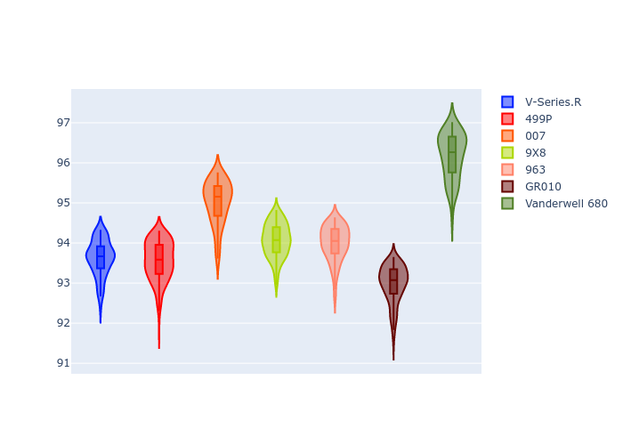
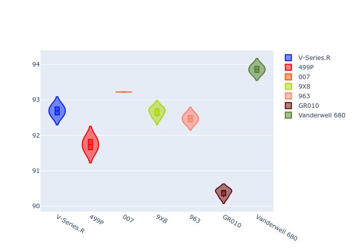
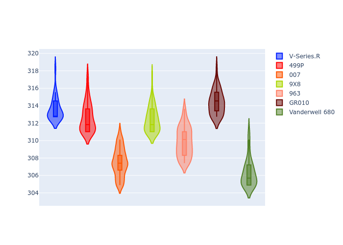
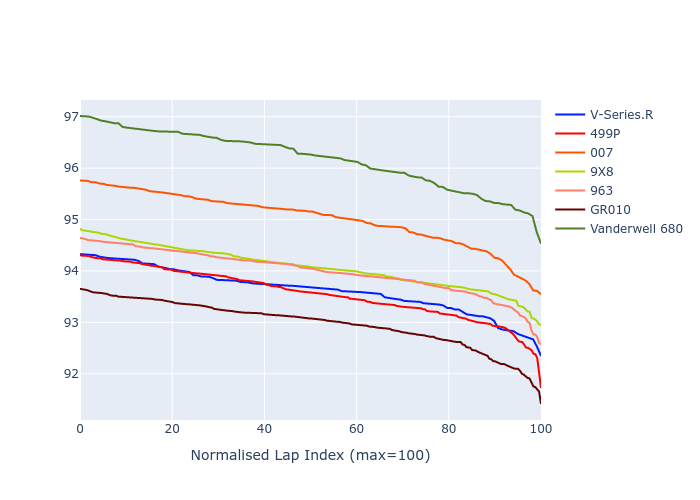

# Combined Plots

## Metadata

- BoP Accuracy: 71.97%
- Overall BoP Grade: C2
- Track: PORTIMAO
- Threshhold: 0.0kph

## BoP Table
| Manufacturer   | Car            | Weight   | Power   | PINC   | E/Stint   | FDS    |
|:---------------|:---------------|:---------|:--------|:-------|:----------|:-------|
| Cadillac       | V-Series.R     | 1035kg   | 513.0kw | -      | 903MJ     | -      |
| Ferrari        | 499P           | 1040kg   | 509.0kw | -      | 899MJ     | 190kph |
| Glickenhaus    | 007            | 1030kg   | 520.0kw | -      | 911MJ     | -      |
| Peugeot        | 9X8            | 1042kg   | 516.0kw | -      | 908MJ     | 150kph |
| Porsche        | 963            | 1045kg   | 516.0kw | -      | 910MJ     | -      |
| Toyota         | GR010          | 1043kg   | 512.0kw | -      | 904MJ     | 190kph |
| Vanwall        | Vanderwell 680 | 1030kg   | 512.0kw | -      | 901MJ     | -      |

## Performance Table
| Manufacturer   | Car            | RP      | QP      | Vavg      |   RDLC | BOP-Grade   | Match   |
|:---------------|:---------------|:--------|:--------|:----------|-------:|:------------|:--------|
| Cadillac       | V-Series.R     | 1:32.92 | 1:31.31 | 310.53kph |   1.02 | ~A1         | 95.80%  |
| Ferrari        | 499P           | 1:32.85 | 1:30.43 | 309.60kph |   1.03 | -A2         | 94.33%  |
| Glickenhaus    | 007            | 1:34.30 | 1:31.95 | 304.53kph |   1.03 | +Ω1         | 37.50%  |
| Peugeot        | 9X8            | 1:33.36 | 1:31.29 | 309.36kph |   1.02 | ~A1         | 100.00% |
| Porsche        | 963            | 1:33.28 | 1:31.11 | 306.84kph |   1.02 | ~A1         | 98.76%  |
| Toyota         | GR010          | 1:32.28 | 1:29.06 | 311.29kph |   1.04 | -C1         | 75.51%  |
| Vanwall        | Vanderwell 680 | 1:35.43 | 1:32.48 | 303.30kph |   1.03 | +Ω1         | 1.87%   |

## Race Laptimes

## Quali Laptimes

## Topspeeds

## Laptimes Lineplot

