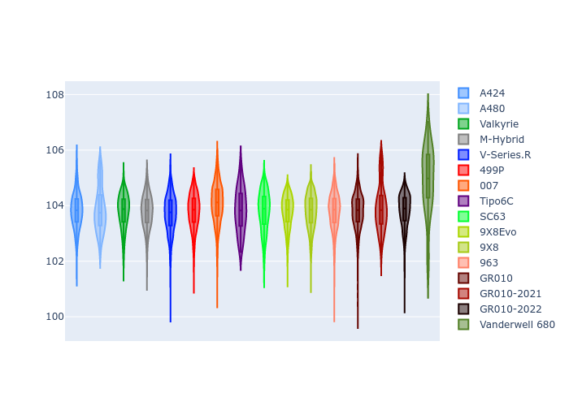
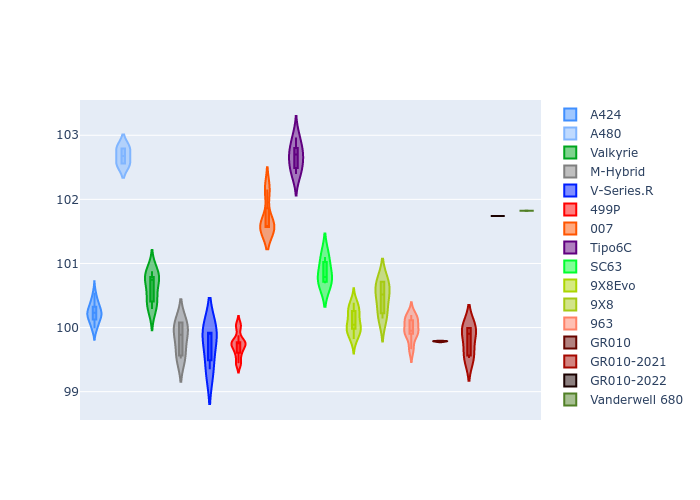
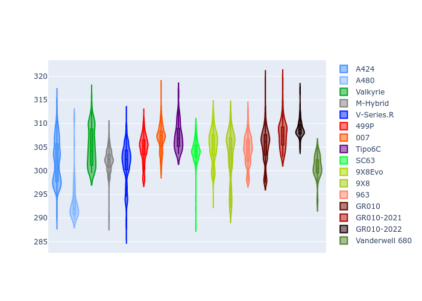
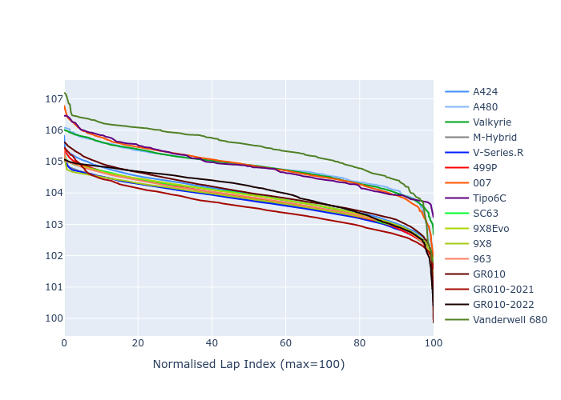

# Combined Plots

## Metadata

- BoP Accuracy: 97.18%
- Overall BoP Grade: A1
- Track: QATAR
- Threshhold: 250.0kph
- Average Laptime: 1:43.91
- Average Quali Laptime: 1:40.58
- Average Topspeed: 303.88kph

## BoP Table
| Manufacturer     | Car            | Weight   | Power   | PINC   | E/Stint   | FDS    | RDP    | QDP    | TDP    |
|:-----------------|:---------------|:---------|:--------|:-------|:----------|:-------|:-------|:-------|:-------|
| Alpine           | A424           | 1068kg   | 515.0kw | +0.70% | 921MJ     | -      | 51.64% | 59.31% | 26.80% |
| Alpine           | A480           | 996kg    | 421.0kw | +0.10% | 777MJ     | -      | 54.81% | 80.56% | 55.69% |
| Aston Martin     | Valkyrie       | 1033kg   | 513.0kw | -      | 905MJ     | -      | 53.50% | 53.33% | 21.51% |
| BMW              | M-Hybrid       | 1060kg   | 517.0kw | -      | 913MJ     | -      | 52.89% | 56.22% | 33.41% |
| Cadillac         | V-Series.R     | 1050kg   | 520.0kw | -      | 908MJ     | -      | 48.63% | 60.80% | 19.01% |
| Ferrari          | 499P           | 1073kg   | 503.0kw | +0.10% | 903MJ     | 190kph | 51.38% | 44.98% | 9.83%  |
| Glickenhaus      | 007            | 1030kg   | 520.0kw | -      | 910MJ     | -      | 46.15% | 49.30% | 41.45% |
| Isotta Fraschini | Tipo6C         | 1037kg   | 520.0kw | -      | 917MJ     | 190kph | 43.95% | 47.22% | 31.53% |
| Lamborghini      | SC63           | 1038kg   | 515.0kw | -      | 906MJ     | -      | 48.33% | 60.95% | 28.65% |
| Peugeot          | 9X8Evo         | 1064kg   | 516.0kw | -0.10% | 922MJ     | 190kph | 48.87% | 52.78% | 15.41% |
| Peugeot          | 9X8            | 1056kg   | 524.0kw | -      | 910MJ     | 150kph | 54.54% | 58.39% | 9.69%  |
| Porsche          | 963            | 1063kg   | 514.0kw | -0.10% | 911MJ     | -      | 50.70% | 44.30% | 29.51% |
| Toyota           | GR010          | 1069kg   | 501.0kw | +0.10% | 900MJ     | 190kph | 51.09% | 52.71% | 11.46% |
| Toyota           | GR010-2021     | 1060kg   | 509.0kw | -0.10% | 901MJ     | 150kph | 53.89% | 50.91% | 25.87% |
| Toyota           | GR010-2022     | 1059kg   | 503.0kw | -0.10% | 894MJ     | 190kph | 53.24% | 64.49% | 9.72%  |
| Vanwall          | Vanderwell 680 | 1030kg   | 520.0kw | -      | 908MJ     | -      | 35.83% | 59.29% | 34.15% |

## Performance Table
| Manufacturer     | Car            | RP      | QP      | Vavg      |   RDLC | BOP-Grade   | Match   |
|:-----------------|:---------------|:--------|:--------|:----------|-------:|:------------|:--------|
| Alpine           | A424           | 1:43.61 | 1:39.97 | 302.86kph |   1.04 | ~A1         | 99.94%  |
| Alpine           | A480           | 1:43.97 | 1:41.63 | 292.90kph |   1.02 | ~A1         | 95.75%  |
| Aston Martin     | Valkyrie       | 1:43.95 | 1:39.82 | 304.97kph |   1.04 | ~A1         | 100.00% |
| BMW              | M-Hybrid       | 1:43.56 | 1:39.56 | 302.93kph |   1.04 | ~A1         | 99.97%  |
| Cadillac         | V-Series.R     | 1:43.44 | 1:39.48 | 302.11kph |   1.04 | ~A1         | 99.81%  |
| Ferrari          | 499P           | 1:43.95 | 1:39.72 | 304.18kph |   1.04 | ~A1         | 99.96%  |
| Glickenhaus      | 007            | 1:44.07 | 1:41.51 | 306.90kph |   1.03 | ~A1         | 98.63%  |
| Isotta Fraschini | Tipo6C         | 1:43.96 | 1:42.45 | 307.15kph |   1.01 | ~A1         | 95.52%  |
| Lamborghini      | SC63           | 1:43.95 | 1:40.89 | 303.69kph |   1.03 | ~A1         | 100.00% |
| Peugeot          | 9X8Evo         | 1:43.96 | 1:40.19 | 304.53kph |   1.04 | ~A1         | 100.00% |
| Peugeot          | 9X8            | 1:43.83 | 1:40.65 | 303.29kph |   1.03 | ~A1         | 99.96%  |
| Porsche          | 963            | 1:43.67 | 1:39.85 | 304.55kph |   1.04 | ~A1         | 99.82%  |
| Toyota           | GR010          | 1:43.95 | 1:39.71 | 304.90kph |   1.04 | ~A1         | 99.67%  |
| Toyota           | GR010-2021     | 1:43.94 | 1:40.29 | 307.56kph |   1.04 | ~A1         | 97.49%  |
| Toyota           | GR010-2022     | 1:43.96 | 1:41.79 | 308.69kph |   1.02 | ~A1         | 99.78%  |
| Vanwall          | Vanderwell 680 | 1:44.87 | 1:41.71 | 300.88kph |   1.03 | +D1         | 68.63%  |

## Race Laptimes

## Quali Laptimes

## Topspeeds

## Laptimes Lineplot

