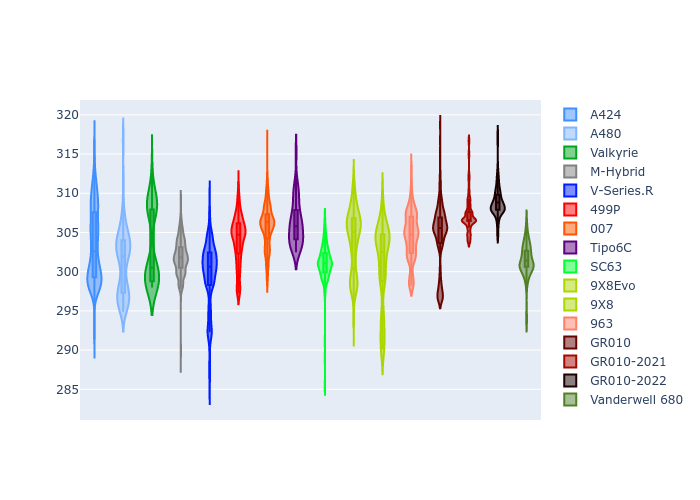

# Combined Plots

## Metadata

- BoP Accuracy: 93.08%
- Overall BoP Grade: A2
- Track: QATAR
- Threshhold: 250.0kph

## BoP Table
| Manufacturer     | Car            | Weight   | Power   | PINC   | E/Stint   | FDS    | RDP    | QDP    | TDP    |
|:-----------------|:---------------|:---------|:--------|:-------|:----------|:-------|:-------|:-------|:-------|
| Alpine           | A424           | 1067kg   | 520.0kw | -0.10% | 923MJ     | -      | 52.35% | 61.85% | 27.84% |
| Alpine           | A480           | 952kg    | 432.0kw | +0.10% | 783MJ     | -      | 54.51% | 76.19% | 54.04% |
| Aston Martin     | Valkyrie       | 1057kg   | 504.0kw | +0.10% | 900MJ     | -      | 53.59% | 53.33% | 21.51% |
| BMW              | M-Hybrid       | 1061kg   | 512.0kw | -0.10% | 909MJ     | -      | 53.26% | 57.23% | 34.54% |
| Cadillac         | V-Series.R     | 1054kg   | 510.0kw | +0.10% | 900MJ     | -      | 47.80% | 56.73% | 19.63% |
| Ferrari          | 499P           | 1083kg   | 508.0kw | -0.10% | 908MJ     | 190kph | 53.02% | 42.32% | 9.88%  |
| Glickenhaus      | 007            | 1050kg   | 520.0kw | -      | 912MJ     | -      | 46.49% | 46.07% | 47.78% |
| Isotta Fraschini | Tipo6C         | 1059kg   | 520.0kw | -      | 920MJ     | 190kph | 43.95% | 47.22% | 31.53% |
| Lamborghini      | SC63           | 1062kg   | 519.0kw | -0.10% | 912MJ     | -      | 46.33% | 59.50% | 29.33% |
| Peugeot          | 9X8Evo         | 1070kg   | 510.0kw | -0.10% | 917MJ     | 190kph | 48.47% | 51.26% | 16.02% |
| Peugeot          | 9X8            | 1050kg   | 520.0kw | -      | 906MJ     | 150kph | 54.07% | 57.08% | 10.80% |
| Porsche          | 963            | 1067kg   | 516.0kw | -0.10% | 914MJ     | -      | 50.87% | 45.25% | 30.77% |
| Toyota           | GR010          | 1100kg   | 512.0kw | -0.10% | 913MJ     | 190kph | 52.43% | 57.12% | 12.82% |
| Toyota           | GR010-2021     | 1085kg   | 513.0kw | +0.10% | 908MJ     | 150kph | 54.09% | 52.67% | 26.37% |
| Toyota           | GR010-2022     | 1100kg   | 512.0kw | +0.10% | 907MJ     | 190kph | 53.48% | 69.44% | 7.86%  |
| Vanwall          | Vanderwell 680 | 1030kg   | 520.0kw | -      | 903MJ     | -      | 53.41% | 56.28% | 29.85% |

## Performance Table
| Manufacturer     | Car            | RP      | QP      | Vavg      |   RDLC | BOP-Grade   | Match   |
|:-----------------|:---------------|:--------|:--------|:----------|-------:|:------------|:--------|
| Alpine           | A424           | 1:42.32 | 1:39.04 | 301.47kph |   1.03 | ~A1         | 98.94%  |
| Alpine           | A480           | 1:41.11 | 1:38.82 | 294.43kph |   1.02 | -C2         | 71.03%  |
| Aston Martin     | Valkyrie       | 1:43.81 | 1:39.85 | 298.46kph |   1.04 | ~A1         | 96.71%  |
| BMW              | M-Hybrid       | 1:42.72 | 1:39.06 | 299.47kph |   1.04 | ~A1         | 99.82%  |
| Cadillac         | V-Series.R     | 1:42.91 | 1:39.28 | 296.41kph |   1.04 | ~A1         | 99.96%  |
| Ferrari          | 499P           | 1:42.60 | 1:38.49 | 300.04kph |   1.04 | ~A1         | 99.50%  |
| Glickenhaus      | 007            | 1:43.18 | 1:40.75 | 298.46kph |   1.02 | +A2         | 93.72%  |
| Isotta Fraschini | Tipo6C         | 1:43.81 | 1:42.42 | 300.33kph |   1.01 | +B2         | 84.33%  |
| Lamborghini      | SC63           | 1:43.52 | 1:40.76 | 299.75kph |   1.03 | ~A1         | 97.10%  |
| Peugeot          | 9X8Evo         | 1:43.34 | 1:39.81 | 301.14kph |   1.04 | ~A1         | 96.57%  |
| Peugeot          | 9X8            | 1:42.55 | 1:39.11 | 293.26kph |   1.03 | ~A1         | 99.30%  |
| Porsche          | 963            | 1:42.60 | 1:39.01 | 300.29kph |   1.04 | ~A1         | 99.71%  |
| Toyota           | GR010          | 1:42.67 | 1:38.46 | 300.21kph |   1.04 | ~A1         | 99.76%  |
| Toyota           | GR010-2021     | 1:42.65 | 1:39.39 | 292.61kph |   1.03 | ~A1         | 99.85%  |
| Toyota           | GR010-2022     | 1:42.73 | 1:40.22 | 298.13kph |   1.03 | ~A1         | 100.00% |
| Vanwall          | Vanderwell 680 | 1:44.49 | 1:40.73 | 294.63kph |   1.04 | +E2         | 52.98%  |

## Race Laptimes

## Quali Laptimes

## Topspeeds

## Laptimes Lineplot

