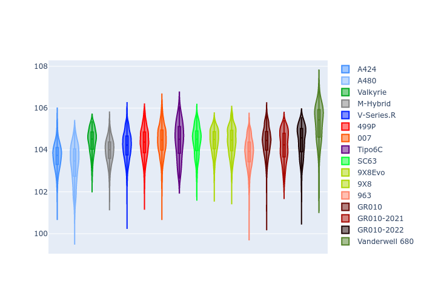

# Combined Plots

## Metadata

- BoP Accuracy: 95.97%
- Overall BoP Grade: A1
- Track: QATAR
- Threshhold: 210.0kph

## BoP Table
| Manufacturer     | Car            | Weight   | Power   | PINC   | E/Stint   | FDS    |
|:-----------------|:---------------|:---------|:--------|:-------|:----------|:-------|
| Alpine           | A424           | 1067kg   | 520.0kw | -1.00% | 921MJ     | -      |
| Alpine           | A480           | 1052kg   | 432.0kw | +1.00% | 768MJ     | -      |
| Aston Martin     | Valkyrie       | 1058kg   | 504.0kw | +1.00% | 902MJ     | -      |
| BMW              | M-Hybrid       | 1061kg   | 512.0kw | -1.00% | 907MJ     | -      |
| Cadillac         | V-Series.R     | 1054kg   | 510.0kw | +1.00% | 902MJ     | -      |
| Ferrari          | 499P           | 1083kg   | 508.0kw | -1.00% | 906MJ     | 190kph |
| Glickenhaus      | 007            | 1050kg   | 520.0kw | -      | 912MJ     | -      |
| Isotta Fraschini | Tipo6C         | 1059kg   | 520.0kw | -      | 920MJ     | 190kph |
| Lamborghini      | SC63           | 1062kg   | 519.0kw | -1.00% | 910MJ     | -      |
| Peugeot          | 9X8Evo         | 1070kg   | 510.0kw | -1.00% | 915MJ     | 190kph |
| Peugeot          | 9X8            | 1050kg   | 520.0kw | -      | 906MJ     | 150kph |
| Porsche          | 963            | 1067kg   | 516.0kw | -1.00% | 912MJ     | -      |
| Toyota           | GR010          | 1100kg   | 512.0kw | -1.00% | 911MJ     | 190kph |
| Toyota           | GR010OLD       | 1085kg   | 513.0kw | +1.00% | 964MJ     | 150kph |
| Vanwall          | Vanderwell 680 | 1030kg   | 520.0kw | -      | 903MJ     | -      |

## Performance Table
| Manufacturer     | Car            | RP      | QP      | Vavg      |   RDLC | BOP-Grade   | Match   |
|:-----------------|:---------------|:--------|:--------|:----------|-------:|:------------|:--------|
| Alpine           | A424           | 1:42.38 | 1:39.23 | 300.97kph |   1.03 | ~A1         | 98.96%  |
| Alpine           | A480           | 1:42.57 | 1:40.45 | 293.36kph |   1.02 | ~A1         | 99.44%  |
| Aston Martin     | Valkyrie       | 1:43.83 | 1:39.89 | 299.05kph |   1.04 | ~A1         | 97.49%  |
| BMW              | M-Hybrid       | 1:42.85 | 1:39.35 | 298.82kph |   1.04 | ~A1         | 99.96%  |
| Cadillac         | V-Series.R     | 1:42.83 | 1:39.42 | 297.33kph |   1.03 | ~A1         | 99.87%  |
| Ferrari          | 499P           | 1:43.05 | 1:39.46 | 299.41kph |   1.04 | ~A1         | 99.94%  |
| Glickenhaus      | 007            | 1:43.20 | 1:40.77 | 298.46kph |   1.02 | ~A1         | 96.77%  |
| Isotta Fraschini | Tipo6C         | 1:43.82 | 1:42.34 | 300.33kph |   1.01 | ~A1         | 95.52%  |
| Lamborghini      | SC63           | 1:43.58 | 1:40.88 | 299.05kph |   1.03 | ~A1         | 97.35%  |
| Peugeot          | 9X8Evo         | 1:43.52 | 1:39.99 | 300.44kph |   1.04 | ~A1         | 96.65%  |
| Peugeot          | 9X8            | 1:42.96 | 1:39.83 | 294.67kph |   1.03 | ~A1         | 99.96%  |
| Porsche          | 963            | 1:42.70 | 1:39.28 | 299.23kph |   1.03 | ~A1         | 99.81%  |
| Toyota           | GR010          | 1:43.30 | 1:39.59 | 299.09kph |   1.04 | ~A1         | 99.97%  |
| Toyota           | GR010OLD       | 1:42.02 | 1:39.61 | 296.69kph |   1.02 | ~A1         | 96.03%  |
| Vanwall          | Vanderwell 680 | 1:44.53 | 1:40.73 | 294.63kph |   1.04 | +D2         | 61.76%  |

## Race Laptimes

## Quali Laptimes

## Topspeeds

## Laptimes Lineplot

