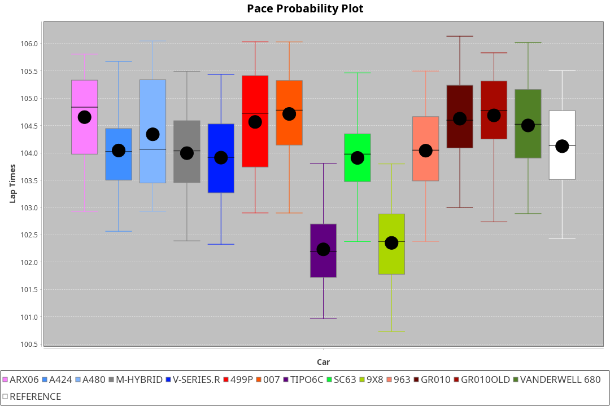
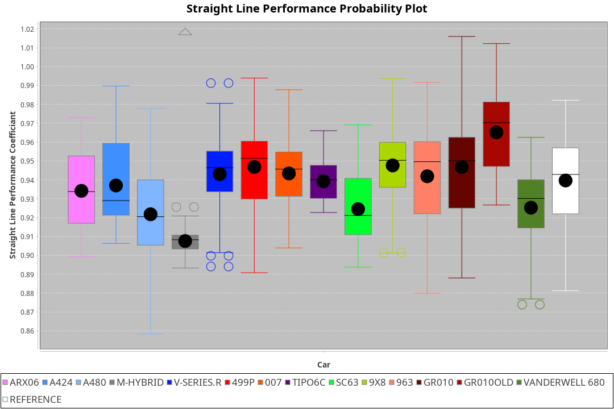
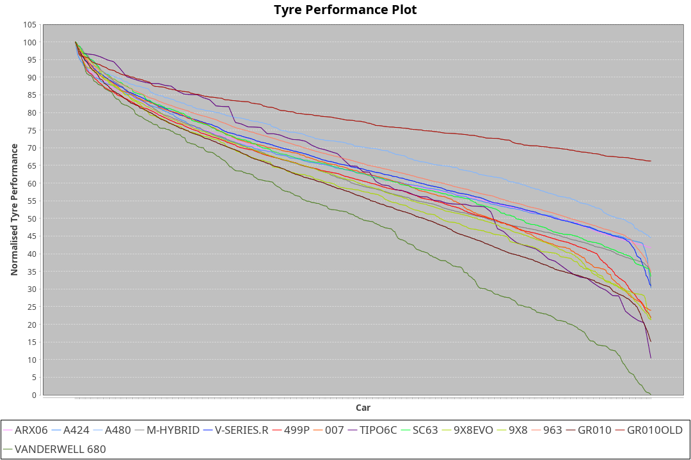

| Manufacturer     | Car            | Weight | Power | PINC    | E/Stint | FDS     |
|:-|:-|:-|:-|:-|:-|:-|
| Acura            | ARX06          | 1081kg | 506kw |    -    | 907MJ   |    -    |
| Alpine           | A424           | 1070kg | 510kw |    -    | 909MJ   |    -    |
| Alpine           | A480           | 950kg  | 413kw |    -    | 749MJ   |    -    |
| BMW              | M-Hybrid       | 1053kg | 505kw |    -    | 900MJ   |    -    |
| Cadillac         | V-Series.R     | 1044kg | 502kw |    -    | 892MJ   |    -    |
| Ferrari          | 499P           | 1084kg | 500kw |    -    | 894MJ   | 190kph  |
| Glickenhaus      | 007            | 1035kg | 494kw |    -    | 887MJ   |    -    |
| Isotta Fraschini | Tipo6C         | 1036kg | 498kw |    -    | 897MJ   | 190kph  |
| Lamborghini      | SC63           | 1055kg | 506kw |    -    | 900MJ   |    -    |
| Peugeot          | 9X8            | 1040kg | 517kw |    -    | 902MJ   | 150kph  |
| Porsche          | 963            | 1058kg | 507kw |    -    | 895MJ   |    -    |
| Toyota           | GR010          | 1090kg | 504kw |    -    | 898MJ   | 190kph  |
| Toyota           | GR010OLD       | 1074kg | 510kw |    -    | 904MJ   | 190kph  |
| Vanwall          | Vanderwell 680 | 1038kg | 519kw |    -    | 903MJ   |    -    |

### BoP Accuracy: 73.52%; Overall BoP Grade: C2
| Manufacturer     | Car            | Type  | RP      | QP      | Weight | Power¹ | Threshhold | PINC    | Power² | E/Stint | AVG Vmax  | FDS     | RDLC | L/Stint | BOP-Grade | Model Accuracy | Model Points | Match% |
|:-|:-|:-|:-|:-|:-|:-|:-|:-|:-|:-|:-|:-|:-|:-|:-|:-|:-|:-|
| Acura            | ARX06          | LMDH  | 1:43.44 | 1:40.60 | 1081kg | 506kw  | 210.0kph   |    -    | 506kw  |  907MJ  | 289.73kph |    -    | 0.98 | 33      | +B1       | 100.00%        | 995          | 88.33% |
| Alpine           | A424           | LMDH  | 1:43.58 | 1:42.45 | 1070kg | 510kw  | 210.0kph   |    -    | 510kw  |  909MJ  | 291.13kph |    -    | 0.99 | 33      | +C2       | 100.00%        | 642          | 72.96% |
| Alpine           | A480           | LMP1  | 1:44.26 | 1:43.21 |  950kg | 413kw  | 210.0kph   |    -    | 413kw  |  749MJ  | 285.71kph |    -    | 0.97 | 31      | ~A1       | 60.26%         | 849          | 96.70% |
| BMW              | M-Hybrid       | LMDH  | 1:42.86 | 1:40.85 | 1053kg | 505kw  | 210.0kph   |    -    | 505kw  |  900MJ  | 287.91kph |    -    | 1.01 | 33      | -D1       | 100.00%        | 1714         | 66.63% |
| Cadillac         | V-Series.R     | LMDH  | 1:42.72 | 1:40.44 | 1044kg | 502kw  | 210.0kph   |    -    | 502kw  |  892MJ  | 292.08kph |    -    | 1.02 | 33      | -D2       | 98.95%         | 2271         | 63.86% |
| Ferrari          | 499P           | LMHHU | 1:44.10 | 1:41.69 | 1084kg | 500kw  | 210.0kph   |    -    | 500kw  |  894MJ  | 290.91kph | 190kph  | 1.01 | 33      | +B2       | 99.93%         | 2718         | 81.77% |
| Glickenhaus      | 007            | LMHNH | 1:44.26 | 1:42.66 | 1035kg | 494kw  | 210.0kph   |    -    | 494kw  |  887MJ  | 292.22kph |    -    | 0.95 | 33      | +C1       | 96.34%         | 1634         | 75.39% |
| Isotta Fraschini | Tipo6C         | LMHHU | 1:44.26 | 1:43.64 | 1036kg | 498kw  | 210.0kph   |    -    | 498kw  |  897MJ  | 291.93kph | 190kph  | 1.07 | 33      | +Ω1       | 92.36%         | 133          | 38.43% |
| Lamborghini      | SC63           | LMDH  | 1:43.42 | 1:43.74 | 1055kg | 506kw  | 210.0kph   |    -    | 506kw  |  900MJ  | 289.50kph |    -    | 1.04 | 33      | ~A1       | 96.54%         | 418          | 98.84% |
| Peugeot          | 9X8            | LMHHE | 1:42.12 | 1:40.43 | 1040kg | 517kw  | 210.0kph   |    -    | 517kw  |  902MJ  | 294.24kph | 150kph  | 1.02 | 33      | -Ω1       | 88.68%         | 2617         | 36.31% |
| Porsche          | 963            | LMDH  | 1:43.00 | 1:40.65 | 1058kg | 507kw  | 210.0kph   |    -    | 507kw  |  895MJ  | 292.17kph |    -    | 1.00 | 33      | -C1       | 99.98%         | 6168         | 76.21% |
| Toyota           | GR010          | LMHHU | 1:43.91 | 1:41.52 | 1090kg | 504kw  | 210.0kph   |    -    | 504kw  |  898MJ  | 291.03kph | 190kph  | 1.01 | 33      | +B1       | 98.53%         | 3557         | 88.82% |
| Toyota           | GR010OLD       | LMHHE | 1:43.00 | 1:40.83 | 1074kg | 510kw  | 210.0kph   |    -    | 510kw  |  904MJ  | 295.27kph | 190kph  | 1.02 | 33      | -B2       | 92.01%         | 1427         | 80.42% |
| Vanwall          | Vanderwell 680 | LMHNH | 1:44.26 | 1:41.79 | 1038kg | 519kw  | 210.0kph   |    -    | 519kw  |  903MJ  | 291.09kph |    -    | 1.00 | 33      | +D2       | 94.62%         | 633          | 64.59% |

## Power below Threshhold
| N/Nmax    | ARX06   | A424    | M-HYBRID | V-SERIES.R | 499P    | 007     | TIPO6C  | SC63    | 9X8     | 963     | GR010   | GR010OLD | VANDERWELL 680 | ​     | RPM      | A480    |
|:-|:-|:-|:-|:-|:-|:-|:-|:-|:-|:-|:-|:-|:-|:-|:-|:-|
|  0.550    |  249    |  251    |  249     |  247       |  246    |  243    |  245    |  249    |  255    |  250    |  248    |  251     |  256           |  ​    |   --     |   -     |
|  0.575    |  272    |  274    |  272     |  270       |  269    |  266    |  268    |  272    |  278    |  273    |  271    |  274     |  279           |  ​    |   --     |   -     |
|  0.600    |  292    |  295    |  292     |  290       |  289    |  285    |  288    |  292    |  298    |  293    |  291    |  295     |  299           |  ​    |   --     |   -     |
|  0.625    |  313    |  316    |  312     |  310       |  309    |  305    |  308    |  313    |  320    |  314    |  312    |  316     |  321           |  ​    |   --     |   -     |
|  0.650    |  334    |  337    |  333     |  331       |  330    |  326    |  329    |  334    |  341    |  335    |  333    |  337     |  342           |  ​    |   --     |   -     |
|  0.675    |  355    |  358    |  355     |  352       |  351    |  347    |  350    |  355    |  363    |  356    |  354    |  358     |  364           |  ​    |   --     |   -     |
|  0.700    |  377    |  380    |  376     |  374       |  372    |  368    |  371    |  377    |  385    |  377    |  375    |  380     |  386           |  ​    |   --     |   -     |
|  0.725    |  398    |  401    |  397     |  395       |  393    |  389    |  392    |  398    |  407    |  399    |  396    |  401     |  408           |  ​    |   --     |   -     |
|  0.750    |  418    |  422    |  417     |  415       |  413    |  408    |  411    |  418    |  427    |  419    |  416    |  422     |  429           |  ​    |   --     |   -     |
|  0.775    |  437    |  441    |  436     |  434       |  432    |  427    |  430    |  437    |  446    |  438    |  435    |  441     |  448           |  ​    |  5000    |  242    |
|  0.800    |  454    |  458    |  454     |  451       |  449    |  444    |  447    |  454    |  464    |  455    |  453    |  458     |  466           |  ​    |  5500    |  286    |
|  0.825    |  469    |  473    |  469     |  466       |  464    |  458    |  462    |  469    |  479    |  470    |  468    |  473     |  481           |  ​    |  6000    |  320    |
|  0.850    |  481    |  485    |  480     |  477       |  475    |  469    |  473    |  481    |  491    |  482    |  479    |  485     |  493           |  ​    |  6500    |  361    |
|  0.875    |  491    |  495    |  490     |  487       |  485    |  479    |  483    |  491    |  502    |  492    |  489    |  495     |  504           |  ​    |  7000    |  404    |
|  0.900    |  498    |  502    |  497     |  494       |  492    |  486    |  490    |  498    |  509    |  499    |  496    |  502     |  511           |  ​    |  7500    |  414    |
|  0.925    |  503    |  507    |  502     |  499       |  497    |  491    |  495    |  503    |  514    |  504    |  501    |  507     |  516           |  ​    |  8000    |  410    |
| **0.950** | **506** | **510** | **505**  | **502**    | **500** | **494** | **498** | **506** | **517** | **507** | **504** | **510**  | **519**        | **​** | **8500** | **413** |
|  0.975    |  504    |  508    |  503     |  500       |  498    |  492    |  496    |  504    |  515    |  505    |  502    |  508     |  517           |  ​    |  9000    |  207    |
|  1.000    |  501    |  505    |  500     |  497       |  495    |  489    |  493    |  501    |  511    |  502    |  499    |  505     |  513           |  ​    |   --     |   -     |
|  1.025    |  432    |  436    |  431     |  429       |  427    |  422    |  425    |  432    |  441    |  433    |  430    |  436     |  443           |  ​    |   --     |   -     |

## Power above Threshhold
| N/Nmax    | ARX06   | A424    | M-HYBRID | V-SERIES.R | 499P    | 007     | TIPO6C  | SC63    | 9X8     | 963     | GR010   | GR010OLD | VANDERWELL 680 | ​     | RPM      | A480    |
|:-|:-|:-|:-|:-|:-|:-|:-|:-|:-|:-|:-|:-|:-|:-|:-|:-|
|  0.550    |  249    |  251    |  249     |  247       |  246    |  243    |  245    |  249    |  255    |  250    |  248    |  251     |  256           |  ​    |   --     |   -     |
|  0.575    |  272    |  274    |  272     |  270       |  269    |  266    |  268    |  272    |  278    |  273    |  271    |  274     |  279           |  ​    |   --     |   -     |
|  0.600    |  292    |  295    |  292     |  290       |  289    |  285    |  288    |  292    |  298    |  293    |  291    |  295     |  299           |  ​    |   --     |   -     |
|  0.625    |  313    |  316    |  312     |  310       |  309    |  305    |  308    |  313    |  320    |  314    |  312    |  316     |  321           |  ​    |   --     |   -     |
|  0.650    |  334    |  337    |  333     |  331       |  330    |  326    |  329    |  334    |  341    |  335    |  333    |  337     |  342           |  ​    |   --     |   -     |
|  0.675    |  355    |  358    |  355     |  352       |  351    |  347    |  350    |  355    |  363    |  356    |  354    |  358     |  364           |  ​    |   --     |   -     |
|  0.700    |  377    |  380    |  376     |  374       |  372    |  368    |  371    |  377    |  385    |  377    |  375    |  380     |  386           |  ​    |   --     |   -     |
|  0.725    |  398    |  401    |  397     |  395       |  393    |  389    |  392    |  398    |  407    |  399    |  396    |  401     |  408           |  ​    |   --     |   -     |
|  0.750    |  418    |  422    |  417     |  415       |  413    |  408    |  411    |  418    |  427    |  419    |  416    |  422     |  429           |  ​    |   --     |   -     |
|  0.775    |  437    |  441    |  436     |  434       |  432    |  427    |  430    |  437    |  446    |  438    |  435    |  441     |  448           |  ​    |  5000    |  242    |
|  0.800    |  454    |  458    |  454     |  451       |  449    |  444    |  447    |  454    |  464    |  455    |  453    |  458     |  466           |  ​    |  5500    |  286    |
|  0.825    |  469    |  473    |  469     |  466       |  464    |  458    |  462    |  469    |  479    |  470    |  468    |  473     |  481           |  ​    |  6000    |  320    |
|  0.850    |  481    |  485    |  480     |  477       |  475    |  469    |  473    |  481    |  491    |  482    |  479    |  485     |  493           |  ​    |  6500    |  361    |
|  0.875    |  491    |  495    |  490     |  487       |  485    |  479    |  483    |  491    |  502    |  492    |  489    |  495     |  504           |  ​    |  7000    |  404    |
|  0.900    |  498    |  502    |  497     |  494       |  492    |  486    |  490    |  498    |  509    |  499    |  496    |  502     |  511           |  ​    |  7500    |  414    |
|  0.925    |  503    |  507    |  502     |  499       |  497    |  491    |  495    |  503    |  514    |  504    |  501    |  507     |  516           |  ​    |  8000    |  410    |
| **0.950** | **506** | **510** | **505**  | **502**    | **500** | **494** | **498** | **506** | **517** | **507** | **504** | **510**  | **519**        | **​** | **8500** | **413** |
|  0.975    |  504    |  508    |  503     |  500       |  498    |  492    |  496    |  504    |  515    |  505    |  502    |  508     |  517           |  ​    |  9000    |  207    |
|  1.000    |  501    |  505    |  500     |  497       |  495    |  489    |  493    |  501    |  511    |  502    |  499    |  505     |  513           |  ​    |   --     |   -     |
|  1.025    |  432    |  436    |  431     |  429       |  427    |  422    |  425    |  432    |  441    |  433    |  430    |  436     |  443           |  ​    |   --     |   -     |
