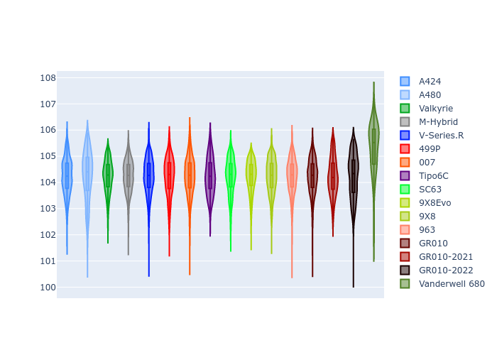
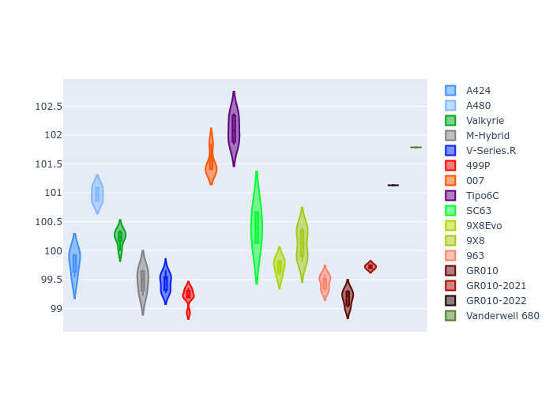
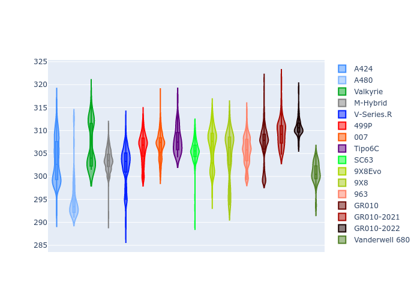
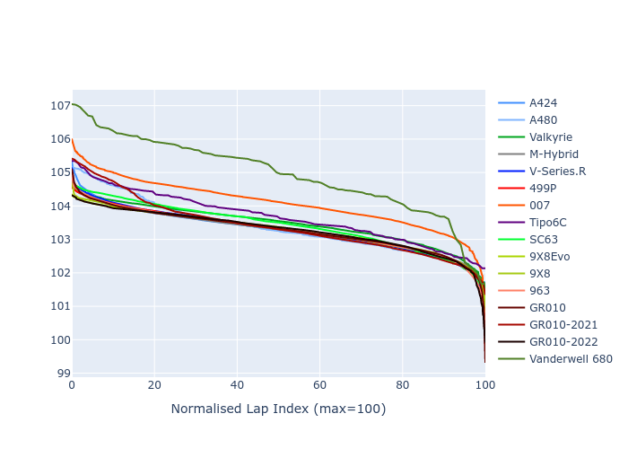

# Combined Plots

## Metadata

- BoP Accuracy: 96.38%
- Overall BoP Grade: A1
- Track: QATAR
- Threshhold: 0.0kph
- Average Laptime: 1:43.54
- Average Quali Laptime: 1:40.22
- Average Topspeed: 305.18kph

## BoP Table
| Manufacturer     | Car            | Weight   | Power   | PINC   | E/Stint   | FDS    | RDP    | QDP    | TDP    |
|:-----------------|:---------------|:---------|:--------|:-------|:----------|:-------|:-------|:-------|:-------|
| Alpine           | A424           | 1040kg   | 507.0kw | -      | 909MJ     | -      | 51.64% | 59.31% | 26.80% |
| Alpine           | A480           | 951kg    | 410.0kw | -      | 762MJ     | -      | 54.81% | 80.56% | 55.69% |
| Aston Martin     | Valkyrie       | 1030kg   | 520.0kw | -      | 911MJ     | -      | 53.50% | 53.33% | 21.51% |
| BMW              | M-Hybrid       | 1040kg   | 510.0kw | -      | 905MJ     | -      | 52.89% | 56.22% | 33.41% |
| Cadillac         | V-Series.R     | 1044kg   | 518.0kw | -      | 905MJ     | -      | 48.63% | 60.80% | 19.01% |
| Ferrari          | 499P           | 1061kg   | 507.0kw | -      | 905MJ     | 190kph | 51.38% | 44.98% | 9.83%  |
| Glickenhaus      | 007            | 1030kg   | 520.0kw | -      | 910MJ     | -      | 46.15% | 49.30% | 41.45% |
| Isotta Fraschini | Tipo6C         | 1030kg   | 520.0kw | -      | 916MJ     | 160kph | 43.95% | 47.22% | 31.53% |
| Lamborghini      | SC63           | 1030kg   | 520.0kw | -      | 910MJ     | -      | 48.33% | 60.95% | 28.65% |
| Peugeot          | 9X8Evo         | 1030kg   | 509.0kw | -      | 912MJ     | 190kph | 48.87% | 52.78% | 15.41% |
| Peugeot          | 9X8            | 1033kg   | 520.0kw | -      | 904MJ     | 150kph | 54.54% | 58.39% | 9.69%  |
| Porsche          | 963            | 1035kg   | 505.0kw | -      | 901MJ     | -      | 50.70% | 44.30% | 29.51% |
| Toyota           | GR010          | 1059kg   | 506.0kw | -      | 903MJ     | 190kph | 51.09% | 52.71% | 11.46% |
| Toyota           | GR010-2021     | 1059kg   | 517.0kw | -      | 908MJ     | 150kph | 53.89% | 50.91% | 25.87% |
| Toyota           | GR010-2022     | 1055kg   | 510.0kw | -      | 900MJ     | 190kph | 53.24% | 64.49% | 9.72%  |
| Vanwall          | Vanderwell 680 | 1030kg   | 520.0kw | -      | 908MJ     | -      | 35.83% | 59.29% | 34.15% |

## Performance Table
| Manufacturer     | Car            | RP      | QP      | Vavg      |   RDLC | BOP-Grade   | Match   |
|:-----------------|:---------------|:--------|:--------|:----------|-------:|:------------|:--------|
| Alpine           | A424           | 1:43.41 | 1:39.79 | 303.47kph |   1.04 | ~A1         | 99.51%  |
| Alpine           | A480           | 1:43.40 | 1:41.09 | 294.92kph |   1.02 | ~A1         | 99.00%  |
| Aston Martin     | Valkyrie       | 1:43.44 | 1:39.34 | 306.79kph |   1.04 | ~A1         | 100.00% |
| BMW              | M-Hybrid       | 1:43.41 | 1:39.42 | 303.53kph |   1.04 | ~A1         | 100.00% |
| Cadillac         | V-Series.R     | 1:43.39 | 1:39.44 | 302.32kph |   1.04 | ~A1         | 99.89%  |
| Ferrari          | 499P           | 1:43.40 | 1:39.21 | 306.22kph |   1.04 | ~A1         | 99.96%  |
| Glickenhaus      | 007            | 1:44.07 | 1:41.51 | 306.90kph |   1.03 | ~A1         | 95.07%  |
| Isotta Fraschini | Tipo6C         | 1:43.38 | 1:41.88 | 307.90kph |   1.01 | ~A1         | 97.76%  |
| Lamborghini      | SC63           | 1:43.41 | 1:40.38 | 305.61kph |   1.03 | ~A1         | 100.00% |
| Peugeot          | 9X8Evo         | 1:43.39 | 1:39.66 | 306.70kph |   1.04 | ~A1         | 100.00% |
| Peugeot          | 9X8            | 1:43.40 | 1:40.24 | 304.87kph |   1.03 | ~A1         | 99.92%  |
| Porsche          | 963            | 1:43.40 | 1:39.60 | 305.64kph |   1.04 | ~A1         | 99.90%  |
| Toyota           | GR010          | 1:43.39 | 1:39.19 | 306.95kph |   1.04 | ~A1         | 99.65%  |
| Toyota           | GR010-2021     | 1:43.41 | 1:39.79 | 309.49kph |   1.04 | ~A1         | 99.74%  |
| Toyota           | GR010-2022     | 1:43.40 | 1:41.25 | 310.76kph |   1.02 | ~A1         | 99.70%  |
| Vanwall          | Vanderwell 680 | 1:44.87 | 1:41.71 | 300.88kph |   1.03 | +E2         | 51.96%  |

## Race Laptimes

## Quali Laptimes

## Topspeeds

## Laptimes Lineplot

