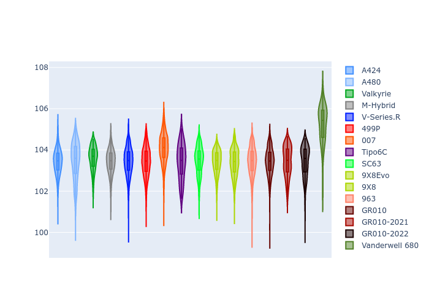
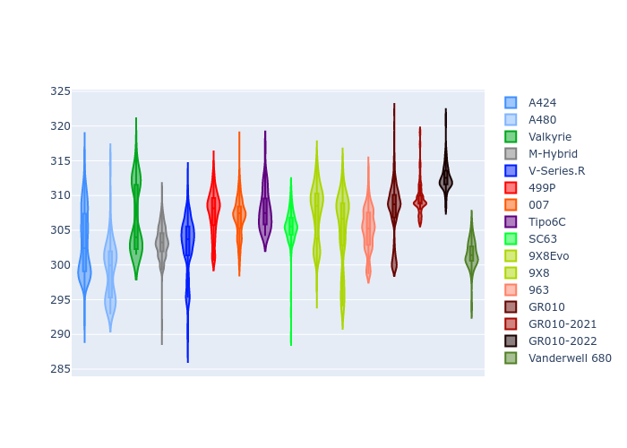

# Combined Plots

## Metadata

- BoP Accuracy: 99.47%
- Overall BoP Grade: A1
- Track: QATAR
- Threshhold: 0.0kph

## BoP Table
| Manufacturer     | Car            | Weight   | Power   | PINC   | E/Stint   | FDS    |
|:-----------------|:---------------|:---------|:--------|:-------|:----------|:-------|
| Alpine           | A424           | 1054kg   | 480.0kw | -      | 886MJ     | -      |
| Alpine           | A480           | 1052kg   | 410.0kw | -      | 747MJ     | -      |
| Aston Martin     | Valkyrie       | 1030kg   | 484.0kw | -      | 879MJ     | -      |
| BMW              | M-Hybrid       | 1049kg   | 480.0kw | -      | 879MJ     | -      |
| Cadillac         | V-Series.R     | 1050kg   | 485.0kw | -      | 877MJ     | -      |
| Ferrari          | 499P           | 1073kg   | 480.0kw | -      | 882MJ     | 190kph |
| Glickenhaus      | 007            | 1031kg   | 489.0kw | -      | 882MJ     | -      |
| Isotta Fraschini | Tipo6C         | 1087kg   | 520.0kw | -      | 923MJ     | 190kph |
| Lamborghini      | SC63           | 1067kg   | 504.0kw | -      | 900MJ     | -      |
| Peugeot          | 9X8Evo         | 1040kg   | 480.0kw | -      | 886MJ     | 190kph |
| Peugeot          | 9X8            | 1047kg   | 495.0kw | -      | 884MJ     | 150kph |
| Porsche          | 963            | 1052kg   | 480.0kw | -      | 880MJ     | -      |
| Toyota           | GR010          | 1071kg   | 480.0kw | -      | 881MJ     | 190kph |
| Toyota           | GR010OLD       | 1090kg   | 480.0kw | -      | 931MJ     | 150kph |
| Vanwall          | Vanderwell 680 | 1033kg   | 520.0kw | -      | 903MJ     | -      |

## Performance Table
| Manufacturer     | Car            | RP      | QP      | Vavg      |   RDLC | BOP-Grade   | Match   |
|:-----------------|:---------------|:--------|:--------|:----------|-------:|:------------|:--------|
| Alpine           | A424           | 1:44.62 | 1:41.35 | 294.43kph |   1.03 | ~A1         | 99.54%  |
| Alpine           | A480           | 1:44.48 | 1:42.28 | 287.12kph |   1.02 | ~A1         | 97.76%  |
| Aston Martin     | Valkyrie       | 1:44.63 | 1:40.63 | 296.80kph |   1.04 | ~A1         | 100.00% |
| BMW              | M-Hybrid       | 1:44.62 | 1:41.00 | 293.88kph |   1.04 | ~A1         | 100.00% |
| Cadillac         | V-Series.R     | 1:44.64 | 1:41.11 | 291.62kph |   1.03 | ~A1         | 99.96%  |
| Ferrari          | 499P           | 1:44.63 | 1:40.93 | 295.08kph |   1.04 | ~A1         | 99.98%  |
| Glickenhaus      | 007            | 1:44.64 | 1:42.14 | 293.82kph |   1.02 | ~A1         | 97.16%  |
| Isotta Fraschini | Tipo6C         | 1:44.62 | 1:43.12 | 297.50kph |   1.01 | ~A1         | 100.00% |
| Lamborghini      | SC63           | 1:44.62 | 1:41.87 | 296.16kph |   1.03 | ~A1         | 99.64%  |
| Peugeot          | 9X8Evo         | 1:44.63 | 1:41.03 | 297.73kph |   1.04 | ~A1         | 98.79%  |
| Peugeot          | 9X8            | 1:44.62 | 1:41.40 | 289.76kph |   1.03 | ~A1         | 99.96%  |
| Porsche          | 963            | 1:44.63 | 1:41.08 | 293.75kph |   1.04 | ~A1         | 99.89%  |
| Toyota           | GR010          | 1:44.63 | 1:40.83 | 295.79kph |   1.04 | ~A1         | 99.97%  |
| Toyota           | GR010OLD       | 1:44.62 | 1:42.10 | 288.40kph |   1.02 | ~A1         | 100.00% |
| Vanwall          | Vanderwell 680 | 1:44.62 | 1:40.82 | 294.32kph |   1.04 | ~A1         | 99.40%  |

## Race Laptimes

## Quali Laptimes

## Topspeeds

## Laptimes Lineplot

