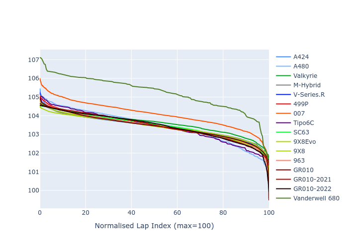

# Combined Plots

## Metadata

- BoP Accuracy: 95.71%
- Overall BoP Grade: A1
- Track: QATAR
- Threshhold: 0.0kph
- Average Laptime: 1:43.59
- Average Quali Laptime: 1:40.28
- Average Topspeed: 305.80kph

## BoP Table
| Manufacturer     | Car            | Weight   | Power   | PINC   | E/Stint   | FDS    | RDP    | QDP    | TDP    |
|:-----------------|:---------------|:---------|:--------|:-------|:----------|:-------|:-------|:-------|:-------|
| Alpine           | A424           | 1038kg   | 505.0kw | -      | 907MJ     | -      | 51.64% | 59.31% | 26.80% |
| Alpine           | A480           | 931kg    | 415.0kw | -      | 749MJ     | -      | 53.05% | 74.07% | 48.97% |
| Aston Martin     | Valkyrie       | 1030kg   | 520.0kw | -      | 911MJ     | -      | 53.50% | 53.33% | 21.51% |
| BMW              | M-Hybrid       | 1040kg   | 509.0kw | -      | 904MJ     | -      | 52.89% | 56.22% | 33.41% |
| Cadillac         | V-Series.R     | 1044kg   | 520.0kw | -      | 907MJ     | -      | 48.63% | 60.80% | 19.01% |
| Ferrari          | 499P           | 1061kg   | 513.0kw | -      | 910MJ     | 190kph | 51.38% | 44.98% | 9.83%  |
| Glickenhaus      | 007            | 1030kg   | 520.0kw | -      | 910MJ     | -      | 46.15% | 49.30% | 41.45% |
| Isotta Fraschini | Tipo6C         | 1030kg   | 520.0kw | -      | 916MJ     | 150kph | 43.95% | 47.22% | 31.53% |
| Lamborghini      | SC63           | 1030kg   | 520.0kw | -      | 910MJ     | -      | 48.33% | 60.95% | 28.65% |
| Peugeot          | 9X8Evo         | 1030kg   | 513.0kw | -      | 916MJ     | 190kph | 48.87% | 52.78% | 15.41% |
| Peugeot          | 9X8            | 1030kg   | 520.0kw | -      | 904MJ     | 140kph | 54.54% | 58.39% | 9.69%  |
| Porsche          | 963            | 1036kg   | 503.0kw | -      | 899MJ     | -      | 50.70% | 44.30% | 29.51% |
| Toyota           | GR010          | 1059kg   | 510.0kw | -      | 906MJ     | 190kph | 51.09% | 52.71% | 11.46% |
| Toyota           | GR010-2021     | 1057kg   | 510.0kw | -      | 902MJ     | 150kph | 54.08% | 54.81% | 9.72%  |
| Toyota           | GR010-2022     | 1055kg   | 518.0kw | -      | 907MJ     | 190kph | 53.45% | 68.83% | 9.58%  |
| Vanwall          | Vanderwell 680 | 1030kg   | 520.0kw | -      | 908MJ     | -      | 49.68% | 60.93% | 34.43% |

## Performance Table
| Manufacturer     | Car            | RP      | QP      | Vavg      |   RDLC | BOP-Grade   | Match   |
|:-----------------|:---------------|:--------|:--------|:----------|-------:|:------------|:--------|
| Alpine           | A424           | 1:43.42 | 1:39.77 | 303.25kph |   1.04 | ~A1         | 99.48%  |
| Alpine           | A480           | 1:43.44 | 1:41.15 | 299.25kph |   1.02 | ~A1         | 99.73%  |
| Aston Martin     | Valkyrie       | 1:43.60 | 1:39.48 | 306.79kph |   1.04 | ~A1         | 100.00% |
| BMW              | M-Hybrid       | 1:43.43 | 1:39.43 | 303.31kph |   1.04 | ~A1         | 100.00% |
| Cadillac         | V-Series.R     | 1:43.44 | 1:39.48 | 302.74kph |   1.04 | ~A1         | 99.82%  |
| Ferrari          | 499P           | 1:43.43 | 1:39.39 | 307.53kph |   1.04 | ~A1         | 99.95%  |
| Glickenhaus      | 007            | 1:44.07 | 1:41.50 | 306.90kph |   1.03 | -A2         | 93.47%  |
| Isotta Fraschini | Tipo6C         | 1:43.40 | 1:41.82 | 307.90kph |   1.02 | ~A1         | 100.00% |
| Lamborghini      | SC63           | 1:43.48 | 1:40.43 | 305.61kph |   1.03 | ~A1         | 100.00% |
| Peugeot          | 9X8Evo         | 1:43.42 | 1:39.65 | 307.57kph |   1.04 | ~A1         | 100.00% |
| Peugeot          | 9X8            | 1:43.39 | 1:40.26 | 305.19kph |   1.03 | ~A1         | 100.00% |
| Porsche          | 963            | 1:43.43 | 1:39.79 | 305.09kph |   1.04 | ~A1         | 99.84%  |
| Toyota           | GR010          | 1:43.43 | 1:39.26 | 307.83kph |   1.04 | ~A1         | 99.79%  |
| Toyota           | GR010-2021     | 1:43.44 | 1:40.17 | 309.65kph |   1.03 | ~A1         | 100.00% |
| Toyota           | GR010-2022     | 1:43.44 | 1:41.20 | 312.67kph |   1.02 | ~A1         | 99.49%  |
| Vanwall          | Vanderwell 680 | 1:45.24 | 1:41.72 | 301.49kph |   1.03 | +Ω1         | 39.81%  |

## Race Laptimes

## Quali Laptimes

## Topspeeds

## Laptimes Lineplot

