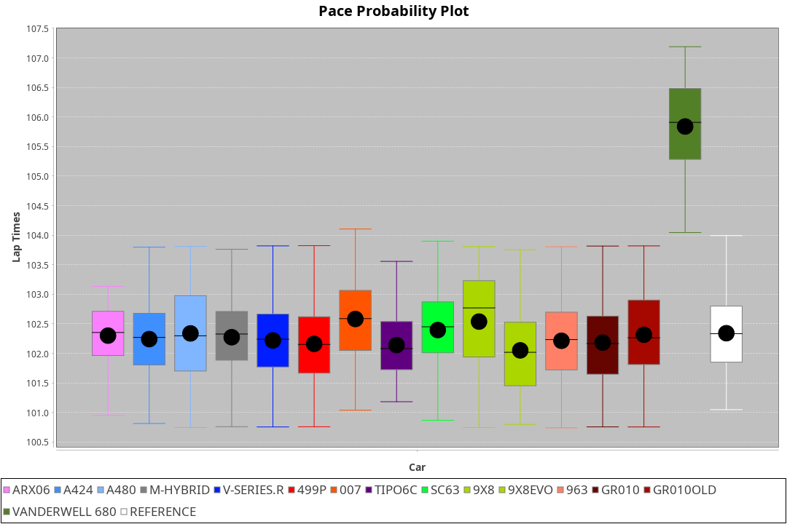
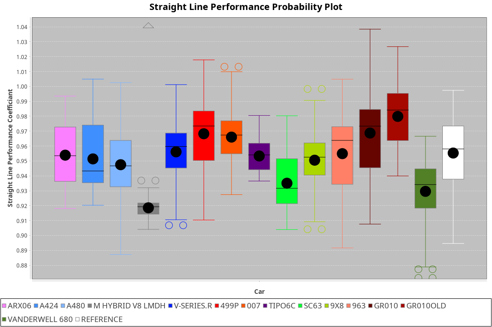
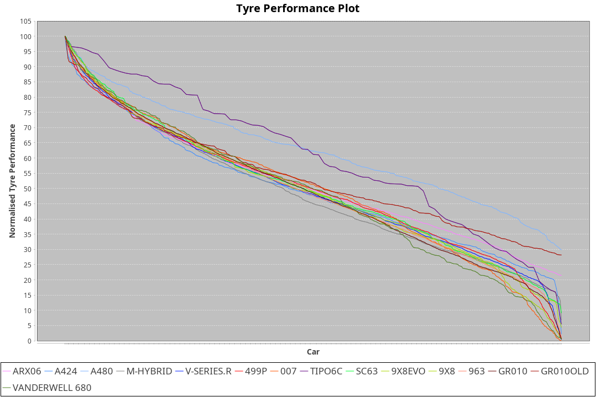

|Manufacturer|Car|Weight|Power|PINC|E/Stint|FDS|
|:-|:-|:-|:-|:-|:-|:-|
|Acura|ARX06|1037kg|510kw|-|906MJ|-|
|Alpine|A424|1031kg|509kw|-|904MJ|-|
|Alpine|A480|931kg|421kw|-|754MJ|-|
|BMW|M Hybrid V8 LMDh|1043kg|513kw|-|906MJ|-|
|Cadillac|V-Series.R|1036kg|509kw|-|897MJ|-|
|Ferrari|499P|1060kg|511kw|-|901MJ|190kph|
|Glickenhaus|007|1040kg|520kw|-|911MJ|-|
|Issotta Fraschini|Tipo6C|1042kg|520kw|-|918MJ|190kph|
|Lamborghini|SC63|1060kg|520kw|-|913MJ|-|
|Peugeot|9X8|1047kg|520kw|-|906MJ|150kph|
|Porsche|963|1037kg|511kw|-|896MJ|-|
|Toyota|GR010|1062kg|513kw|-|903MJ|190kph|
|Toyota|GR010OLD|1057kg|515kw|-|906MJ|190kph|
|Vanwall|Vanderwell 680|1030kg|520kw|-|903MJ|-|

### BoP Accuracy: 92.05%; Overall BoP Grade: A2
|Manufacturer|Car|Type|RP|QP|Weight|Power¹|Threshhold|PINC|Power²|E/Stint|AVG Vmax|FDS|RDLC|L/Stint|BOP-Grade|ModelAccuracy|ModelPoints|Match%|
|:-|:-|:-|:-|:-|:-|:-|:-|:-|:-|:-|:-|:-|:-|:-|:-|:-|:-|:-|
|Acura|ARX06|LMDH|1:42.17|1:39.35|1037kg|510kw|0.0kph|-|510kw|906MJ|295.85kph|-|1.02|33|+B2|100.00%|995|80.34%|
|Alpine|A424|LMDH|1:42.18|1:41.56|1031kg|509kw|0.0kph|-|509kw|904MJ|295.60kph|-|1.03|33|~A1|81.15%|521|99.71%|
|Alpine|A480|LMP1|1:42.21|1:40.78|931kg|421kw|0.0kph|-|421kw|754MJ|292.86kph|-|0.99|31|~A1|67.92%|957|100.00%|
|BMW|M Hybrid V8 LMDh|LMDH|1:42.20|1:40.26|1043kg|513kw|0.0kph|-|513kw|906MJ|291.41kph|-|1.02|33|~A1|98.60%|1690|96.91%|
|Cadillac|V-Series.R|LMDH|1:42.17|1:39.97|1036kg|509kw|0.0kph|-|509kw|897MJ|295.71kph|-|1.02|33|+A2|91.10%|1770|94.68%|
|Ferrari|499P|LMHHU|1:42.19|1:40.13|1060kg|511kw|0.0kph|-|511kw|901MJ|297.32kph|190kph|1.03|33|~A1|84.26%|2292|100.00%|
|Glickenhaus|007|LMHNH|1:42.21|1:40.84|1040kg|520kw|0.0kph|-|520kw|911MJ|298.34kph|-|0.95|33|~A1|94.63%|1605|100.00%|
|Issotta Fraschini|Tipo6C|LMHHU|1:42.16|1:42.36|1042kg|520kw|0.0kph|-|520kw|918MJ|296.30kph|190kph|1.07|33|+B1|66.67%|96|86.50%|
|Lamborghini|SC63|LMDH|1:42.17|1:42.55|1060kg|520kw|0.0kph|-|520kw|913MJ|292.82kph|-|1.03|33|+B1|96.77%|419|88.40%|
|Peugeot|9X8|LMHHE|1:42.17|1:40.37|1047kg|520kw|0.0kph|-|520kw|906MJ|294.92kph|150kph|1.01|33|~A1|83.63%|2468|100.00%|
|Porsche|963|LMDH|1:42.20|1:39.94|1037kg|511kw|0.0kph|-|511kw|896MJ|296.08kph|-|1.02|33|~A1|93.14%|5746|100.00%|
|Toyota|GR010|LMHHU|1:42.19|1:40.14|1062kg|513kw|0.0kph|-|513kw|903MJ|297.47kph|190kph|1.03|33|~A1|87.37%|3154|100.00%|
|Toyota|GR010OLD|LMHHE|1:42.19|1:40.01|1057kg|515kw|0.0kph|-|515kw|906MJ|299.50kph|190kph|1.03|33|~A1|89.81%|1393|100.00%|
|Vanwall|Vanderwell 680|LMHNH|1:43.66|1:41.01|1030kg|520kw|0.0kph|-|520kw|903MJ|292.32kph|-|1.01|33|+Ω1|90.28%|604|42.19%|

## Power below Threshhold
|N/Nmax|ARX06|A424|MHYBRIDV8LMDH|VSERIES.R|499P|007|TIPO6C|SC63|9X8|963|GR010|GR010OLD|VANDERWELL680|​|RPM|A480|
|:-|:-|:-|:-|:-|:-|:-|:-|:-|:-|:-|:-|:-|:-|:-|:-|:-|
|0.550|251|251|253|251|252|256|256|256|256|252|253|254|256|​|--|-|
|0.575|274|274|276|274|275|279|279|279|279|275|276|277|279|​|--|-|
|0.600|295|294|296|294|295|300|300|300|300|295|296|297|300|​|--|-|
|0.625|316|315|317|315|316|322|322|322|322|316|317|319|322|​|--|-|
|0.650|337|336|338|336|337|343|343|343|343|337|338|340|343|​|--|-|
|0.675|358|357|360|357|359|365|365|365|365|359|360|362|365|​|--|-|
|0.700|380|379|382|379|380|387|387|387|387|380|382|383|387|​|--|-|
|0.725|401|400|403|400|402|409|409|409|409|402|403|405|409|​|--|-|
|0.750|422|421|424|421|422|430|430|430|430|422|424|426|430|​|--|-|
|0.775|441|440|443|440|441|449|449|449|449|441|443|445|449|​|5000|247|
|0.800|458|457|461|457|459|467|467|467|467|459|461|463|467|​|5500|292|
|0.825|473|472|476|472|474|482|482|482|482|474|476|478|482|​|6000|326|
|0.850|485|484|487|484|485|494|494|494|494|485|487|489|494|​|6500|368|
|0.875|495|494|498|494|496|505|505|505|505|496|498|500|505|​|7000|411|
|0.900|502|501|505|501|503|512|512|512|512|503|505|507|512|​|7500|422|
|0.925|507|506|510|506|508|517|517|517|517|508|510|512|517|​|8000|418|
|**0.950**|**510**|**509**|**513**|**509**|**511**|**520**|**520**|**520**|**520**|**511**|**513**|**515**|**520**|**​**|**8500**|**421**|
|0.975|508|507|511|507|509|518|518|518|518|509|511|513|518|​|9000|211|
|1.000|505|504|507|504|505|514|514|514|514|505|507|509|514|​|--|-|
|1.025|436|435|438|435|436|444|444|444|444|436|438|440|444|​|--|-|

## Power above Threshhold
|N/Nmax|ARX06|A424|MHYBRIDV8LMDH|VSERIES.R|499P|007|TIPO6C|SC63|9X8|963|GR010|GR010OLD|VANDERWELL680|​|RPM|A480|
|:-|:-|:-|:-|:-|:-|:-|:-|:-|:-|:-|:-|:-|:-|:-|:-|:-|
|0.550|251|251|253|251|252|256|256|256|256|252|253|254|256|​|--|-|
|0.575|274|274|276|274|275|279|279|279|279|275|276|277|279|​|--|-|
|0.600|295|294|296|294|295|300|300|300|300|295|296|297|300|​|--|-|
|0.625|316|315|317|315|316|322|322|322|322|316|317|319|322|​|--|-|
|0.650|337|336|338|336|337|343|343|343|343|337|338|340|343|​|--|-|
|0.675|358|357|360|357|359|365|365|365|365|359|360|362|365|​|--|-|
|0.700|380|379|382|379|380|387|387|387|387|380|382|383|387|​|--|-|
|0.725|401|400|403|400|402|409|409|409|409|402|403|405|409|​|--|-|
|0.750|422|421|424|421|422|430|430|430|430|422|424|426|430|​|--|-|
|0.775|441|440|443|440|441|449|449|449|449|441|443|445|449|​|5000|247|
|0.800|458|457|461|457|459|467|467|467|467|459|461|463|467|​|5500|292|
|0.825|473|472|476|472|474|482|482|482|482|474|476|478|482|​|6000|326|
|0.850|485|484|487|484|485|494|494|494|494|485|487|489|494|​|6500|368|
|0.875|495|494|498|494|496|505|505|505|505|496|498|500|505|​|7000|411|
|0.900|502|501|505|501|503|512|512|512|512|503|505|507|512|​|7500|422|
|0.925|507|506|510|506|508|517|517|517|517|508|510|512|517|​|8000|418|
|**0.950**|**510**|**509**|**513**|**509**|**511**|**520**|**520**|**520**|**520**|**511**|**513**|**515**|**520**|**​**|**8500**|**421**|
|0.975|508|507|511|507|509|518|518|518|518|509|511|513|518|​|9000|211|
|1.000|505|504|507|504|505|514|514|514|514|505|507|509|514|​|--|-|
|1.025|436|435|438|435|436|444|444|444|444|436|438|440|444|​|--|-|
