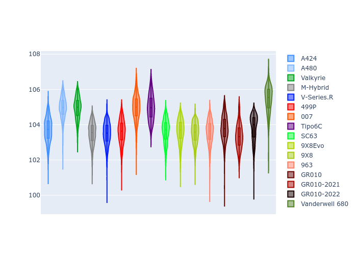
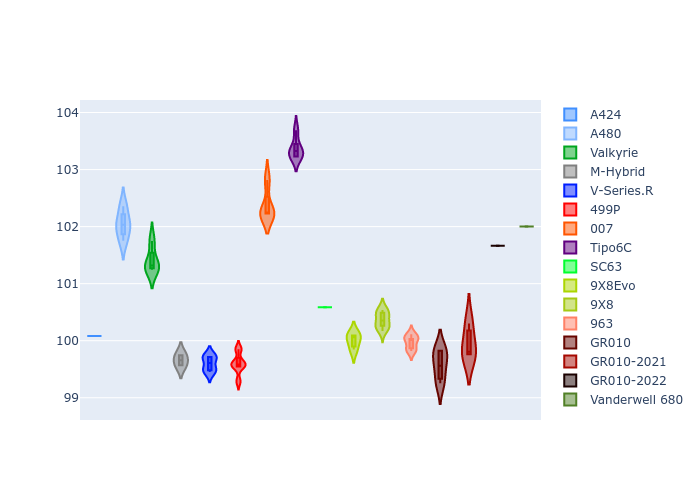
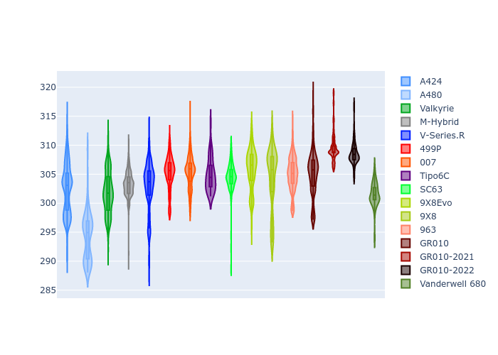
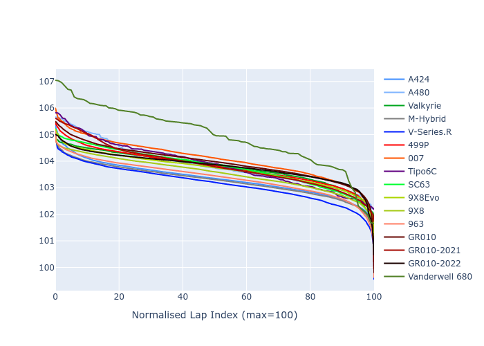

# Combined Plots

## Metadata

- BoP Accuracy: 94.34%
- Overall BoP Grade: A2
- Track: QATAR
- Threshhold: 250.0kph
- Average Laptime: 1:43.82
- Average Quali Laptime: 1:40.61
- Laptime Std Dev: 0.58 seconds
- Filtered Average Topspeed: 304.06kph

## BoP Table
| Manufacturer     | Car            | Weight   | Power   | PINC   | E/Stint   | FDS    | RDP    | QDP    | TDP    |
|:-----------------|:---------------|:---------|:--------|:-------|:----------|:-------|:-------|:-------|:-------|
| Alpine           | A424           | 1056kg   | 511.0kw | +0.10% | 915MJ     | -      | 52.20% | 54.51% | 24.58% |
| Alpine           | A480           | 990kg    | 421.0kw | +0.10% | 761MJ     | -      | 53.05% | 74.07% | 48.97% |
| Aston Martin     | Valkyrie       | 1040kg   | 513.0kw | -      | 906MJ     | -      | 53.39% | 54.11% | 23.71% |
| BMW              | M-Hybrid       | 1050kg   | 513.0kw | +0.10% | 909MJ     | -      | 53.47% | 52.95% | 33.73% |
| Cadillac         | V-Series.R     | 1047kg   | 519.0kw | -      | 907MJ     | -      | 49.22% | 60.31% | 18.04% |
| Ferrari          | 499P           | 1062kg   | 503.0kw | -0.10% | 901MJ     | 190kph | 51.56% | 44.72% | 9.86%  |
| Glickenhaus      | 007            | 1032kg   | 514.0kw | -      | 905MJ     | -      | 46.14% | 49.30% | 41.45% |
| Isotta Fraschini | Tipo6C         | 1032kg   | 507.0kw | -      | 905MJ     | 190kph | 43.95% | 47.22% | 31.53% |
| Lamborghini      | SC63           | 1040kg   | 520.0kw | +0.10% | 911MJ     | -      | 48.25% | 60.95% | 28.65% |
| Peugeot          | 9X8Evo         | 1052kg   | 518.0kw | -0.10% | 923MJ     | 190kph | 50.17% | 49.36% | 17.73% |
| Peugeot          | 9X8            | 1046kg   | 524.0kw | -      | 909MJ     | 150kph | 54.54% | 58.39% | 9.69%  |
| Porsche          | 963            | 1056kg   | 511.0kw | +0.10% | 909MJ     | -      | 50.78% | 41.25% | 27.61% |
| Toyota           | GR010          | 1071kg   | 502.0kw | +0.10% | 901MJ     | 190kph | 51.68% | 51.25% | 14.48% |
| Toyota           | GR010-2021     | 1055kg   | 509.0kw | -0.10% | 901MJ     | 150kph | 54.04% | 54.81% | 9.72%  |
| Toyota           | GR010-2022     | 1060kg   | 503.0kw | -0.10% | 894MJ     | 190kph | 53.24% | 64.49% | 9.72%  |
| Vanwall          | Vanderwell 680 | 1030kg   | 520.0kw | -      | 908MJ     | -      | 49.68% | 60.93% | 34.43% |

## Performance Table
| Manufacturer     | Car            | RP      | QP      | Vavg      |   RDLC | BOP-Grade   | Match   |
|:-----------------|:---------------|:--------|:--------|:----------|-------:|:------------|:--------|
| Alpine           | A424           | 1:43.65 | 1:40.01 | 302.49kph |   1.04 | ~A1         | 99.98%  |
| Alpine           | A480           | 1:44.39 | 1:42.78 | 294.27kph |   1.02 | +B1         | 85.10%  |
| Aston Martin     | Valkyrie       | 1:44.40 | 1:40.73 | 301.79kph |   1.04 | ~A1         | 97.21%  |
| BMW              | M-Hybrid       | 1:43.50 | 1:39.62 | 303.29kph |   1.04 | ~A1         | 99.98%  |
| Cadillac         | V-Series.R     | 1:43.37 | 1:39.51 | 302.92kph |   1.04 | ~A1         | 99.95%  |
| Ferrari          | 499P           | 1:43.45 | 1:39.52 | 305.27kph |   1.04 | ~A1         | 99.99%  |
| Glickenhaus      | 007            | 1:44.40 | 1:41.81 | 305.40kph |   1.03 | +A2         | 91.83%  |
| Isotta Fraschini | Tipo6C         | 1:44.39 | 1:42.77 | 304.88kph |   1.02 | +A2         | 91.79%  |
| Lamborghini      | SC63           | 1:43.62 | 1:40.64 | 304.63kph |   1.03 | ~A1         | 100.00% |
| Peugeot          | 9X8Evo         | 1:43.56 | 1:39.88 | 305.90kph |   1.04 | ~A1         | 100.00% |
| Peugeot          | 9X8            | 1:43.47 | 1:40.24 | 304.34kph |   1.03 | ~A1         | 99.96%  |
| Porsche          | 963            | 1:43.55 | 1:39.76 | 305.06kph |   1.04 | ~A1         | 99.95%  |
| Toyota           | GR010          | 1:43.62 | 1:39.58 | 305.05kph |   1.04 | ~A1         | 99.82%  |
| Toyota           | GR010-2021     | 1:42.87 | 1:39.59 | 309.55kph |   1.03 | ~A1         | 100.00% |
| Toyota           | GR010-2022     | 1:43.58 | 1:41.52 | 308.59kph |   1.02 | ~A1         | 99.33%  |
| Vanwall          | Vanderwell 680 | 1:45.32 | 1:41.82 | 301.49kph |   1.03 | +Ω1         | 44.55%  |

## Race Laptimes

## Quali Laptimes

## Topspeeds

## Laptimes Lineplot

