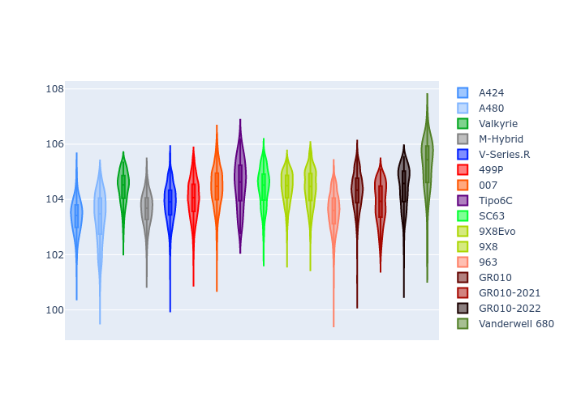
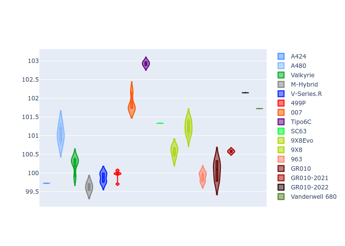

# Combined Plots

## Metadata

- BoP Accuracy: 92.54%
- Overall BoP Grade: A2
- Track: QATAR
- Threshhold: 250.0kph

## BoP Table
| Manufacturer     | Car            | Weight   | Power   | PINC   | E/Stint   | FDS    | RDP    | QDP    | TDP    |
|:-----------------|:---------------|:---------|:--------|:-------|:----------|:-------|:-------|:-------|:-------|
| Alpine           | A424           | 1057kg   | 520.0kw | -0.10% | 922MJ     | -      | 52.35% | 61.85% | 27.84% |
| Alpine           | A480           | 952kg    | 432.0kw | +0.10% | 783MJ     | -      | 54.51% | 76.19% | 54.04% |
| Aston Martin     | Valkyrie       | 1052kg   | 504.0kw | +0.10% | 899MJ     | -      | 53.59% | 53.33% | 21.51% |
| BMW              | M-Hybrid       | 1051kg   | 512.0kw | -0.10% | 908MJ     | -      | 53.26% | 57.23% | 34.54% |
| Cadillac         | V-Series.R     | 1044kg   | 510.0kw | +0.10% | 899MJ     | -      | 47.80% | 56.73% | 19.63% |
| Ferrari          | 499P           | 1073kg   | 508.0kw | -0.10% | 907MJ     | 190kph | 53.02% | 42.32% | 9.88%  |
| Glickenhaus      | 007            | 1040kg   | 520.0kw | -      | 911MJ     | -      | 46.49% | 46.07% | 47.78% |
| Isotta Fraschini | Tipo6C         | 1059kg   | 520.0kw | -      | 920MJ     | 190kph | 43.95% | 47.22% | 31.53% |
| Lamborghini      | SC63           | 1052kg   | 519.0kw | -0.10% | 911MJ     | -      | 46.33% | 59.50% | 29.33% |
| Peugeot          | 9X8Evo         | 1060kg   | 510.0kw | -0.10% | 916MJ     | 190kph | 48.47% | 51.26% | 16.02% |
| Peugeot          | 9X8            | 1040kg   | 520.0kw | -      | 905MJ     | 150kph | 54.07% | 57.08% | 10.80% |
| Porsche          | 963            | 1057kg   | 516.0kw | -0.10% | 913MJ     | -      | 50.87% | 45.25% | 30.77% |
| Toyota           | GR010          | 1090kg   | 512.0kw | -0.10% | 911MJ     | 190kph | 52.43% | 57.12% | 12.82% |
| Toyota           | GR010-2021     | 1075kg   | 513.0kw | +0.10% | 907MJ     | 150kph | 54.09% | 52.67% | 26.37% |
| Toyota           | GR010-2022     | 1090kg   | 512.0kw | +0.10% | 906MJ     | 190kph | 53.48% | 69.44% | 7.86%  |
| Vanwall          | Vanderwell 680 | 1030kg   | 520.0kw | -      | 903MJ     | -      | 53.41% | 56.28% | 29.85% |

## Performance Table
| Manufacturer     | Car            | RP      | QP      | Vavg      |   RDLC | BOP-Grade   | Match   |
|:-----------------|:---------------|:--------|:--------|:----------|-------:|:------------|:--------|
| Alpine           | A424           | 1:42.04 | 1:38.78 | 302.50kph |   1.03 | ~A1         | 98.63%  |
| Alpine           | A480           | 1:41.11 | 1:38.82 | 294.43kph |   1.02 | -C1         | 75.99%  |
| Aston Martin     | Valkyrie       | 1:43.67 | 1:39.72 | 298.98kph |   1.04 | +A2         | 94.20%  |
| BMW              | M-Hybrid       | 1:42.44 | 1:38.81 | 300.50kph |   1.04 | ~A1         | 99.60%  |
| Cadillac         | V-Series.R     | 1:42.64 | 1:39.02 | 297.44kph |   1.04 | ~A1         | 99.91%  |
| Ferrari          | 499P           | 1:42.34 | 1:38.25 | 301.05kph |   1.04 | ~A1         | 99.43%  |
| Glickenhaus      | 007            | 1:42.87 | 1:40.46 | 299.49kph |   1.02 | ~A1         | 95.48%  |
| Isotta Fraschini | Tipo6C         | 1:43.81 | 1:42.42 | 300.33kph |   1.01 | +C1         | 79.10%  |
| Lamborghini      | SC63           | 1:43.24 | 1:40.49 | 300.78kph |   1.03 | ~A1         | 97.47%  |
| Peugeot          | 9X8Evo         | 1:43.06 | 1:39.54 | 302.16kph |   1.04 | ~A1         | 97.53%  |
| Peugeot          | 9X8            | 1:42.27 | 1:38.85 | 294.28kph |   1.03 | ~A1         | 99.21%  |
| Porsche          | 963            | 1:42.32 | 1:38.75 | 301.31kph |   1.04 | ~A1         | 99.68%  |
| Toyota           | GR010          | 1:42.41 | 1:38.21 | 301.21kph |   1.04 | ~A1         | 99.78%  |
| Toyota           | GR010-2021     | 1:42.38 | 1:39.15 | 293.59kph |   1.03 | ~A1         | 99.85%  |
| Toyota           | GR010-2022     | 1:42.48 | 1:39.98 | 299.12kph |   1.03 | ~A1         | 100.00% |
| Vanwall          | Vanderwell 680 | 1:44.49 | 1:40.73 | 294.63kph |   1.04 | +Ω1         | 44.79%  |

## Race Laptimes

## Quali Laptimes

## Topspeeds

## Laptimes Lineplot

