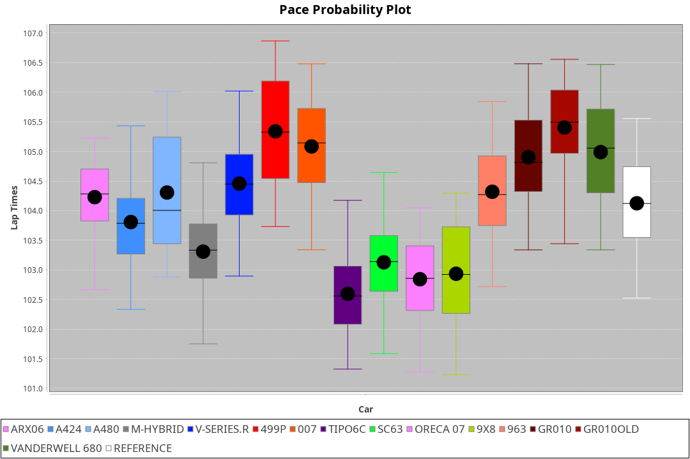
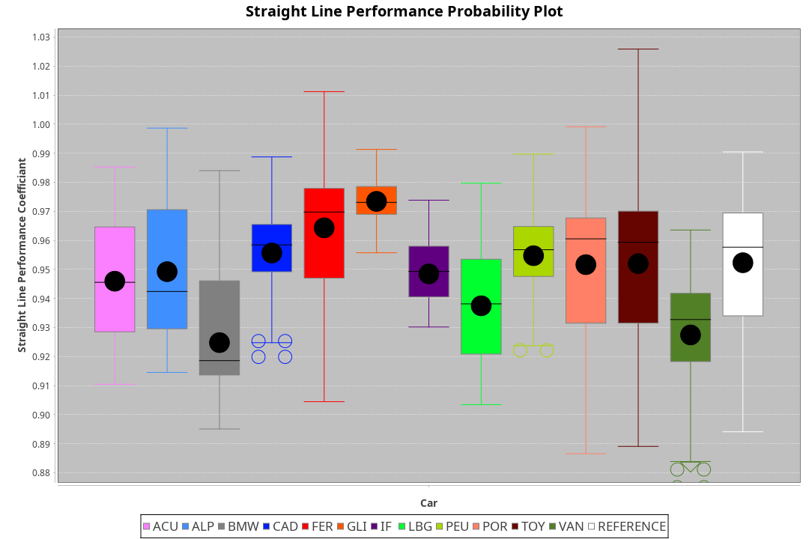
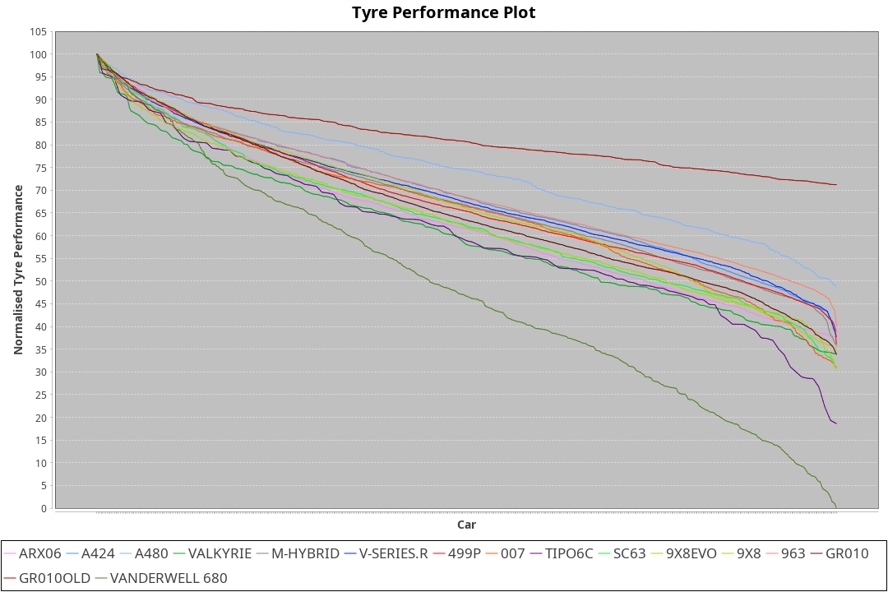

|Manufacturer|Car|Weight|Power|PINC|E/Stint|FDS|
|:-|:-|:-|:-|:-|:-|:-|
|Acura|ARX06|1078kg|506kw|1%|909MJ|-|
|Alpine|A424|1070kg|510kw|1%|911MJ|-|
|Alpine|A480|952kg|410kw|1%|748MJ|-|
|BMW|M-Hybrid|1053kg|505kw|1%|901MJ|-|
|Cadillac|V-Series.R|1044kg|502kw|1%|894MJ|-|
|Ferrari|499P|1072kg|503kw|-|895MJ|190kph|
|Glickenhaus|007|1038kg|509kw|-|901MJ|-|
|IsottaFraschini|Tipo6C|1040kg|517kw|-1%|913MJ|190kph|
|Lamborghini|SC63|1055kg|506kw|1%|902MJ|-|
|Peugeot|9X8|1040kg|517kw|-1%|901MJ|150kph|
|Porsche|963|1058kg|507kw|1%|897MJ|-|
|Toyota|GR010|1084kg|507kw|-1%|899MJ|190kph|
|Toyota|GR010OLD|1071kg|510kw|-1%|902MJ|190kph|
|Vanwall|Vanderwell680|1030kg|515kw|-|899MJ|-|

### BoP Accuracy: 79.85%; Overall BoP Grade: C1
|Manufacturer|Car|Type|RP|QP|Weight|Power¹|Threshhold|PINC|Power²|E/Stint|AVG Vmax|FDS|RDLC|L/Stint|BOP-Grade|ModelAccuracy|ModelPoints|Match%|
|:-|:-|:-|:-|:-|:-|:-|:-|:-|:-|:-|:-|:-|:-|:-|:-|:-|:-|:-|
|Acura|ARX06|LMDH|1:44.44|1:41.40|1078kg|506kw|210.0kph|1%|511kw|909MJ|292.98kph|-|0.98|33|+B2|100.00%|995|82.67%|
|Alpine|A424|LMDH|1:43.77|1:43.26|1070kg|510kw|210.0kph|1%|515kw|911MJ|293.59kph|-|0.99|33|~A1|80.53%|517|96.51%|
|Alpine|A480|LMP1|1:44.29|1:43.06|952kg|410kw|210.0kph|1%|414kw|748MJ|289.30kph|-|0.97|31|~A1|56.35%|794|100.00%|
|BMW|M-Hybrid|LMDH|1:43.57|1:41.65|1053kg|505kw|210.0kph|1%|510kw|901MJ|290.14kph|-|1.01|33|-B1|96.62%|1656|85.37%|
|Cadillac|V-Series.R|LMDH|1:43.52|1:41.23|1044kg|502kw|210.0kph|1%|507kw|894MJ|294.26kph|-|1.02|33|-B1|90.68%|2081|85.24%|
|Ferrari|499P|LMHHU|1:44.47|1:42.24|1072kg|503kw|210.0kph|-|503kw|895MJ|295.14kph|190kph|1.02|33|+B2|94.63%|2574|83.06%|
|Glickenhaus|007|LMHNH|1:44.47|1:42.77|1038kg|509kw|210.0kph|-|509kw|901MJ|296.06kph|-|0.95|33|+B1|94.93%|1610|86.99%|
|IsottaFraschini|Tipo6C|LMHHU|1:42.86|1:43.24|1040kg|517kw|210.0kph|-1%|512kw|913MJ|295.59kph|190kph|1.07|33|-E2|66.67%|96|54.53%|
|Lamborghini|SC63|LMDH|1:43.55|1:44.17|1055kg|506kw|210.0kph|1%|511kw|902MJ|291.75kph|-|1.04|33|-B1|92.15%|399|85.90%|
|Peugeot|9X8|LMHHE|1:42.61|1:40.97|1040kg|517kw|210.0kph|-1%|512kw|901MJ|294.32kph|150kph|1.02|33|-Ω1|83.80%|2473|41.34%|
|Porsche|963|LMDH|1:43.58|1:41.39|1058kg|507kw|210.0kph|1%|512kw|897MJ|294.46kph|-|1.00|33|-B1|95.67%|5902|86.28%|
|Toyota|GR010|LMHHU|1:44.93|1:42.79|1084kg|507kw|210.0kph|-1%|502kw|899MJ|294.33kph|190kph|1.01|33|+E1|91.69%|3310|58.69%|
|Toyota|GR010OLD|LMHHE|1:44.46|1:42.24|1071kg|510kw|210.0kph|-1%|505kw|902MJ|297.08kph|190kph|1.02|33|+A2|85.24%|1322|90.93%|
|Vanwall|Vanderwell680|LMHNH|1:44.45|1:41.98|1030kg|515kw|210.0kph|-|515kw|899MJ|291.41kph|-|1.01|33|+B2|93.72%|627|80.45%|

## Power below Threshhold
|N/Nmax|ACURA|ALPINE|BMW|CADILLAC|FERRARI|GLICKENHAUS|ISOTTAFRASCHINI|LAMBORGHINI|PEUGEOT|PORSCHE|TOYOTA|TOYOTA|VANWALL|​|RPM|A480|
|:-|:-|:-|:-|:-|:-|:-|:-|:-|:-|:-|:-|:-|:-|:-|:-|:-|
|0.550|249|251|249|247|248|251|255|249|255|250|250|251|254|​|--|-|
|0.575|272|274|272|270|271|274|278|272|278|273|273|274|277|​|--|-|
|0.600|292|295|292|290|291|294|298|292|298|293|293|295|297|​|--|-|
|0.625|313|316|312|310|311|315|320|313|320|314|314|316|319|​|--|-|
|0.650|334|337|333|331|332|336|341|334|341|335|335|337|340|​|--|-|
|0.675|355|358|355|352|353|357|363|355|363|356|356|358|362|​|--|-|
|0.700|377|380|376|374|374|379|385|377|385|377|377|380|383|​|--|-|
|0.725|398|401|397|395|395|400|407|398|407|399|399|401|405|​|--|-|
|0.750|418|422|417|415|416|421|427|418|427|419|419|422|426|​|--|-|
|0.775|437|441|436|434|435|440|446|437|446|438|438|441|445|​|5000|242|
|0.800|454|458|454|451|452|457|464|454|464|455|455|458|463|​|5500|286|
|0.825|469|473|469|466|467|472|479|469|479|470|470|473|478|​|6000|319|
|0.850|481|485|480|477|478|484|491|481|491|482|482|485|489|​|6500|361|
|0.875|491|495|490|487|488|494|502|491|502|492|492|495|500|​|7000|403|
|0.900|498|502|497|494|495|501|509|498|509|499|499|502|507|​|7500|413|
|0.925|503|507|502|499|500|506|514|503|514|504|504|507|512|​|8000|409|
|**0.950**|**506**|**510**|**505**|**502**|**503**|**509**|**517**|**506**|**517**|**507**|**507**|**510**|**515**|**​**|**8500**|**412**|
|0.975|504|508|503|500|501|507|515|504|515|505|505|508|513|​|9000|206|
|1.000|501|505|500|497|498|504|511|501|511|502|502|505|509|​|--|-|
|1.025|432|436|431|429|430|435|441|432|441|433|433|436|440|​|--|-|

## Power above Threshhold
|N/Nmax|ACURA|ALPINE|BMW|CADILLAC|FERRARI|GLICKENHAUS|ISOTTAFRASCHINI|LAMBORGHINI|PEUGEOT|PORSCHE|TOYOTA|TOYOTA|VANWALL|​|RPM|A480|
|:-|:-|:-|:-|:-|:-|:-|:-|:-|:-|:-|:-|:-|:-|:-|:-|:-|
|0.550|252|254|251|250|248|251|252|252|252|252|247|249|254|​|--|-|
|0.575|275|277|274|273|271|274|275|275|275|275|270|272|277|​|--|-|
|0.600|295|297|295|293|291|294|296|295|296|296|290|292|297|​|--|-|
|0.625|316|319|316|314|311|315|317|316|317|317|310|312|319|​|--|-|
|0.650|337|340|337|335|332|336|338|337|338|338|331|333|340|​|--|-|
|0.675|359|362|358|356|353|357|359|359|359|359|352|355|362|​|--|-|
|0.700|380|383|380|377|374|379|381|380|381|381|374|376|383|​|--|-|
|0.725|402|405|401|399|395|400|403|402|403|403|395|397|405|​|--|-|
|0.750|422|426|422|419|416|421|423|422|423|423|415|417|426|​|--|-|
|0.775|441|445|441|438|435|440|442|441|442|442|434|436|445|​|5000|242|
|0.800|459|463|458|455|452|457|460|459|460|460|451|454|463|​|5500|286|
|0.825|474|478|473|470|467|472|475|474|475|475|466|469|478|​|6000|319|
|0.850|485|489|485|482|478|484|486|485|486|486|477|480|489|​|6500|361|
|0.875|496|500|495|492|488|494|497|496|497|497|487|490|500|​|7000|403|
|0.900|503|507|502|499|495|501|504|503|504|504|494|497|507|​|7500|413|
|0.925|508|512|507|504|500|506|509|508|509|509|499|502|512|​|8000|409|
|**0.950**|**511**|**515**|**510**|**507**|**503**|**509**|**512**|**511**|**512**|**512**|**502**|**505**|**515**|**​**|**8500**|**412**|
|0.975|509|513|508|505|501|507|510|509|510|510|500|503|513|​|9000|206|
|1.000|505|509|505|502|498|504|506|505|506|506|497|500|509|​|--|-|
|1.025|436|440|436|433|430|435|437|436|437|437|429|431|440|​|--|-|
