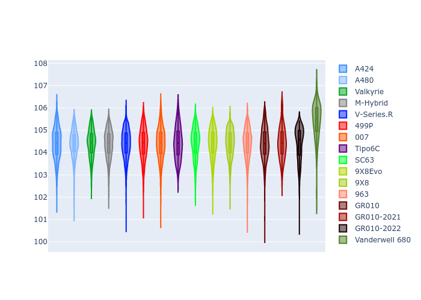
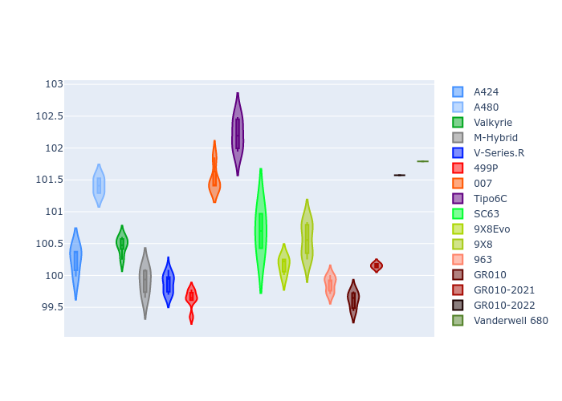
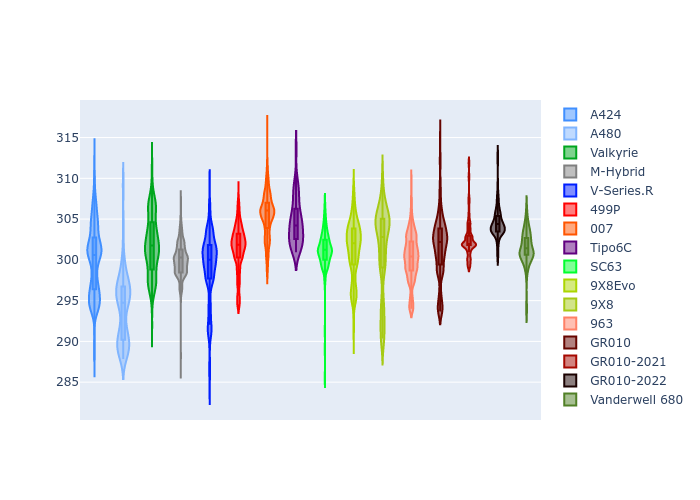
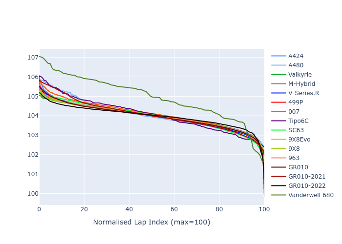

# Combined Plots

## Metadata

- BoP Accuracy: 98.25%
- Overall BoP Grade: A1
- Track: QATAR
- Threshhold: 250.0kph
- Average Laptime: 1:44.46
- Average Quali Laptime: 1:41.21
- Laptime Std Dev: 0.22 seconds
- Filtered Average Topspeed: 301.33kph

## BoP Table
| Manufacturer     | Car            | Weight   | Power   | PINC   | E/Stint   | FDS    | RDP    | QDP    | TDP    |
|:-----------------|:---------------|:---------|:--------|:-------|:----------|:-------|:-------|:-------|:-------|
| Alpine           | A424           | 1058kg   | 487.0kw | +3.70% | 902MJ     | -      | 52.20% | 54.51% | 24.58% |
| Alpine           | A480           | 966kg    | 410.0kw | +0.10% | 748MJ     | -      | 53.05% | 74.07% | 48.97% |
| Aston Martin     | Valkyrie       | 1054kg   | 520.0kw | -      | 913MJ     | -      | 53.39% | 54.11% | 23.71% |
| BMW              | M-Hybrid       | 1058kg   | 490.0kw | +3.20% | 897MJ     | -      | 53.47% | 52.95% | 33.73% |
| Cadillac         | V-Series.R     | 1069kg   | 498.0kw | +3.70% | 899MJ     | -      | 49.22% | 60.31% | 18.04% |
| Ferrari          | 499P           | 1065kg   | 480.0kw | +1.90% | 886MJ     | 200kph | 51.56% | 44.72% | 9.86%  |
| Glickenhaus      | 007            | 1043kg   | 520.0kw | -      | 911MJ     | -      | 46.14% | 49.30% | 41.45% |
| Isotta Fraschini | Tipo6C         | 1061kg   | 520.0kw | -      | 920MJ     | 200kph | 43.95% | 47.22% | 31.53% |
| Lamborghini      | SC63           | 1068kg   | 520.0kw | -0.40% | 913MJ     | -      | 48.25% | 60.95% | 28.65% |
| Peugeot          | 9X8Evo         | 1036kg   | 502.0kw | -3.30% | 898MJ     | 200kph | 50.17% | 49.36% | 17.73% |
| Peugeot          | 9X8            | 1038kg   | 488.0kw | +4.80% | 888MJ     | 150kph | 54.54% | 58.39% | 9.69%  |
| Porsche          | 963            | 1050kg   | 501.0kw | -3.60% | 890MJ     | -      | 50.78% | 41.25% | 27.61% |
| Toyota           | GR010          | 1063kg   | 485.0kw | -0.60% | 883MJ     | 200kph | 51.68% | 51.25% | 14.48% |
| Toyota           | GR010-2021     | 1061kg   | 482.0kw | -0.40% | 876MJ     | 200kph | 54.04% | 54.81% | 9.72%  |
| Toyota           | GR010-2022     | 1054kg   | 488.0kw | -1.60% | 876MJ     | 190kph | 53.24% | 64.49% | 9.72%  |
| Vanwall          | Vanderwell 680 | 1030kg   | 520.0kw | -      | 908MJ     | -      | 49.68% | 60.93% | 34.43% |

## Performance Table
| Manufacturer     | Car            | RP      | QP      | Vavg      |   RDLC | BOP-Grade   | Match   |
|:-----------------|:---------------|:--------|:--------|:----------|-------:|:------------|:--------|
| Alpine           | A424           | 1:44.41 | 1:40.72 | 300.03kph |   1.04 | ~A1         | 99.94%  |
| Alpine           | A480           | 1:44.41 | 1:42.80 | 294.06kph |   1.02 | ~A1         | 98.80%  |
| Aston Martin     | Valkyrie       | 1:44.40 | 1:40.73 | 301.81kph |   1.04 | ~A1         | 100.00% |
| BMW              | M-Hybrid       | 1:44.41 | 1:40.46 | 300.04kph |   1.04 | ~A1         | 100.00% |
| Cadillac         | V-Series.R     | 1:44.41 | 1:40.47 | 299.22kph |   1.04 | ~A1         | 99.86%  |
| Ferrari          | 499P           | 1:44.41 | 1:40.42 | 301.50kph |   1.04 | ~A1         | 99.75%  |
| Glickenhaus      | 007            | 1:44.41 | 1:41.83 | 305.51kph |   1.03 | ~A1         | 99.05%  |
| Isotta Fraschini | Tipo6C         | 1:44.40 | 1:42.77 | 304.61kph |   1.02 | ~A1         | 100.00% |
| Lamborghini      | SC63           | 1:44.42 | 1:41.39 | 301.29kph |   1.03 | ~A1         | 100.00% |
| Peugeot          | 9X8Evo         | 1:44.40 | 1:40.66 | 301.37kph |   1.04 | ~A1         | 100.00% |
| Peugeot          | 9X8            | 1:44.41 | 1:41.13 | 301.37kph |   1.03 | ~A1         | 100.00% |
| Porsche          | 963            | 1:44.40 | 1:40.55 | 300.34kph |   1.04 | ~A1         | 99.92%  |
| Toyota           | GR010          | 1:44.40 | 1:40.30 | 301.49kph |   1.04 | ~A1         | 99.85%  |
| Toyota           | GR010-2021     | 1:44.40 | 1:41.03 | 302.62kph |   1.03 | ~A1         | 100.00% |
| Toyota           | GR010-2022     | 1:44.41 | 1:42.32 | 304.56kph |   1.02 | ~A1         | 99.48%  |
| Vanwall          | Vanderwell 680 | 1:45.32 | 1:41.82 | 301.49kph |   1.03 | +C1         | 75.36%  |

## Race Laptimes

## Quali Laptimes

## Topspeeds

## Laptimes Lineplot

